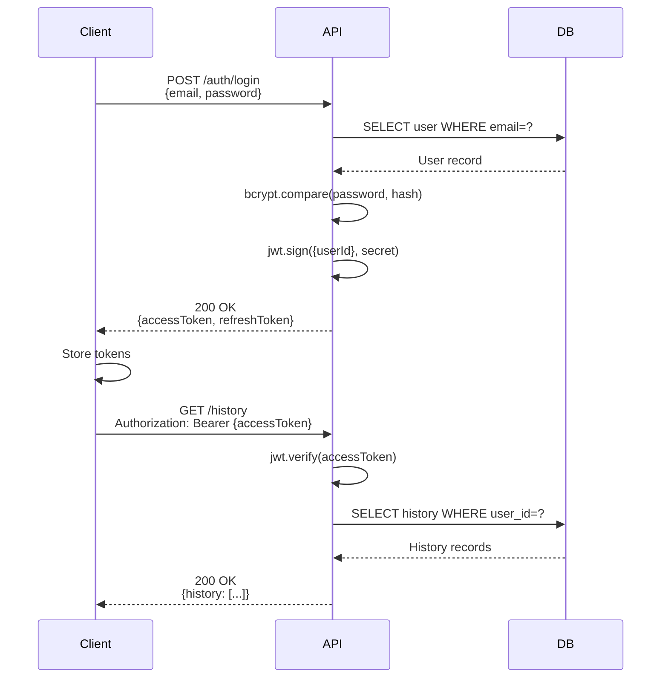

# API Design

**Project**: Basic Calculator Web App  
**Version**: 1.0 (v1)  
**Date**: 2025-11-07  
**Author**: System Architect  
**Status**: Draft

---

## Executive Summary

This document defines the RESTful API design for the Basic Calculator Web App premium features. The API follows REST principles with JWT authentication, versioned endpoints, and comprehensive error handling.

**Base URL**: `https://api.calcapp.com/v1`

**Key Design Principles:**

- **RESTful** design (resource-oriented URLs, HTTP verbs)
- **Versioned** API (v1, v2, etc. in URL path)
- **JSON** request/response bodies
- **JWT** authentication via Authorization header
- **Idempotent** operations where appropriate
- **Rate limited** (100 requests/minute per user)
- **CORS** enabled for web app domain only

---

## 1. API Overview

### 1.1 Endpoints Summary

| Endpoint | Method | Auth | Purpose |
|----------|--------|------|---------|
| `/auth/register` | POST | No | Create new user account |
| `/auth/login` | POST | No | Authenticate user (get JWT) |
| `/auth/refresh` | POST | Yes (Refresh Token) | Refresh access token |
| `/auth/logout` | POST | Yes | Invalidate refresh token |
| `/auth/me` | GET | Yes | Get current user profile |
| `/history` | GET | Yes | List calculation history |
| `/history` | POST | Yes | Create calculation record |
| `/history/{id}` | DELETE | Yes | Delete calculation record |
| `/subscription` | GET | Yes | Get current subscription |
| `/subscription` | POST | Yes | Create subscription (upgrade) |
| `/subscription` | DELETE | Yes | Cancel subscription |
| `/webhooks/stripe` | POST | No (Signed) | Stripe webhook events |

### 1.2 Authentication Flow



---

## 2. Authentication API

### 2.1 POST `/auth/register`

Create a new user account.

**Request:**

```http
POST /v1/auth/register HTTP/1.1
Host: api.calcapp.com
Content-Type: application/json

{
  "email": "alice@example.com",
  "password": "SecurePass123!",
  "displayName": "Alice Johnson"
}
```

**Request Body Schema:**

| Field | Type | Required | Validation |
|-------|------|----------|------------|
| `email` | string | Yes | Valid email format, unique |
| `password` | string | Yes | Min 8 chars, 1 uppercase, 1 lowercase, 1 number |
| `displayName` | string | No | Max 100 chars |

**Response (Success):**

```http
HTTP/1.1 201 Created
Content-Type: application/json

{
  "user": {
    "id": "550e8400-e29b-41d4-a716-446655440000",
    "email": "alice@example.com",
    "displayName": "Alice Johnson",
    "emailVerified": false,
    "createdAt": "2025-11-07T10:00:00Z"
  },
  "tokens": {
    "accessToken": "eyJhbGciOiJIUzI1NiIsInR5cCI6IkpXVCJ9...",
    "refreshToken": "eyJhbGciOiJIUzI1NiIsInR5cCI6IkpXVCJ9...",
    "expiresIn": 604800
  }
}
```

**Response Fields:**

| Field | Type | Description |
|-------|------|-------------|
| `user.id` | UUID | User unique identifier |
| `user.email` | string | User email |
| `user.displayName` | string | User display name |
| `user.emailVerified` | boolean | Email verification status |
| `user.createdAt` | ISO 8601 | Account creation timestamp |
| `tokens.accessToken` | JWT | Access token (7 days validity) |
| `tokens.refreshToken` | JWT | Refresh token (30 days validity) |
| `tokens.expiresIn` | number | Access token expiry (seconds) |

**Error Responses:**

| Status | Code | Message | Scenario |
|--------|------|---------|----------|
| 400 | `VALIDATION_ERROR` | "Invalid email format" | Email not valid |
| 400 | `VALIDATION_ERROR` | "Password too weak" | Password doesn't meet requirements |
| 409 | `EMAIL_EXISTS` | "Email already registered" | Email already in use |
| 500 | `INTERNAL_ERROR` | "Registration failed" | Database error |

**Example Error Response:**

```json
{
  "error": {
    "code": "EMAIL_EXISTS",
    "message": "Email already registered",
    "details": {
      "field": "email",
      "value": "alice@example.com"
    }
  }
}
```

---

### 2.2 POST `/auth/login`

Authenticate user and receive JWT tokens.

**Request:**

```http
POST /v1/auth/login HTTP/1.1
Host: api.calcapp.com
Content-Type: application/json

{
  "email": "alice@example.com",
  "password": "SecurePass123!"
}
```

**Response (Success):**

```http
HTTP/1.1 200 OK
Content-Type: application/json

{
  "user": {
    "id": "550e8400-e29b-41d4-a716-446655440000",
    "email": "alice@example.com",
    "displayName": "Alice Johnson",
    "emailVerified": true
  },
  "tokens": {
    "accessToken": "eyJhbGciOiJIUzI1NiIsInR5cCI6IkpXVCJ9...",
    "refreshToken": "eyJhbGciOiJIUzI1NiIsInR5cCI6IkpXVCJ9...",
    "expiresIn": 604800
  }
}
```

**Error Responses:**

| Status | Code | Message |
|--------|------|---------|
| 400 | `VALIDATION_ERROR` | "Email and password required" |
| 401 | `INVALID_CREDENTIALS` | "Invalid email or password" |
| 403 | `ACCOUNT_DISABLED` | "Account has been deleted" |
| 429 | `RATE_LIMIT_EXCEEDED` | "Too many login attempts. Try again in 15 minutes" |

---

### 2.3 POST `/auth/refresh`

Refresh access token using refresh token.

**Request:**

```http
POST /v1/auth/refresh HTTP/1.1
Host: api.calcapp.com
Content-Type: application/json
Authorization: Bearer {refreshToken}

{}
```

**Response (Success):**

```http
HTTP/1.1 200 OK
Content-Type: application/json

{
  "tokens": {
    "accessToken": "eyJhbGciOiJIUzI1NiIsInR5cCI6IkpXVCJ9...",
    "refreshToken": "eyJhbGciOiJIUzI1NiIsInR5cCI6IkpXVCJ9...",
    "expiresIn": 604800
  }
}
```

**Error Responses:**

| Status | Code | Message |
|--------|------|---------|
| 401 | `INVALID_TOKEN` | "Invalid or expired refresh token" |
| 401 | `TOKEN_REVOKED` | "Refresh token has been revoked" |

---

### 2.4 POST `/auth/logout`

Invalidate refresh token (logout user).

**Request:**

```http
POST /v1/auth/logout HTTP/1.1
Host: api.calcapp.com
Authorization: Bearer {accessToken}

{}
```

**Response (Success):**

```http
HTTP/1.1 204 No Content
```

---

### 2.5 GET `/auth/me`

Get current authenticated user profile.

**Request:**

```http
GET /v1/auth/me HTTP/1.1
Host: api.calcapp.com
Authorization: Bearer {accessToken}
```

**Response (Success):**

```http
HTTP/1.1 200 OK
Content-Type: application/json

{
  "user": {
    "id": "550e8400-e29b-41d4-a716-446655440000",
    "email": "alice@example.com",
    "displayName": "Alice Johnson",
    "emailVerified": true,
    "createdAt": "2025-11-01T10:00:00Z",
    "subscription": {
      "status": "active",
      "currentPeriodEnd": "2025-12-01T10:00:00Z"
    }
  }
}
```

---

## 3. Calculation History API

### 3.1 GET `/history`

Retrieve user's calculation history.

**Request:**

```http
GET /v1/history?limit=100&cursor=2025-11-06T10:00:00Z HTTP/1.1
Host: api.calcapp.com
Authorization: Bearer {accessToken}
```

**Query Parameters:**

| Parameter | Type | Required | Default | Description |
|-----------|------|----------|---------|-------------|
| `limit` | integer | No | 100 | Max records to return (1-1000) |
| `cursor` | ISO 8601 | No | null | Pagination cursor (created_at timestamp) |

**Response (Success):**

```http
HTTP/1.1 200 OK
Content-Type: application/json

{
  "history": [
    {
      "id": "12345678",
      "expression": "7 + 3",
      "result": "10",
      "metadata": {
        "operator": "+",
        "operand1": 7,
        "operand2": 3
      },
      "createdAt": "2025-11-07T10:05:00Z"
    },
    {
      "id": "12345677",
      "expression": "15 * 2",
      "result": "30",
      "metadata": {
        "operator": "*",
        "operand1": 15,
        "operand2": 2
      },
      "createdAt": "2025-11-07T10:03:00Z"
    }
  ],
  "pagination": {
    "nextCursor": "2025-11-07T10:00:00Z",
    "hasMore": true
  }
}
```

**Response Fields:**

| Field | Type | Description |
|-------|------|-------------|
| `history` | array | Calculation records (most recent first) |
| `history[].id` | string | Calculation ID |
| `history[].expression` | string | Calculation expression (e.g., "7 + 3") |
| `history[].result` | string | Calculation result (e.g., "10") |
| `history[].metadata` | object | Additional metadata (operator, operands, etc.) |
| `history[].createdAt` | ISO 8601 | Calculation timestamp |
| `pagination.nextCursor` | ISO 8601 | Cursor for next page |
| `pagination.hasMore` | boolean | More records available |

**Error Responses:**

| Status | Code | Message |
|--------|------|---------|
| 401 | `UNAUTHORIZED` | "Invalid or expired access token" |
| 403 | `FORBIDDEN` | "Premium subscription required" |

---

### 3.2 POST `/history`

Create a new calculation record.

**Request:**

```http
POST /v1/history HTTP/1.1
Host: api.calcapp.com
Authorization: Bearer {accessToken}
Content-Type: application/json

{
  "expression": "7 + 3",
  "result": "10",
  "metadata": {
    "operator": "+",
    "operand1": 7,
    "operand2": 3,
    "precision": 15
  }
}
```

**Request Body Schema:**

| Field | Type | Required | Validation |
|-------|------|----------|------------|
| `expression` | string | Yes | Max 500 chars |
| `result` | string | Yes | Max 100 chars |
| `metadata` | object | No | Any valid JSON object |

**Response (Success):**

```http
HTTP/1.1 201 Created
Content-Type: application/json
Location: /v1/history/12345679

{
  "calculation": {
    "id": "12345679",
    "expression": "7 + 3",
    "result": "10",
    "metadata": {
      "operator": "+",
      "operand1": 7,
      "operand2": 3,
      "precision": 15
    },
    "createdAt": "2025-11-07T10:10:00Z"
  }
}
```

**Idempotency:**

- Use `Idempotency-Key` header to prevent duplicate calculations
- If same key is sent twice within 24 hours, return existing record (200 OK)

**Example with Idempotency Key:**

```http
POST /v1/history HTTP/1.1
Idempotency-Key: 550e8400-e29b-41d4-a716-446655440000
Authorization: Bearer {accessToken}
Content-Type: application/json

{...}
```

**Error Responses:**

| Status | Code | Message |
|--------|------|---------|
| 400 | `VALIDATION_ERROR` | "Expression is required" |
| 401 | `UNAUTHORIZED` | "Invalid access token" |
| 403 | `FORBIDDEN` | "Premium subscription required" |
| 429 | `RATE_LIMIT_EXCEEDED` | "Too many requests" |

---

### 3.3 DELETE `/history/{id}`

Delete a calculation record.

**Request:**

```http
DELETE /v1/history/12345679 HTTP/1.1
Host: api.calcapp.com
Authorization: Bearer {accessToken}
```

**Response (Success):**

```http
HTTP/1.1 204 No Content
```

**Error Responses:**

| Status | Code | Message |
|--------|------|---------|
| 401 | `UNAUTHORIZED` | "Invalid access token" |
| 404 | `NOT_FOUND` | "Calculation not found" |
| 403 | `FORBIDDEN` | "Cannot delete another user's calculation" |

---

## 4. Subscription API

### 4.1 GET `/subscription`

Get current user's subscription.

**Request:**

```http
GET /v1/subscription HTTP/1.1
Host: api.calcapp.com
Authorization: Bearer {accessToken}
```

**Response (Success - Active Subscription):**

```http
HTTP/1.1 200 OK
Content-Type: application/json

{
  "subscription": {
    "id": "550e8400-e29b-41d4-a716-446655440000",
    "status": "active",
    "pricePerMonth": 5.00,
    "currency": "usd",
    "currentPeriodStart": "2025-11-01T10:00:00Z",
    "currentPeriodEnd": "2025-12-01T10:00:00Z",
    "cancelAtPeriodEnd": false,
    "createdAt": "2025-11-01T10:00:00Z"
  }
}
```

**Response (No Subscription):**

```http
HTTP/1.1 404 Not Found
Content-Type: application/json

{
  "error": {
    "code": "NO_SUBSCRIPTION",
    "message": "User has no active subscription"
  }
}
```

---

### 4.2 POST `/subscription`

Create a new subscription (upgrade to premium).

**Request:**

```http
POST /v1/subscription HTTP/1.1
Host: api.calcapp.com
Authorization: Bearer {accessToken}
Content-Type: application/json

{
  "paymentMethodToken": "pm_1234567890",
  "priceId": "price_monthly_5usd"
}
```

**Request Body Schema:**

| Field | Type | Required | Description |
|-------|------|----------|-------------|
| `paymentMethodToken` | string | Yes | Stripe payment method token (from Stripe.js) |
| `priceId` | string | Yes | Stripe price ID (e.g., "price_monthly_5usd") |

**Response (Success):**

```http
HTTP/1.1 201 Created
Content-Type: application/json

{
  "subscription": {
    "id": "550e8400-e29b-41d4-a716-446655440000",
    "status": "active",
    "pricePerMonth": 5.00,
    "currency": "usd",
    "currentPeriodStart": "2025-11-07T10:00:00Z",
    "currentPeriodEnd": "2025-12-07T10:00:00Z",
    "cancelAtPeriodEnd": false,
    "createdAt": "2025-11-07T10:00:00Z"
  }
}
```

**Error Responses:**

| Status | Code | Message |
|--------|------|---------|
| 400 | `VALIDATION_ERROR` | "Invalid payment method token" |
| 402 | `PAYMENT_REQUIRED` | "Payment declined by card issuer" |
| 409 | `ALREADY_SUBSCRIBED` | "User already has an active subscription" |
| 500 | `STRIPE_ERROR` | "Payment processing failed" |

---

### 4.3 DELETE `/subscription`

Cancel subscription (at end of billing period).

**Request:**

```http
DELETE /v1/subscription HTTP/1.1
Host: api.calcapp.com
Authorization: Bearer {accessToken}
```

**Response (Success):**

```http
HTTP/1.1 200 OK
Content-Type: application/json

{
  "subscription": {
    "id": "550e8400-e29b-41d4-a716-446655440000",
    "status": "active",
    "pricePerMonth": 5.00,
    "currency": "usd",
    "currentPeriodStart": "2025-11-01T10:00:00Z",
    "currentPeriodEnd": "2025-12-01T10:00:00Z",
    "cancelAtPeriodEnd": true,
    "canceledAt": "2025-11-07T10:00:00Z",
    "createdAt": "2025-11-01T10:00:00Z"
  }
}
```

**Note**: User retains access until `currentPeriodEnd`.

**Error Responses:**

| Status | Code | Message |
|--------|------|---------|
| 404 | `NO_SUBSCRIPTION` | "No active subscription to cancel" |
| 409 | `ALREADY_CANCELED` | "Subscription already canceled" |

---

## 5. Webhooks API

### 5.1 POST `/webhooks/stripe`

Receive Stripe webhook events (subscription lifecycle).

**Request:**

```http
POST /v1/webhooks/stripe HTTP/1.1
Host: api.calcapp.com
Content-Type: application/json
Stripe-Signature: t=1699372800,v1=abc123...

{
  "id": "evt_1234567890",
  "type": "customer.subscription.updated",
  "data": {
    "object": {
      "id": "sub_XYZ789",
      "status": "active",
      "current_period_start": 1699372800,
      "current_period_end": 1701964800
    }
  }
}
```

**Supported Event Types:**

| Event | Action |
|-------|--------|
| `customer.subscription.created` | Create subscription record |
| `customer.subscription.updated` | Update subscription status |
| `customer.subscription.deleted` | Mark subscription as canceled |
| `invoice.payment_succeeded` | Record successful payment |
| `invoice.payment_failed` | Mark subscription as past_due |

**Response (Success):**

```http
HTTP/1.1 200 OK
Content-Type: application/json

{
  "received": true
}
```

**Security:**

- Verify `Stripe-Signature` header (webhook signing secret)
- Reject webhooks with invalid signature (401 Unauthorized)
- Idempotent processing (store event ID to prevent duplicates)

---

## 6. Error Handling

### 6.1 Standard Error Response

All errors follow this structure:

```json
{
  "error": {
    "code": "ERROR_CODE",
    "message": "Human-readable error message",
    "details": {
      "field": "email",
      "constraint": "unique"
    },
    "requestId": "550e8400-e29b-41d4-a716-446655440000",
    "timestamp": "2025-11-07T10:00:00Z"
  }
}
```

### 6.2 HTTP Status Codes

| Status | Meaning | Usage |
|--------|---------|-------|
| 200 | OK | Successful GET/POST/DELETE |
| 201 | Created | Successful resource creation |
| 204 | No Content | Successful DELETE with no body |
| 400 | Bad Request | Invalid input (validation error) |
| 401 | Unauthorized | Missing or invalid auth token |
| 403 | Forbidden | Valid token but insufficient permissions |
| 404 | Not Found | Resource doesn't exist |
| 409 | Conflict | Resource already exists (e.g., email) |
| 429 | Too Many Requests | Rate limit exceeded |
| 500 | Internal Server Error | Unexpected server error |
| 502 | Bad Gateway | Upstream service error (Stripe) |
| 503 | Service Unavailable | Server overloaded or maintenance |

### 6.3 Error Codes

| Code | Description |
|------|-------------|
| `VALIDATION_ERROR` | Input validation failed |
| `INVALID_CREDENTIALS` | Login failed (wrong email/password) |
| `UNAUTHORIZED` | Missing or invalid access token |
| `FORBIDDEN` | Insufficient permissions |
| `NOT_FOUND` | Resource not found |
| `EMAIL_EXISTS` | Email already registered |
| `ALREADY_SUBSCRIBED` | User already has subscription |
| `NO_SUBSCRIPTION` | User has no active subscription |
| `PAYMENT_REQUIRED` | Payment declined |
| `RATE_LIMIT_EXCEEDED` | Too many requests |
| `INTERNAL_ERROR` | Unexpected server error |
| `STRIPE_ERROR` | Stripe API error |

---

## 7. Rate Limiting

### 7.1 Rate Limit Strategy

**Per-User Rate Limits:**

| Endpoint Pattern | Limit | Window |
|------------------|-------|--------|
| `/auth/register` | 5 requests | 1 hour |
| `/auth/login` | 10 requests | 15 minutes |
| `/auth/*` (other) | 100 requests | 1 minute |
| `/history` (GET) | 100 requests | 1 minute |
| `/history` (POST) | 50 requests | 1 minute |
| `/subscription/*` | 10 requests | 1 minute |

**Global Rate Limits:**

- 10,000 requests/minute per server (DDoS protection)
- AWS WAF rules for suspicious patterns

**Rate Limit Headers:**

```http
HTTP/1.1 200 OK
X-RateLimit-Limit: 100
X-RateLimit-Remaining: 95
X-RateLimit-Reset: 1699372860
```

**Rate Limit Exceeded Response:**

```http
HTTP/1.1 429 Too Many Requests
Retry-After: 60

{
  "error": {
    "code": "RATE_LIMIT_EXCEEDED",
    "message": "Too many requests. Try again in 60 seconds.",
    "retryAfter": 60
  }
}
```

---

## 8. CORS Configuration

### 8.1 Allowed Origins

**Production:**

```
https://app.calcapp.com
```

**Staging:**

```
https://staging.calcapp.com
```

**Development:**

```
http://localhost:3000
http://localhost:5173  (Vite dev server)
```

### 8.2 CORS Headers

```http
Access-Control-Allow-Origin: https://app.calcapp.com
Access-Control-Allow-Methods: GET, POST, DELETE, OPTIONS
Access-Control-Allow-Headers: Content-Type, Authorization, Idempotency-Key
Access-Control-Allow-Credentials: true
Access-Control-Max-Age: 86400
```

---

## 9. API Versioning

### 9.1 Versioning Strategy

**URL Path Versioning**: `/v1/`, `/v2/`, etc.

**Current Version**: v1

**Version Lifecycle:**

- **Active**: v1 (current version, receives new features)
- **Deprecated**: (none yet)
- **Sunset**: (none yet)

**Deprecation Policy:**

1. Announce deprecation 6 months in advance
2. Provide migration guide
3. Support deprecated version for 12 months
4. Sunset (remove) after 12 months

**Example Deprecation Header:**

```http
HTTP/1.1 200 OK
Deprecation: true
Sunset: Sat, 31 May 2026 23:59:59 GMT
Link: <https://docs.calcapp.com/api/v2-migration>; rel="deprecation"
```

---

## 10. Security

### 10.1 Authentication

**JWT Token Structure:**

```json
{
  "header": {
    "alg": "HS256",
    "typ": "JWT"
  },
  "payload": {
    "sub": "550e8400-e29b-41d4-a716-446655440000",
    "email": "alice@example.com",
    "type": "access",
    "iat": 1699372800,
    "exp": 1699977600
  },
  "signature": "..."
}
```

**Token Types:**

- **Access Token**: Short-lived (7 days), used for API requests
- **Refresh Token**: Long-lived (30 days), used to refresh access token

**Token Storage (Client-Side):**

- Access token: `httpOnly` cookie (XSS protection)
- Refresh token: `httpOnly` cookie (XSS protection)
- `SameSite=Strict` (CSRF protection)
- `Secure` flag (HTTPS only)

### 10.2 Input Validation

**All inputs validated with Zod schemas:**

```typescript
import { z } from 'zod';

export const RegisterSchema = z.object({
  email: z.string().email(),
  password: z.string()
    .min(8, "Password too short")
    .regex(/[A-Z]/, "Requires uppercase")
    .regex(/[a-z]/, "Requires lowercase")
    .regex(/[0-9]/, "Requires number"),
  displayName: z.string().max(100).optional(),
});
```

**SQL Injection Prevention:**

- Use Prisma ORM (parameterized queries)
- Never concatenate user input into SQL

**XSS Prevention:**

- Sanitize all user inputs (strip HTML tags)
- Set `Content-Security-Policy` header

---

## 11. API Documentation

### 11.1 OpenAPI Specification

Generate OpenAPI 3.0 spec for interactive documentation:

```yaml
openapi: 3.0.0
info:
  title: Calculator App API
  version: 1.0.0
  description: RESTful API for premium calculator features
servers:
  - url: https://api.calcapp.com/v1
    description: Production server
paths:
  /auth/register:
    post:
      summary: Register new user
      requestBody:
        required: true
        content:
          application/json:
            schema:
              $ref: '#/components/schemas/RegisterRequest'
      responses:
        '201':
          description: User created successfully
          content:
            application/json:
              schema:
                $ref: '#/components/schemas/RegisterResponse'
```

**Interactive Docs**: Host Swagger UI at `https://docs.calcapp.com/api`

---

## 12. Testing

### 12.1 API Test Strategy

**Unit Tests** (Service layer):

- Test business logic in isolation
- Mock database calls
- 80%+ code coverage

**Integration Tests** (API endpoints):

- Test full request/response cycle
- Use test database (reset between tests)
- Test error scenarios (401, 403, 404, etc.)

**Contract Tests** (API consumers):

- Test that API matches OpenAPI spec
- Use Pact or similar tool
- Run in CI/CD pipeline

**Example Integration Test**:

```typescript
import { describe, it, expect } from 'vitest';
import request from 'supertest';
import { app } from '../src/app';

describe('POST /auth/register', () => {
  it('should create new user and return tokens', async () => {
    const response = await request(app)
      .post('/v1/auth/register')
      .send({
        email: 'test@example.com',
        password: 'SecurePass123!',
      })
      .expect(201);

    expect(response.body.user.email).toBe('test@example.com');
    expect(response.body.tokens.accessToken).toBeDefined();
  });

  it('should reject duplicate email', async () => {
    // Create user
    await request(app)
      .post('/v1/auth/register')
      .send({ email: 'test@example.com', password: 'SecurePass123!' });

    // Try to create again
    const response = await request(app)
      .post('/v1/auth/register')
      .send({ email: 'test@example.com', password: 'SecurePass123!' })
      .expect(409);

    expect(response.body.error.code).toBe('EMAIL_EXISTS');
  });
});
```

---

## Appendix A: Example Request/Response Flows

### A.1 Complete User Journey (Registration → Subscription)

**Step 1: Register**

```http
POST /v1/auth/register
{
  "email": "alice@example.com",
  "password": "SecurePass123!"
}

→ 201 Created
{
  "user": {...},
  "tokens": {...}
}
```

**Step 2: Create Subscription**

```http
POST /v1/subscription
Authorization: Bearer {accessToken}
{
  "paymentMethodToken": "pm_1234567890",
  "priceId": "price_monthly_5usd"
}

→ 201 Created
{
  "subscription": {...}
}
```

**Step 3: Save Calculation**

```http
POST /v1/history
Authorization: Bearer {accessToken}
{
  "expression": "7 + 3",
  "result": "10"
}

→ 201 Created
{
  "calculation": {...}
}
```

**Step 4: Retrieve History**

```http
GET /v1/history?limit=100
Authorization: Bearer {accessToken}

→ 200 OK
{
  "history": [...],
  "pagination": {...}
}
```

---

## Appendix B: Status Code Decision Tree

```
Request received
│
├─ Valid syntax? ─No→ 400 Bad Request
│  └─Yes
│
├─ Has auth token? ─No→ 401 Unauthorized
│  └─Yes
│
├─ Token valid? ─No→ 401 Unauthorized
│  └─Yes
│
├─ Has permission? ─No→ 403 Forbidden
│  └─Yes
│
├─ Resource exists? ─No→ 404 Not Found (for GET/PUT/DELETE)
│  └─Yes (or N/A for POST)
│
├─ Conflict with existing? ─Yes→ 409 Conflict (e.g., duplicate email)
│  └─No
│
├─ Rate limit exceeded? ─Yes→ 429 Too Many Requests
│  └─No
│
├─ Server error? ─Yes→ 500 Internal Server Error
│  └─No
│
└─ Success! → 200 OK / 201 Created / 204 No Content
```

---

**Document Status**: Draft → Review → Approved  
**Next Review Date**: 2025-11-14  
**Owner**: System Architect  
**Approvers**: API Designer, Security Architect, Technical Lead
