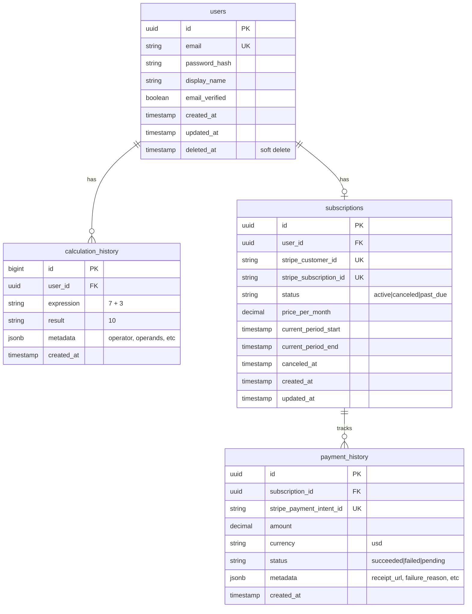

# Data Architecture

**Project**: Basic Calculator Web App  
**Version**: 1.0  
**Date**: 2025-11-07  
**Author**: System Architect  
**Status**: Draft

---

## Executive Summary

This document defines the data architecture for the Basic Calculator Web App, including database schema, data models, storage strategies, and data flow patterns. The architecture uses **PostgreSQL** for relational data (users, subscriptions) and **browser localStorage** for free-tier calculation history.

**Key Design Decisions:**

- **PostgreSQL (RDS Aurora)** for premium user data (ACID transactions required)
- **localStorage** for free tier history (zero backend cost, instant access)
- **JSONB columns** for flexible calculation history metadata
- **Prisma ORM** for type-safe database access and migrations
- **Soft deletes** for user accounts (GDPR compliance)
- **Partitioning** for historical data (performance optimization)

---

## 1. Data Model Overview

### 1.1 Entity-Relationship Diagram



### 1.2 Data Storage Strategy

| Data Type | Storage Location | Rationale | Size Estimate |
|-----------|------------------|-----------|---------------|
| **Free tier history** | Browser localStorage (5MB limit) | Zero backend cost, instant access, works offline | 100 calcs × 100 bytes = 10KB |
| **Premium history** | PostgreSQL (JSONB) | Unlimited storage, cross-device sync, queryable | 1000 users × 10K calcs × 200 bytes = 2GB |
| **User accounts** | PostgreSQL (users table) | Relational data, ACID transactions | 1000 users × 1KB = 1MB |
| **Subscriptions** | PostgreSQL (subscriptions table) | Payment history, billing cycles | 1000 subs × 500 bytes = 500KB |
| **Static assets** | AWS S3 + CloudFront | Global CDN, 99.99% availability | HTML/CSS/JS = 500KB |

---

## 2. Database Schema

### 2.1 Table: `users`

**Purpose**: Store user account information for premium users

```sql
CREATE TABLE users (
    id UUID PRIMARY KEY DEFAULT gen_random_uuid(),
    email VARCHAR(255) NOT NULL UNIQUE,
    password_hash VARCHAR(255) NOT NULL,
    display_name VARCHAR(100),
    email_verified BOOLEAN DEFAULT FALSE,
    created_at TIMESTAMP WITH TIME ZONE DEFAULT NOW(),
    updated_at TIMESTAMP WITH TIME ZONE DEFAULT NOW(),
    deleted_at TIMESTAMP WITH TIME ZONE,  -- Soft delete for GDPR
    
    CONSTRAINT email_format CHECK (email ~* '^[A-Za-z0-9._%+-]+@[A-Za-z0-9.-]+\.[A-Za-z]{2,}$')
);

-- Indexes
CREATE INDEX idx_users_email ON users(email) WHERE deleted_at IS NULL;
CREATE INDEX idx_users_created_at ON users(created_at);
```

**Fields:**

| Column | Type | Nullable | Description |
|--------|------|----------|-------------|
| `id` | UUID | No | Primary key (v4 UUID) |
| `email` | VARCHAR(255) | No | User email (unique, login identifier) |
| `password_hash` | VARCHAR(255) | No | bcrypt hash (cost 12) |
| `display_name` | VARCHAR(100) | Yes | User's display name (optional) |
| `email_verified` | BOOLEAN | No | Email verification status (default: false) |
| `created_at` | TIMESTAMPTZ | No | Account creation timestamp |
| `updated_at` | TIMESTAMPTZ | No | Last update timestamp |
| `deleted_at` | TIMESTAMPTZ | Yes | Soft delete timestamp (GDPR right to erasure) |

**Constraints:**

- `email` must be unique (case-insensitive)
- `email` must match email format regex
- `password_hash` must be bcrypt hash (60 characters)

**Sample Data:**

```sql
INSERT INTO users (email, password_hash, display_name, email_verified) VALUES
('alice@example.com', '$2b$12$...', 'Alice Johnson', true),
('bob@example.com', '$2b$12$...', 'Bob Smith', false);
```

---

### 2.2 Table: `subscriptions`

**Purpose**: Track premium subscriptions and billing information

```sql
CREATE TABLE subscriptions (
    id UUID PRIMARY KEY DEFAULT gen_random_uuid(),
    user_id UUID NOT NULL REFERENCES users(id) ON DELETE CASCADE,
    stripe_customer_id VARCHAR(255) NOT NULL UNIQUE,
    stripe_subscription_id VARCHAR(255) NOT NULL UNIQUE,
    status VARCHAR(50) NOT NULL DEFAULT 'active',
    price_per_month DECIMAL(10, 2) NOT NULL,
    current_period_start TIMESTAMP WITH TIME ZONE NOT NULL,
    current_period_end TIMESTAMP WITH TIME ZONE NOT NULL,
    canceled_at TIMESTAMP WITH TIME ZONE,
    created_at TIMESTAMP WITH TIME ZONE DEFAULT NOW(),
    updated_at TIMESTAMP WITH TIME ZONE DEFAULT NOW(),
    
    CONSTRAINT status_check CHECK (status IN ('active', 'canceled', 'past_due', 'incomplete', 'trialing'))
);

-- Indexes
CREATE UNIQUE INDEX idx_subscriptions_user_id ON subscriptions(user_id);
CREATE INDEX idx_subscriptions_status ON subscriptions(status);
CREATE INDEX idx_subscriptions_stripe_customer_id ON subscriptions(stripe_customer_id);
```

**Fields:**

| Column | Type | Nullable | Description |
|--------|------|----------|-------------|
| `id` | UUID | No | Primary key |
| `user_id` | UUID | No | Foreign key to users table |
| `stripe_customer_id` | VARCHAR(255) | No | Stripe customer ID (cus_xxx) |
| `stripe_subscription_id` | VARCHAR(255) | No | Stripe subscription ID (sub_xxx) |
| `status` | VARCHAR(50) | No | Subscription status (active, canceled, past_due, etc.) |
| `price_per_month` | DECIMAL(10,2) | No | Monthly price in USD |
| `current_period_start` | TIMESTAMPTZ | No | Billing period start |
| `current_period_end` | TIMESTAMPTZ | No | Billing period end |
| `canceled_at` | TIMESTAMPTZ | Yes | Cancellation timestamp |
| `created_at` | TIMESTAMPTZ | No | Subscription creation timestamp |
| `updated_at` | TIMESTAMPTZ | No | Last update timestamp |

**Constraints:**

- Each user can have at most one active subscription (enforced by unique index on `user_id`)
- `status` must be one of: 'active', 'canceled', 'past_due', 'incomplete', 'trialing'

**Sample Data:**

```sql
INSERT INTO subscriptions (user_id, stripe_customer_id, stripe_subscription_id, status, price_per_month, current_period_start, current_period_end) VALUES
('...', 'cus_ABC123', 'sub_XYZ789', 'active', 5.00, '2025-11-01', '2025-12-01');
```

---

### 2.3 Table: `calculation_history`

**Purpose**: Store calculation history for premium users

```sql
CREATE TABLE calculation_history (
    id BIGSERIAL PRIMARY KEY,
    user_id UUID NOT NULL REFERENCES users(id) ON DELETE CASCADE,
    expression VARCHAR(500) NOT NULL,
    result VARCHAR(100) NOT NULL,
    metadata JSONB,
    created_at TIMESTAMP WITH TIME ZONE DEFAULT NOW(),
    
    CONSTRAINT expression_length CHECK (LENGTH(expression) <= 500)
) PARTITION BY RANGE (created_at);

-- Create monthly partitions (example for November 2025)
CREATE TABLE calculation_history_2025_11 PARTITION OF calculation_history
    FOR VALUES FROM ('2025-11-01') TO ('2025-12-01');

CREATE TABLE calculation_history_2025_12 PARTITION OF calculation_history
    FOR VALUES FROM ('2025-12-01') TO ('2026-01-01');

-- Indexes (created on each partition automatically)
CREATE INDEX idx_calc_history_user_created ON calculation_history(user_id, created_at DESC);
CREATE INDEX idx_calc_history_created ON calculation_history(created_at DESC);
CREATE INDEX idx_calc_history_metadata ON calculation_history USING GIN (metadata);
```

**Fields:**

| Column | Type | Nullable | Description |
|--------|------|----------|-------------|
| `id` | BIGSERIAL | No | Primary key (auto-increment) |
| `user_id` | UUID | No | Foreign key to users table |
| `expression` | VARCHAR(500) | No | Calculation expression (e.g., "7 + 3") |
| `result` | VARCHAR(100) | No | Calculation result (e.g., "10") |
| `metadata` | JSONB | Yes | Additional metadata (operator, operands, timestamp_ms, etc.) |
| `created_at` | TIMESTAMPTZ | No | Calculation timestamp |

**Metadata JSONB Structure:**

```json
{
  "operator": "+",
  "operand1": 7,
  "operand2": 3,
  "precision": 15,
  "client_timestamp": 1699372800000,
  "device_type": "desktop",
  "browser": "Chrome"
}
```

**Partitioning Strategy:**

- **Monthly range partitions** on `created_at` column
- Automatically create next month's partition via cron job
- Archive old partitions to S3 Glacier after 2 years
- Drop partitions after 5 years (data retention policy)

**Sample Data:**

```sql
INSERT INTO calculation_history (user_id, expression, result, metadata) VALUES
('...', '7 + 3', '10', '{"operator": "+", "operand1": 7, "operand2": 3}'),
('...', '15 * 2', '30', '{"operator": "*", "operand1": 15, "operand2": 2}');
```

---

### 2.4 Table: `payment_history`

**Purpose**: Audit trail for all payment transactions

```sql
CREATE TABLE payment_history (
    id UUID PRIMARY KEY DEFAULT gen_random_uuid(),
    subscription_id UUID NOT NULL REFERENCES subscriptions(id) ON DELETE CASCADE,
    stripe_payment_intent_id VARCHAR(255) NOT NULL UNIQUE,
    amount DECIMAL(10, 2) NOT NULL,
    currency VARCHAR(3) DEFAULT 'usd',
    status VARCHAR(50) NOT NULL,
    metadata JSONB,
    created_at TIMESTAMP WITH TIME ZONE DEFAULT NOW(),
    
    CONSTRAINT status_check CHECK (status IN ('succeeded', 'failed', 'pending', 'canceled', 'requires_action'))
);

-- Indexes
CREATE INDEX idx_payment_history_subscription_id ON payment_history(subscription_id);
CREATE INDEX idx_payment_history_status ON payment_history(status);
CREATE INDEX idx_payment_history_created ON payment_history(created_at DESC);
```

**Fields:**

| Column | Type | Nullable | Description |
|--------|------|----------|-------------|
| `id` | UUID | No | Primary key |
| `subscription_id` | UUID | No | Foreign key to subscriptions table |
| `stripe_payment_intent_id` | VARCHAR(255) | No | Stripe payment intent ID (pi_xxx) |
| `amount` | DECIMAL(10,2) | No | Payment amount (e.g., 5.00) |
| `currency` | VARCHAR(3) | No | Currency code (usd, eur, gbp, etc.) |
| `status` | VARCHAR(50) | No | Payment status (succeeded, failed, etc.) |
| `metadata` | JSONB | Yes | Additional payment metadata (receipt_url, failure_reason, etc.) |
| `created_at` | TIMESTAMPTZ | No | Payment timestamp |

**Metadata JSONB Structure:**

```json
{
  "receipt_url": "https://stripe.com/receipts/...",
  "failure_code": null,
  "failure_message": null,
  "payment_method_type": "card",
  "last4": "4242",
  "brand": "visa"
}
```

**Sample Data:**

```sql
INSERT INTO payment_history (subscription_id, stripe_payment_intent_id, amount, currency, status, metadata) VALUES
('...', 'pi_ABC123', 5.00, 'usd', 'succeeded', '{"receipt_url": "https://stripe.com/receipts/..."}');
```

---

## 3. Data Access Patterns

### 3.1 Common Queries

#### Query 1: Get User by Email (Login)

```sql
SELECT id, email, password_hash, email_verified, display_name
FROM users
WHERE email = $1 AND deleted_at IS NULL;
```

**Index Used**: `idx_users_email`  
**Performance**: <1ms (indexed lookup)

---

#### Query 2: Get User's Calculation History (Recent 100)

```sql
SELECT id, expression, result, metadata, created_at
FROM calculation_history
WHERE user_id = $1
ORDER BY created_at DESC
LIMIT 100;
```

**Index Used**: `idx_calc_history_user_created`  
**Performance**: <10ms (composite index scan)

---

#### Query 3: Get User's Active Subscription

```sql
SELECT s.*, u.email
FROM subscriptions s
JOIN users u ON s.user_id = u.id
WHERE s.user_id = $1 AND s.status = 'active';
```

**Index Used**: `idx_subscriptions_user_id`  
**Performance**: <2ms (indexed lookup + join)

---

#### Query 4: Get Payment History for Subscription

```sql
SELECT id, stripe_payment_intent_id, amount, currency, status, created_at
FROM payment_history
WHERE subscription_id = $1
ORDER BY created_at DESC
LIMIT 12;  -- Last 12 months
```

**Index Used**: `idx_payment_history_subscription_id`  
**Performance**: <5ms (indexed scan)

---

#### Query 5: Search Calculation History by Expression

```sql
SELECT id, expression, result, created_at
FROM calculation_history
WHERE user_id = $1
  AND expression ILIKE '%' || $2 || '%'
ORDER BY created_at DESC
LIMIT 50;
```

**Index Used**: None (full table scan, but limited to user's partition)  
**Performance**: <50ms (can add pg_trgm index if search is heavily used)  
**Optimization**: Add GIN index with pg_trgm extension for LIKE queries

---

### 3.2 Write Patterns

#### Insert Calculation (Premium User)

```sql
INSERT INTO calculation_history (user_id, expression, result, metadata)
VALUES ($1, $2, $3, $4)
RETURNING id, created_at;
```

**Performance**: <5ms (append-only, partitioned table)  
**Concurrency**: No locks (separate rows per user)

---

#### Update Subscription Status (Stripe Webhook)

```sql
UPDATE subscriptions
SET status = $1, updated_at = NOW()
WHERE stripe_subscription_id = $2
RETURNING id, user_id;
```

**Performance**: <2ms (indexed update)  
**Idempotency**: Use Stripe event ID to prevent duplicate processing

---

#### Soft Delete User Account (GDPR)

```sql
UPDATE users
SET deleted_at = NOW(), updated_at = NOW()
WHERE id = $1 AND deleted_at IS NULL
RETURNING id;

-- Cascade delete: subscriptions and calculation_history automatically deleted (ON DELETE CASCADE)
```

**Performance**: <5ms + cascade deletes (<100ms for typical user)  
**GDPR Compliance**: User data marked as deleted, can be hard-deleted after 30 days

---

## 4. Data Migration Strategy

### 4.1 Prisma Migrations

**Tool**: Prisma Migrate

**Workflow**:

1. **Development**: Generate migration from Prisma schema changes

    ```bash
    npx prisma migrate dev --name add_calculation_history
    ```

2. **Staging**: Apply migration

    ```bash
    npx prisma migrate deploy
    ```

3. **Production**: Apply migration with zero-downtime strategy

    ```bash
    npx prisma migrate deploy
    ```

**Migration Example** (Add index):

```sql
-- Migration: 20251107_add_metadata_index
CREATE INDEX CONCURRENTLY idx_calc_history_metadata
ON calculation_history USING GIN (metadata);
```

**Zero-Downtime Strategy**:

- Use `CREATE INDEX CONCURRENTLY` (no table locks)
- Add new columns as nullable, backfill data, then make NOT NULL
- Never drop columns in same migration (two-phase: stop using, then drop)

---

### 4.2 Data Seeding

**Seed Script** (for development/testing):

```typescript
// prisma/seed.ts
import { PrismaClient } from '@prisma/client';
import bcrypt from 'bcrypt';

const prisma = new PrismaClient();

async function main() {
  // Create test user
  const passwordHash = await bcrypt.hash('password123', 12);
  
  const user = await prisma.user.create({
    data: {
      email: 'test@example.com',
      passwordHash,
      displayName: 'Test User',
      emailVerified: true,
    },
  });

  // Create test subscription
  await prisma.subscription.create({
    data: {
      userId: user.id,
      stripeCustomerId: 'cus_test123',
      stripeSubscriptionId: 'sub_test123',
      status: 'active',
      pricePerMonth: 5.0,
      currentPeriodStart: new Date(),
      currentPeriodEnd: new Date(Date.now() + 30 * 24 * 60 * 60 * 1000),
    },
  });

  // Create test calculation history
  await prisma.calculationHistory.createMany({
    data: [
      { userId: user.id, expression: '7 + 3', result: '10' },
      { userId: user.id, expression: '15 * 2', result: '30' },
    ],
  });

  console.log('Database seeded successfully');
}

main()
  .catch(console.error)
  .finally(() => prisma.$disconnect());
```

**Run Seed**:

```bash
npx prisma db seed
```

---

## 5. Data Archival & Retention

### 5.1 Retention Policy

| Data Type | Retention Period | Archival Strategy | Reason |
|-----------|------------------|-------------------|--------|
| Calculation history (active premium) | Unlimited (while subscribed) | None | Core feature |
| Calculation history (canceled premium) | 90 days | Move to S3 Glacier | Grace period for re-subscription |
| User accounts (deleted) | 30 days (soft delete) | Hard delete after 30 days | GDPR compliance |
| Payment history | 7 years | Compress + move to S3 Glacier after 2 years | Tax/audit requirements |
| Audit logs | 1 year | Move to S3 Glacier after 90 days | Security investigation |

### 5.2 Archival Process

**Monthly Cron Job** (Lambda scheduled event):

1. **Identify old partitions** (>2 years old)
2. **Export to S3** (Parquet format for compression + query via Athena)
3. **Verify export** (row count, checksums)
4. **Drop old partitions** (after successful export)

**Export Script**:

```sql
COPY (
  SELECT * FROM calculation_history_2023_01
) TO PROGRAM 'aws s3 cp - s3://calcapp-archives/history/2023-01.csv.gz'
WITH (FORMAT CSV, HEADER, COMPRESSION gzip);
```

**Cost Savings**:

- RDS storage: $0.10/GB-month
- S3 Glacier: $0.004/GB-month (25x cheaper)
- 1TB history = $100/month RDS vs $4/month Glacier

---

## 6. Data Security & Privacy

### 6.1 Encryption

**Encryption at Rest**:

- RDS Aurora: AES-256 encryption enabled by default
- S3: Server-side encryption (SSE-S3) for static assets
- Backups: Encrypted with same key as database

**Encryption in Transit**:

- TLS 1.3 for all API communication
- PostgreSQL SSL connections enforced (RDS parameter: `rds.force_ssl = 1`)
- Stripe API calls over HTTPS only

### 6.2 Data Minimization (GDPR Principle)

**What We Collect**:

- ✅ Email (required for login)
- ✅ Password hash (required for authentication)
- ✅ Calculation history (core feature)
- ✅ Payment history (legal requirement)

**What We DON'T Collect**:

- ❌ Full name (optional display name only)
- ❌ Phone number
- ❌ Address (Stripe collects billing address, not us)
- ❌ Credit card details (Stripe tokenization)
- ❌ IP addresses (except in server logs for 90 days)
- ❌ Browsing history (no tracking pixels)

### 6.3 GDPR Compliance

**User Rights Implementation**:

1. **Right to Access** (Data Export):

    ```typescript
    async function exportUserData(userId: string) {
      const user = await prisma.user.findUnique({ where: { id: userId } });
      const history = await prisma.calculationHistory.findMany({ where: { userId } });
      const subscription = await prisma.subscription.findUnique({ where: { userId } });
      
      return {
        user: { email: user.email, displayName: user.displayName },
        history: history.map(h => ({ expression: h.expression, result: h.result })),
        subscription: subscription ? { status: subscription.status } : null,
      };
    }
    ```

2. **Right to Erasure** (Soft Delete):

    ```typescript
    async function deleteUser(userId: string) {
      await prisma.user.update({
        where: { id: userId },
        data: { deletedAt: new Date() },
      });
      // Cascade deletes subscription and calculation_history (ON DELETE CASCADE)
    }
    ```

3. **Right to Rectification** (Update API):

    ```typescript
    async function updateUser(userId: string, data: { email?: string, displayName?: string }) {
      await prisma.user.update({ where: { id: userId }, data });
    }
    ```

---

## 7. Backup & Recovery

### 7.1 Backup Strategy

**RDS Aurora Automated Backups**:

- **Continuous backups** to S3 (every 5 minutes)
- **Retention**: 35 days (maximum)
- **Point-in-time recovery**: Restore to any second within retention window
- **Cross-region replication**: Async replication to EU-West (disaster recovery)

**Manual Snapshots** (before major migrations):

```bash
aws rds create-db-cluster-snapshot \
  --db-cluster-snapshot-identifier calcapp-pre-migration-20251107 \
  --db-cluster-identifier calcapp-production
```

### 7.2 Recovery Procedures

**Scenario 1: Accidental Data Deletion** (e.g., user deleted by mistake)

1. Identify deletion timestamp (check audit logs)
2. Restore RDS cluster to point-in-time (5 minutes before deletion)
3. Create temporary RDS instance from snapshot
4. Export deleted user's data
5. Import data back to production
6. **RTO**: 30 minutes, **RPO**: 5 minutes

**Scenario 2: Database Corruption** (e.g., bad migration)

1. Stop application (prevent writes to corrupted data)
2. Restore from latest automated backup (within 35 days)
3. Re-apply migrations (if corruption was due to incomplete migration)
4. Validate data integrity (row counts, checksums)
5. Resume application
6. **RTO**: 15 minutes, **RPO**: 5 minutes

**Scenario 3: Complete Region Failure** (e.g., AWS US-East outage)

1. Promote read replica in EU-West to primary
2. Update DNS (Route 53 failover routing)
3. Update application config (new database endpoint)
4. Resume application in EU-West
5. **RTO**: 1 hour (manual process), **RPO**: 1 minute (async replication lag)

---

## 8. Data Quality & Validation

### 8.1 Application-Level Validation (Prisma + Zod)

**Prisma Schema** (type safety):

```prisma
model User {
  id            String   @id @default(uuid())
  email         String   @unique
  passwordHash  String
  displayName   String?
  emailVerified Boolean  @default(false)
  createdAt     DateTime @default(now())
  updatedAt     DateTime @updatedAt
  deletedAt     DateTime?

  subscriptions      Subscription[]
  calculationHistory CalculationHistory[]

  @@index([email])
}
```

**Zod Validation** (runtime checks):

```typescript
import { z } from 'zod';

export const CreateUserSchema = z.object({
  email: z.string().email(),
  password: z.string().min(8).max(100).regex(/[A-Z]/).regex(/[a-z]/).regex(/[0-9]/),
  displayName: z.string().max(100).optional(),
});

export const CreateCalculationSchema = z.object({
  expression: z.string().max(500),
  result: z.string().max(100),
  metadata: z.object({
    operator: z.enum(['+', '-', '*', '/']).optional(),
    operand1: z.number().optional(),
    operand2: z.number().optional(),
  }).optional(),
});
```

### 8.2 Database-Level Validation (Constraints)

**Check Constraints**:

```sql
ALTER TABLE users ADD CONSTRAINT email_format 
  CHECK (email ~* '^[A-Za-z0-9._%+-]+@[A-Za-z0-9.-]+\.[A-Za-z]{2,}$');

ALTER TABLE calculation_history ADD CONSTRAINT expression_length 
  CHECK (LENGTH(expression) <= 500);

ALTER TABLE subscriptions ADD CONSTRAINT status_check 
  CHECK (status IN ('active', 'canceled', 'past_due', 'incomplete', 'trialing'));
```

**Foreign Key Constraints** (data integrity):

```sql
ALTER TABLE subscriptions ADD CONSTRAINT fk_user 
  FOREIGN KEY (user_id) REFERENCES users(id) ON DELETE CASCADE;

ALTER TABLE calculation_history ADD CONSTRAINT fk_user 
  FOREIGN KEY (user_id) REFERENCES users(id) ON DELETE CASCADE;
```

---

## 9. Performance Optimization

### 9.1 Indexing Strategy

**Created Indexes** (see schema sections above):

1. `idx_users_email` - Login queries
2. `idx_users_created_at` - User growth analytics
3. `idx_subscriptions_user_id` - Get user's subscription
4. `idx_subscriptions_status` - Active subscription count
5. `idx_calc_history_user_created` - User history queries (composite index)
6. `idx_calc_history_created` - Global history analytics
7. `idx_calc_history_metadata` - Metadata searches (GIN index)
8. `idx_payment_history_subscription_id` - Payment history queries

**Index Monitoring** (identify unused indexes):

```sql
SELECT schemaname, tablename, indexname, idx_scan
FROM pg_stat_user_indexes
WHERE idx_scan = 0
ORDER BY pg_relation_size(indexrelid) DESC;
```

### 9.2 Query Optimization

**Pagination** (avoid OFFSET on large tables):

```sql
-- Bad (OFFSET scans all skipped rows)
SELECT * FROM calculation_history
WHERE user_id = $1
ORDER BY created_at DESC
LIMIT 100 OFFSET 1000;  -- Slow for large offsets

-- Good (cursor-based pagination)
SELECT * FROM calculation_history
WHERE user_id = $1 AND created_at < $2  -- Cursor: last seen created_at
ORDER BY created_at DESC
LIMIT 100;  -- Fast (uses index)
```

**Connection Pooling** (reduce connection overhead):

```typescript
import { PrismaClient } from '@prisma/client';

const prisma = new PrismaClient({
  datasources: {
    db: {
      url: process.env.DATABASE_URL + '?connection_limit=10&pool_timeout=20',
    },
  },
});
```

**Prepared Statements** (Prisma default, but explicit example):

```typescript
// Prisma automatically uses prepared statements
const user = await prisma.user.findUnique({
  where: { email: 'test@example.com' },  // SQL: SELECT * FROM users WHERE email = $1
});
```

---

## 10. Monitoring & Alerting

### 10.1 Database Metrics (CloudWatch)

| Metric | Threshold | Alert |
|--------|-----------|-------|
| **CPU Utilization** | >80% for 10 min | High (scale up RDS) |
| **Database Connections** | >80 (of 100 max) | High (connection leak) |
| **Read Latency** | p99 >100ms for 5 min | Medium (investigate slow queries) |
| **Write Latency** | p99 >200ms for 5 min | Medium (investigate slow writes) |
| **Replication Lag** | >60 seconds | Critical (data loss risk) |
| **Failed Queries** | >10/min | High (application error) |
| **Disk Space** | >80% used | High (provision more storage) |

### 10.2 Query Performance Monitoring

**pg_stat_statements Extension** (identify slow queries):

```sql
-- Enable extension
CREATE EXTENSION IF NOT EXISTS pg_stat_statements;

-- Top 10 slowest queries
SELECT
  query,
  calls,
  total_exec_time,
  mean_exec_time,
  max_exec_time
FROM pg_stat_statements
ORDER BY mean_exec_time DESC
LIMIT 10;
```

**Slow Query Log** (RDS parameter):

```
log_min_duration_statement = 1000  -- Log queries >1 second
```

---

## Appendix A: Prisma Schema (Full)

```prisma
// prisma/schema.prisma

generator client {
  provider = "prisma-client-js"
}

datasource db {
  provider = "postgresql"
  url      = env("DATABASE_URL")
}

model User {
  id            String   @id @default(uuid())
  email         String   @unique
  passwordHash  String   @map("password_hash")
  displayName   String?  @map("display_name")
  emailVerified Boolean  @default(false) @map("email_verified")
  createdAt     DateTime @default(now()) @map("created_at")
  updatedAt     DateTime @updatedAt @map("updated_at")
  deletedAt     DateTime? @map("deleted_at")

  subscriptions      Subscription[]
  calculationHistory CalculationHistory[]

  @@index([email])
  @@index([createdAt])
  @@map("users")
}

model Subscription {
  id                     String   @id @default(uuid())
  userId                 String   @map("user_id")
  stripeCustomerId       String   @unique @map("stripe_customer_id")
  stripeSubscriptionId   String   @unique @map("stripe_subscription_id")
  status                 String
  pricePerMonth          Decimal  @map("price_per_month") @db.Decimal(10, 2)
  currentPeriodStart     DateTime @map("current_period_start")
  currentPeriodEnd       DateTime @map("current_period_end")
  canceledAt             DateTime? @map("canceled_at")
  createdAt              DateTime @default(now()) @map("created_at")
  updatedAt              DateTime @updatedAt @map("updated_at")

  user           User             @relation(fields: [userId], references: [id], onDelete: Cascade)
  paymentHistory PaymentHistory[]

  @@unique([userId])
  @@index([status])
  @@index([stripeCustomerId])
  @@map("subscriptions")
}

model CalculationHistory {
  id         BigInt   @id @default(autoincrement())
  userId     String   @map("user_id")
  expression String
  result     String
  metadata   Json?
  createdAt  DateTime @default(now()) @map("created_at")

  user User @relation(fields: [userId], references: [id], onDelete: Cascade)

  @@index([userId, createdAt(sort: Desc)])
  @@index([createdAt(sort: Desc)])
  @@map("calculation_history")
}

model PaymentHistory {
  id                      String   @id @default(uuid())
  subscriptionId          String   @map("subscription_id")
  stripePaymentIntentId   String   @unique @map("stripe_payment_intent_id")
  amount                  Decimal  @db.Decimal(10, 2)
  currency                String   @default("usd")
  status                  String
  metadata                Json?
  createdAt               DateTime @default(now()) @map("created_at")

  subscription Subscription @relation(fields: [subscriptionId], references: [id], onDelete: Cascade)

  @@index([subscriptionId])
  @@index([status])
  @@index([createdAt(sort: Desc)])
  @@map("payment_history")
}
```

---

**Document Status**: Draft → Review → Approved  
**Next Review Date**: 2025-11-14  
**Owner**: System Architect  
**Approvers**: Database Designer, Technical Lead
