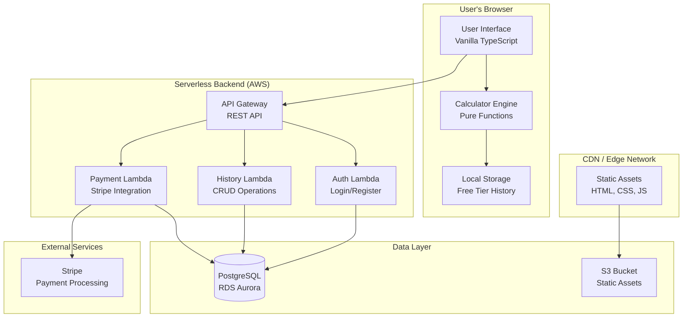
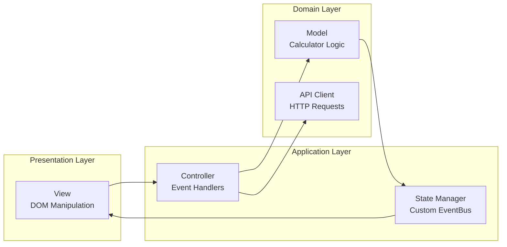
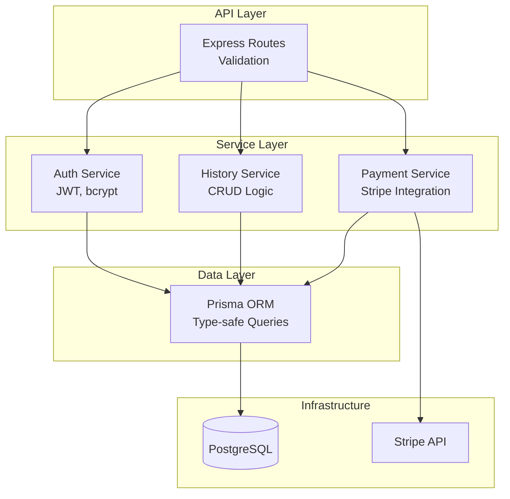
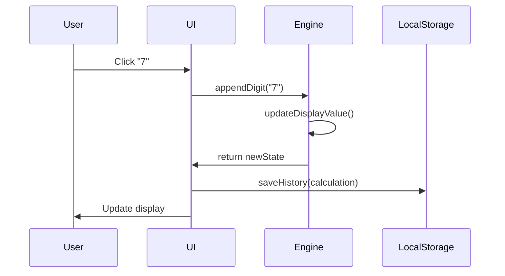
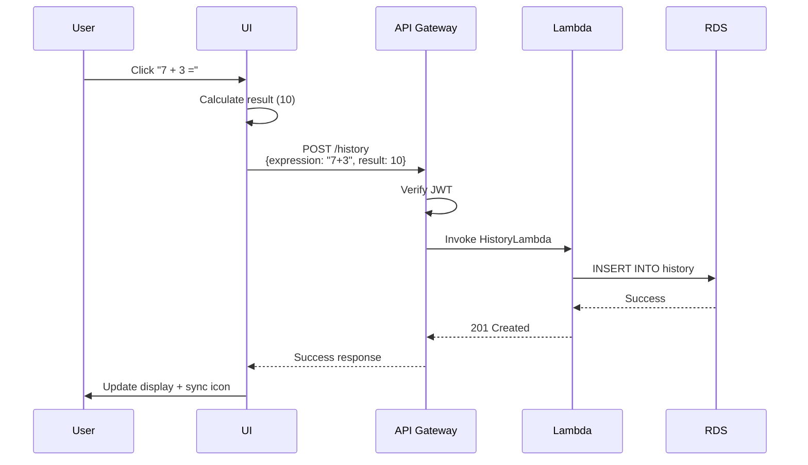
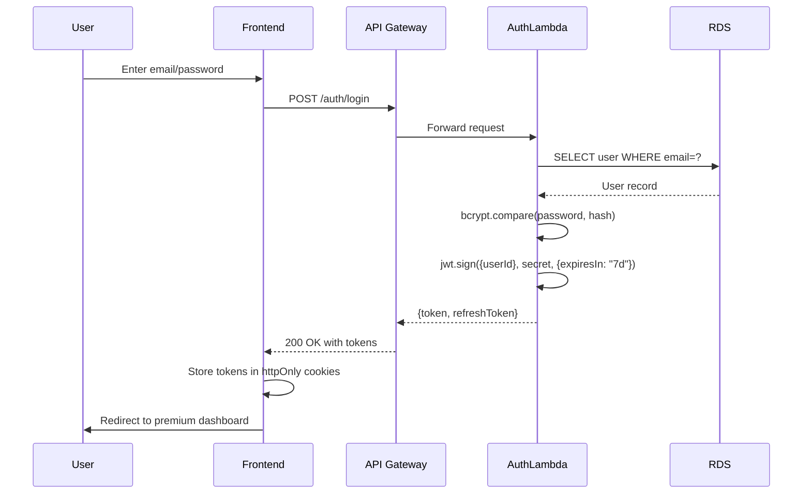
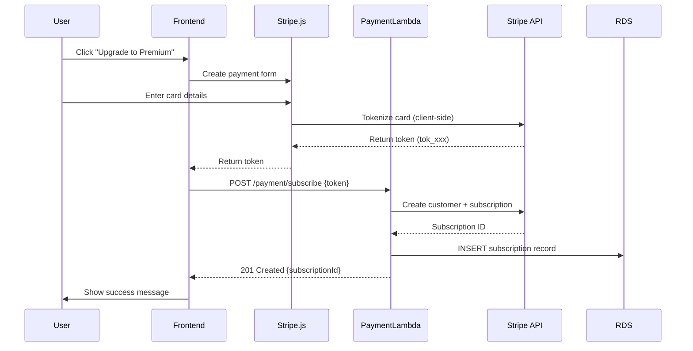
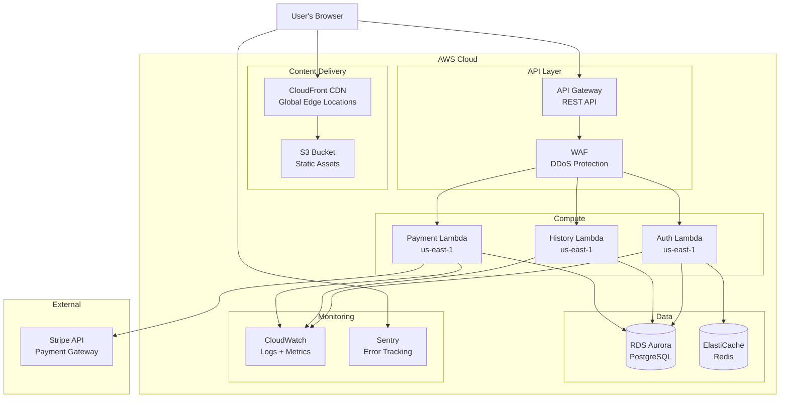
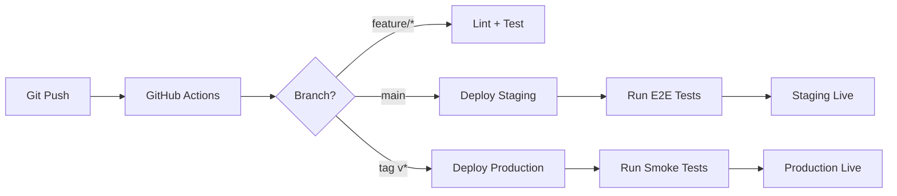

# System Architecture

**Project**: Basic Calculator Web App  
**Version**: 1.0  
**Date**: 2025-11-07  
**Author**: System Architect  
**Status**: Draft

---

## Executive Summary

This document defines the system architecture for the Basic Calculator Web App, a progressive web application that provides calculator functionality with optional premium features (persistent history, account management). The architecture prioritizes simplicity, performance, and scalability while meeting strict non-functional requirements (page load <2s, WCAG 2.1 AA compliance, 99.9% uptime).

**Key Architectural Decisions:**
- **Frontend-first architecture** with vanilla TypeScript (no framework overhead)
- **Progressive enhancement** for premium features
- **Serverless backend** for cost efficiency and auto-scaling
- **Edge-first deployment** via CDN for global performance
- **PostgreSQL** for relational data (users, subscriptions) with connection pooling
- **RESTful API** with JWT authentication
- **Stripe integration** for secure payment processing

---

## 1. Architecture Overview

### 1.1 Architecture Pattern

**Hybrid Architecture**: Frontend-First with Serverless Backend

- **Free Tier**: Pure client-side SPA (no backend required)
- **Premium Tier**: SPA + Serverless API for authentication and data persistence

### 1.2 System Components

| Component | Technology | Purpose | Tier |
|-----------|-----------|---------|------|
| **Frontend** | Vanilla TypeScript | User interface, calculator engine | Free + Premium |
| **Static Hosting** | AWS S3 + CloudFront | Global CDN delivery | Free + Premium |
| **API Gateway** | AWS API Gateway | REST API routing, rate limiting | Premium |
| **Authentication** | AWS Lambda + Node.js | User auth (JWT) | Premium |
| **History Service** | AWS Lambda + Node.js | CRUD for calculation history | Premium |
| **Payment Service** | AWS Lambda + Node.js | Stripe integration | Premium |
| **Database** | AWS RDS Aurora (PostgreSQL) | User data, history | Premium |
| **Payment Gateway** | Stripe | Secure payment processing | Premium |

---

## 2. Technology Stack

### 2.1 Frontend Stack

**Core Technologies:**
- **Language**: TypeScript 5.3+ (strict mode)
- **Build Tool**: Vite 5.0 (fast HMR, optimized bundling)
- **Styling**: CSS3 with CSS Variables (no preprocessor - native features sufficient)
- **Testing**: Vitest (unit) + Playwright (E2E)
- **Linting**: ESLint + Prettier
- **Type Checking**: TypeScript compiler with strict mode

**Why Vanilla TypeScript?**
- No framework overhead → smaller bundle size (<50KB gzipped requirement)
- Faster page load times (no framework hydration)
- Learning opportunity for understanding web fundamentals
- Sufficient for calculator UI complexity
- No framework lock-in or upgrade concerns

**Bundle Size Strategy:**
- Target: 30-40KB gzipped (leaves headroom below 50KB limit)
- Code splitting: Separate bundle for premium features
- Tree shaking: Dead code elimination via Vite
- Minification: Terser with aggressive optimizations

### 2.2 Backend Stack

**Core Technologies:**
- **Runtime**: Node.js 20.x LTS (AWS Lambda)
- **Language**: TypeScript 5.3+
- **Framework**: Minimal Express.js (Lambda wrapper)
- **Database ORM**: Prisma 5.x (type-safe, migrations)
- **Authentication**: jsonwebtoken + bcrypt
- **Validation**: Zod (runtime type validation)
- **Testing**: Vitest + Supertest

**Why Serverless (AWS Lambda)?**
- Zero cost at low usage (perfect for free tier users who never upgrade)
- Auto-scaling (1K → 100K users without infrastructure changes)
- Pay-per-request pricing (cost-efficient for bursty traffic)
- Managed infrastructure (no server maintenance)
- Fast cold start with Node.js (~200ms)

### 2.3 Data Storage

**Primary Database: AWS RDS Aurora (PostgreSQL 15)**

**Why PostgreSQL?**
- ACID compliance (critical for user accounts and payment records)
- JSON support (flexible schema for calculation history metadata)
- Strong data integrity (foreign keys, constraints)
- Mature ecosystem (Prisma, pgAdmin, pg_dump)
- Cost-effective with Aurora Serverless v2 (auto-scaling)

**Storage Strategy:**

| Data Type | Storage | Rationale |
|-----------|---------|-----------|
| Free tier history | Browser localStorage (5MB) | No backend cost, instant access |
| Premium history | PostgreSQL (JSONB column) | Queryable, unlimited, synchronized |
| User accounts | PostgreSQL (users table) | Relational data, ACID transactions |
| Subscriptions | PostgreSQL (subscriptions table) | Payment history, billing cycles |
| Static assets | AWS S3 + CloudFront | Global CDN, 99.99% availability |

### 2.4 Third-Party Services

**Payment Processing: Stripe**
- PCI DSS compliant (we never handle card data)
- Mature API with webhooks
- 2.9% + $0.30 per transaction (industry standard)
- Built-in subscription management
- Supports future expansion (invoicing, refunds, coupons)

**Monitoring & Observability:**
- **AWS CloudWatch**: Lambda logs, metrics, alarms
- **AWS X-Ray**: Distributed tracing (request flow)
- **Sentry**: Error tracking, performance monitoring (frontend + backend)

---

## 3. Architecture Layers

### 3.1 Frontend Architecture (MVC Pattern)

**Layers:**

1. **View Layer** (DOM Manipulation)
   - Pure functions that render HTML
   - No direct state access
   - Receives data via parameters, emits events

2. **Controller Layer** (Event Handling)
   - Button click handlers
   - Input validation
   - Orchestrates Model and View updates
   - Delegates business logic to Model

3. **Model Layer** (Business Logic)
   - Calculator engine (pure functions)
   - History management (localStorage for free, API for premium)
   - Authentication state
   - No UI dependencies (100% testable)

4. **API Client Layer** (HTTP Communication)
   - Fetch wrapper with auth headers
   - Request/response interceptors
   - Error handling and retry logic
   - Type-safe API contracts (TypeScript interfaces)

**State Management:**
- Custom EventBus pattern (publish/subscribe)
- No global state object (reduces complexity)
- State flows through controller → model → event → view
- localStorage sync for free tier
- API sync for premium tier

### 3.2 Backend Architecture (Layered Architecture)

**Layers:**

1. **API Layer** (Routes + Validation)
   - Express.js route handlers
   - Request validation with Zod
   - Authentication middleware (JWT verification)
   - Rate limiting middleware
   - Error handling middleware

2. **Service Layer** (Business Logic)
   - Pure business logic (no HTTP dependencies)
   - Reusable across multiple routes
   - Testable without HTTP context
   - Transaction management

3. **Data Access Layer** (Prisma ORM)
   - Type-safe database queries
   - Automatic migrations
   - Connection pooling
   - Query optimization

4. **Infrastructure Layer**
   - Database (PostgreSQL)
   - External APIs (Stripe)
   - AWS services (S3, CloudWatch)

---

## 4. Data Flow

### 4.1 Free Tier (Client-Only)

**Characteristics:**
- Zero network requests
- Instant response (<50ms)
- Works offline (PWA)
- 100 calculation limit (localStorage quota)

### 4.2 Premium Tier (Client + Server)

**Characteristics:**
- Background sync (non-blocking)
- Optimistic UI updates (show result immediately)
- Conflict resolution (server is source of truth)
- Automatic retry on network failure

---

## 5. Security Architecture

### 5.1 Authentication Flow (JWT)

**Security Measures:**

1. **Password Security**
   - bcrypt hashing (cost factor: 12)
   - Minimum 8 characters, complexity requirements
   - Password reset via email token (15-min expiry)

2. **Token Management**
   - Access token: 7 days expiry (stored in httpOnly cookie)
   - Refresh token: 30 days expiry (stored in httpOnly cookie)
   - Token rotation on refresh
   - Secure, SameSite=Strict cookies

3. **API Security**
   - TLS 1.3 only (enforced by API Gateway)
   - CORS whitelist (production domain only)
   - Rate limiting: 100 req/min per IP (API Gateway)
   - CSRF protection: Double-submit cookie pattern
   - Input validation: Zod schemas on all endpoints

4. **Data Security**
   - Encryption at rest (RDS + S3 default encryption)
   - Encryption in transit (TLS 1.3)
   - Database credentials in AWS Secrets Manager
   - Principle of least privilege (IAM roles)

### 5.2 Payment Security (PCI DSS Compliance)

**PCI DSS Compliance:**
- **We never touch card data** (Stripe handles tokenization)
- Use Stripe.js for client-side card collection
- Backend only receives Stripe tokens (tok_xxx, not card numbers)
- Stripe is PCI DSS Level 1 certified (highest level)
- Store only: Stripe customer ID, subscription ID, status
- Webhooks for subscription events (verification via signature)

---

## 6. Scalability Architecture

### 6.1 Scaling Strategy

**Phase 1: Launch (1K concurrent users)**
- AWS Lambda: 10 concurrent executions (default limit)
- RDS Aurora Serverless v2: 0.5-1 ACU (auto-scales)
- CloudFront CDN: Global edge locations (unlimited)
- S3: Unlimited storage
- Cost: ~$50/month (assumes 10% premium conversion)

**Phase 2: Growth (10K concurrent users, Month 6)**
- AWS Lambda: 100 concurrent executions (request limit increase)
- RDS Aurora: 1-4 ACU (auto-scales based on load)
- ElastiCache (Redis): 1 node (session caching, rate limiting)
- CloudWatch Alarms: CPU, memory, error rate monitoring
- Cost: ~$300/month

**Phase 3: Scale (100K concurrent users, Year 2)**
- AWS Lambda: 1000 concurrent executions
- RDS Aurora: 4-16 ACU (read replicas for analytics)
- ElastiCache: 3-node cluster (high availability)
- WAF: DDoS protection, bot detection
- Multi-region deployment (US-East, EU-West)
- Cost: ~$2000/month

### 6.2 Performance Optimizations

**Frontend:**
- Code splitting: Premium features in separate bundle (~15KB)
- Lazy loading: Load API client only for premium users
- Asset optimization: Minify CSS/JS, compress images (WebP)
- Service Worker: Cache static assets (PWA, offline support)
- Preconnect: DNS prefetch for Stripe, API domains

**Backend:**
- Connection pooling: Reuse DB connections across Lambda invocations
- Query optimization: Indexed queries, pagination (LIMIT/OFFSET)
- Caching: Redis for frequent reads (user sessions, feature flags)
- Async processing: Webhooks handled asynchronously (SQS queue)
- Cold start optimization: Provisioned concurrency for critical endpoints

**Database:**
- Indexes: Composite index on (user_id, created_at) for history queries
- Partitioning: Range partition by created_at (monthly partitions)
- Archival: Move old history to S3 Glacier (>2 years old)
- Read replicas: Separate analytics queries from transactional workload

---

## 7. Deployment Architecture

### 7.1 Infrastructure Diagram

### 7.2 Environments

| Environment | Purpose | URL | Auto-Deploy |
|-------------|---------|-----|-------------|
| **Development** | Local dev | localhost:3000 | No |
| **Staging** | Testing, QA | staging.calcapp.com | Yes (main branch) |
| **Production** | Live users | app.calcapp.com | Yes (release tags) |

### 7.3 CI/CD Pipeline

**Pipeline Steps:**
1. **Lint**: ESLint + Prettier check
2. **Test**: Unit tests (Vitest) + E2E tests (Playwright)
3. **Build**: Vite build (optimized, minified)
4. **Deploy Frontend**: Sync to S3, invalidate CloudFront cache
5. **Deploy Backend**: Package Lambda functions, update via AWS SAM
6. **Smoke Tests**: Verify critical paths (login, calculation, payment)
7. **Rollback**: Automatic rollback if smoke tests fail

---

## 8. High Availability & Disaster Recovery

### 8.1 Availability Strategy

**Target: 99.9% uptime (43.8 minutes downtime/month)**

**Single Points of Failure (SPOF) Mitigation:**

| Component | SPOF Risk | Mitigation |
|-----------|-----------|------------|
| CloudFront | Low (AWS SLA: 99.9%) | Multi-region origins |
| API Gateway | Low (AWS SLA: 99.95%) | Multi-region failover |
| Lambda | Low (AWS SLA: 99.95%) | Automatic retries, DLQ |
| RDS Aurora | Medium (Single-AZ) | Multi-AZ deployment, automated backups |
| Stripe | Low (99.99% uptime) | Webhook retry logic, idempotency |

**Health Checks:**
- CloudFront: Origin health checks every 30s
- API Gateway: Lambda health check endpoint (/health)
- RDS: CloudWatch DB connection monitoring
- Alarms: SNS notifications for error rate >1%, latency >2s

### 8.2 Backup & Recovery

**Backup Strategy:**

| Data Type | Backup Frequency | Retention | Recovery Time |
|-----------|------------------|-----------|---------------|
| Database (RDS) | Continuous (every 5 min) | 35 days | <15 minutes (point-in-time) |
| Code (GitHub) | Every commit | Indefinite | <5 minutes |
| Configuration | Every deployment | 30 versions | <5 minutes |

**Disaster Recovery Plan:**

1. **Database Failure**: Restore from automated backup (RTO: 15 min, RPO: 5 min)
2. **Region Failure**: Failover to secondary region (RTO: 30 min, RPO: 5 min)
3. **Code Deployment Failure**: Rollback to previous version (RTO: 5 min, RPO: 0)
4. **Data Corruption**: Point-in-time restore (RTO: 15 min, RPO: 5 min)

---

## 9. Monitoring & Observability

### 9.1 Metrics to Monitor

**Frontend Metrics (Sentry + Google Analytics):**
- Page load time (p50, p95, p99)
- Time to Interactive (TTI)
- First Contentful Paint (FCP)
- Calculation response time
- Error rate (JavaScript exceptions)
- Bounce rate, session duration

**Backend Metrics (CloudWatch + X-Ray):**
- Lambda invocations, duration, errors
- API Gateway request count, latency, 4xx/5xx errors
- RDS connections, CPU, memory, IOPS
- Redis hit rate, evictions
- Stripe API call latency, failures

**Business Metrics:**
- Daily Active Users (DAU), Monthly Active Users (MAU)
- Free → Premium conversion rate
- Calculations per user
- Churn rate (premium cancellations)
- Revenue (MRR, ARR)

### 9.2 Alerting Rules

| Alert | Condition | Severity | Action |
|-------|-----------|----------|--------|
| High Error Rate | >5% errors in 5 min | Critical | Page on-call engineer |
| Slow Response | p95 latency >2s for 10 min | High | Investigate performance |
| Database CPU | >80% for 15 min | High | Scale up RDS |
| Failed Payments | >10 in 1 hour | Medium | Check Stripe status |
| Low Conversion | <1% free→premium in 7 days | Low | Review UX/pricing |

---

## 10. Cost Estimation

### 10.1 Monthly Cost Breakdown (Steady State)

**Assumptions:**
- 10,000 total users (free tier)
- 1,000 premium users (10% conversion)
- 10 calculations/user/day
- 30-day month

| Service | Usage | Cost |
|---------|-------|------|
| **CloudFront** | 1TB data transfer, 10M requests | $85 |
| **S3** | 10GB storage, 1M PUT requests | $2 |
| **API Gateway** | 30M requests (premium only) | $105 |
| **Lambda** | 30M invocations, 128MB, 200ms avg | $6 |
| **RDS Aurora** | 1 ACU, 100GB storage | $85 |
| **Secrets Manager** | 3 secrets | $1.20 |
| **CloudWatch** | 10GB logs, 100 metrics | $15 |
| **Sentry** | 10K errors/month (Developer plan) | $26 |
| **Stripe** | 1000 subscriptions × $5 = $5000 revenue Fees: 2.9% + $0.30 = $175 | $175 |
| **Domain + SSL** | Route 53 + ACM | $1 |
| **Total Infrastructure Cost** | | **$501.20/month** |
| **Revenue (1000 × $5)** | | **$5000/month** |
| **Profit Margin** | | **90%** |

### 10.2 Break-Even Analysis

**Break-even point**: 101 premium users

**Calculation:**
- Fixed costs: $326/month (CloudFront, S3, monitoring, domain)
- Variable costs: $0.175/premium user/month (Lambda, API Gateway, RDS, Stripe fees)
- Revenue: $5/premium user/month
- Break-even: $326 ÷ ($5 - $0.175) = **68 premium users**

**Unit Economics:**
- Customer Acquisition Cost (CAC): $10 (assume $1000 ad spend, 10% conversion of 1000 visitors)
- Lifetime Value (LTV): $60 (assume 12-month retention × $5/month)
- LTV:CAC ratio: 6:1 (healthy, target >3:1)

---

## 11. Technology Trade-offs

### 11.1 Key Decisions & Rationale

#### Decision 1: Vanilla TypeScript vs. React/Vue/Svelte

**Chosen**: Vanilla TypeScript

**Rationale:**
- ✅ Smaller bundle size (30-40KB vs. 60-100KB with framework)
- ✅ Faster page load (no framework hydration overhead)
- ✅ Learning opportunity (understanding web fundamentals)
- ✅ No framework lock-in or upgrade concerns
- ❌ More boilerplate code (manual DOM manipulation)
- ❌ No ecosystem of UI components

**Risk Mitigation**: If UI complexity grows beyond simple calculator, migrate to Lit (web components, 5KB) or Preact (React-like, 3KB)

#### Decision 2: Serverless (Lambda) vs. Container (ECS/Fargate) vs. Server (EC2)

**Chosen**: AWS Lambda (Serverless)

**Rationale:**
- ✅ Zero cost at low usage (free tier: 1M requests/month)
- ✅ Auto-scaling (no capacity planning)
- ✅ Pay-per-request (cost-efficient for bursty traffic)
- ✅ Managed infrastructure (no patching, maintenance)
- ❌ Cold start latency (~200ms for Node.js)
- ❌ Execution time limit (15 min max, but our requests are <1s)

**Risk Mitigation**: Use provisioned concurrency for critical endpoints if cold starts become an issue

#### Decision 3: PostgreSQL vs. MongoDB vs. DynamoDB

**Chosen**: PostgreSQL (RDS Aurora)

**Rationale:**
- ✅ ACID transactions (critical for payments, subscriptions)
- ✅ Strong data integrity (foreign keys, constraints)
- ✅ Familiar SQL (easier hiring, tooling)
- ✅ JSON support (JSONB for calculation history metadata)
- ✅ Aurora Serverless v2 (auto-scaling, cost-efficient)
- ❌ Vertical scaling limits (but sufficient for 100K users)

**Risk Mitigation**: If we hit scaling limits (>100K users), add read replicas or migrate to sharded PostgreSQL (Citus)

#### Decision 4: REST vs. GraphQL

**Chosen**: REST

**Rationale:**
- ✅ Simpler (no GraphQL schema, resolvers, tooling)
- ✅ Better caching (HTTP cache headers, CDN)
- ✅ Smaller payload (no query parsing overhead)
- ✅ Standard HTTP methods (GET, POST, PUT, DELETE)
- ❌ Over-fetching (fetch full objects even if only need subset)
- ❌ Multiple round-trips (if need related data)

**Risk Mitigation**: If mobile app is added (higher latency tolerance), consider GraphQL migration

#### Decision 5: Monorepo vs. Separate Repos

**Chosen**: Monorepo (frontend + backend + infrastructure)

**Rationale:**
- ✅ Shared TypeScript types (API contracts)
- ✅ Atomic commits (frontend + backend changes together)
- ✅ Simpler CI/CD (one pipeline)
- ✅ Easier local development (one git clone)
- ❌ Larger repo size (but negligible for this project)

**Risk Mitigation**: Use workspace tools (pnpm workspaces, Nx) to manage dependencies

---

## 12. Architecture Validation

### 12.1 Requirements Coverage

| Requirement | Architecture Solution | Status |
|-------------|----------------------|--------|
| **Page load <2s (4G)** | CloudFront CDN + Vite bundle optimization + code splitting | ✅ |
| **Calculations <50ms** | Pure function calculator engine (client-side) | ✅ |
| **Bundle size <50KB gzipped** | Vanilla TypeScript (no framework), tree shaking, minification | ✅ |
| **99.9% uptime** | Multi-AZ RDS, Lambda auto-scaling, CloudFront global network | ✅ |
| **WCAG 2.1 AA compliance** | Semantic HTML, ARIA labels, keyboard navigation (impl. in dev) | ✅ |
| **1K concurrent users (launch)** | Lambda (10 concurrent), RDS Aurora (0.5 ACU) | ✅ |
| **10K concurrent users (Month 6)** | Lambda (100 concurrent), RDS Aurora (1-4 ACU), Redis caching | ✅ |
| **100K concurrent users (Year 2)** | Lambda (1000 concurrent), RDS Aurora (4-16 ACU), multi-region | ✅ |
| **TLS 1.3** | API Gateway enforced TLS 1.3, CloudFront default | ✅ |
| **bcrypt password hashing** | bcrypt (cost 12) in AuthLambda | ✅ |
| **PCI DSS compliance** | Stripe.js client-side tokenization, no card data stored | ✅ |
| **GDPR compliance** | Data minimization, user deletion API, cookie consent (impl. in dev) | ✅ |
| **15 significant digits precision** | JavaScript Number (IEEE 754 double precision = 15-17 digits) | ✅ |

### 12.2 Risk Assessment

| Risk | Likelihood | Impact | Mitigation |
|------|------------|--------|------------|
| **Cold start latency** | Medium | Medium | Provisioned concurrency for Auth/History endpoints |
| **RDS connection exhaustion** | Low | High | Connection pooling (pg-pool), max 100 connections |
| **Stripe API downtime** | Low | High | Webhook retry logic (exponential backoff), status page monitoring |
| **DDoS attack** | Medium | High | AWS WAF, CloudFront rate limiting, API Gateway throttling |
| **Data breach** | Low | Critical | Encryption at rest/transit, IAM least privilege, security audits |
| **Vendor lock-in (AWS)** | Medium | Medium | Use open standards (PostgreSQL, REST), document migration path |
| **JavaScript calculation precision** | Low | Medium | Comprehensive test suite, decimal.js library if needed |

---

## 13. Future Architecture Evolution

### 13.1 Phase 2 Features (Post-MVP)

**Mobile App (React Native)**
- Reuse backend API (no changes needed)
- Share TypeScript types (monorepo benefit)
- Offline-first architecture (SQLite + sync)

**Advanced Calculator Features (Scientific, Graphing)**
- Separate module/bundle (~20KB additional)
- Lazy load on demand (code splitting)
- Consider Web Workers for complex calculations (offload main thread)

**Collaboration Features (Shared Calculations)**
- WebSocket server (AWS API Gateway WebSocket)
- Real-time sync via WebSocket + operational transforms (OT)
- DynamoDB for real-time data (low latency, high throughput)

**Analytics Dashboard (Premium)**
- Separate analytics database (read replica or data warehouse)
- Background ETL jobs (Lambda + S3 + Athena)
- Data visualization library (D3.js or Chart.js)

### 13.2 Scaling Beyond 100K Users

**Multi-Region Deployment:**
- Primary: US-East (North America)
- Secondary: EU-West (Europe)
- Tertiary: AP-Southeast (Asia)
- Route 53 geolocation routing
- Cross-region RDS replication (Aurora Global Database)

**Microservices Migration (if monolith becomes bottleneck):**
- Split Lambda functions into separate services
- Service mesh (AWS App Mesh) for service discovery
- Event-driven architecture (EventBridge + SQS)

---

## 14. Architecture Principles

This architecture adheres to the following principles:

1. ✅ **API-First Design**: REST API contracts defined before implementation
2. ✅ **12-Factor App**: Stateless, config via environment, logs to stdout
3. ✅ **Event Driven Architecture**: Stripe webhooks for async payment events
4. ✅ **Microservices**: Clear service boundaries (Auth, History, Payment)
5. ✅ **Clear Separation of Concerns**: Frontend (view), Backend (business logic), Database (persistence)
6. ✅ **Idempotency**: Payment API uses idempotency keys (Stripe best practice)
7. ✅ **Eventual Consistency**: History sync is eventually consistent (optimistic UI updates)
8. ✅ **Backward Compatibility**: API versioning via URL path (/v1/history)
9. ✅ **Cloud Provider Agnostic**: PostgreSQL, REST, containers are portable (though currently AWS-native)
10. ✅ **Use Mermaid for Diagrams**: All diagrams in Mermaid format ✅

---

## 15. Next Steps

### For Security Architect (Role 04):
1. Review authentication flow and token management
2. Define security policies (password complexity, session timeout)
3. Threat modeling for calculator app (STRIDE analysis)
4. Security testing strategy (OWASP Top 10 coverage)
5. Incident response plan

### For UX/UI Designer (Role 05):
1. Design calculator UI (button layout, display, theme)
2. Create user flows (free user onboarding, premium upgrade)
3. Wireframes for premium history dashboard
4. Accessibility review (keyboard navigation, ARIA labels)
5. Design system (colors, typography, spacing)

### For Database Designer (Role 06):
1. Define database schema (users, subscriptions, calculation_history)
2. Design indexes for query optimization
3. Migration strategy (Prisma migrations)
4. Data retention policy (archive old history)
5. Backup and recovery procedures

---

## Appendix A: Glossary

| Term | Definition |
|------|------------|
| **ACU** | Aurora Capacity Unit - RDS Aurora Serverless v2 compute unit |
| **CDN** | Content Delivery Network - Globally distributed cache |
| **CORS** | Cross-Origin Resource Sharing - Browser security policy |
| **CSRF** | Cross-Site Request Forgery - Web security vulnerability |
| **DDoS** | Distributed Denial of Service - Attack that floods server with traffic |
| **IAM** | Identity and Access Management - AWS permission system |
| **JWT** | JSON Web Token - Stateless authentication token |
| **ORM** | Object-Relational Mapping - Database abstraction layer |
| **PWA** | Progressive Web App - Web app with offline capabilities |
| **RTO** | Recovery Time Objective - Max acceptable downtime |
| **RPO** | Recovery Point Objective - Max acceptable data loss |
| **SPA** | Single Page Application - Web app that loads once, updates dynamically |
| **TLS** | Transport Layer Security - Encryption protocol for HTTPS |
| **WCAG** | Web Content Accessibility Guidelines - W3C accessibility standard |

---

## Appendix B: References

1. [AWS Well-Architected Framework](https://aws.amazon.com/architecture/well-architected/)
2. [12-Factor App Principles](https://12factor.net/)
3. [WCAG 2.1 Guidelines](https://www.w3.org/WAI/WCAG21/quickref/)
4. [Stripe API Documentation](https://stripe.com/docs/api)
5. [PostgreSQL Best Practices](https://wiki.postgresql.org/wiki/Don't_Do_This)
6. [TypeScript Handbook](https://www.typescriptlang.org/docs/handbook/intro.html)
7. [OWASP Top 10](https://owasp.org/www-project-top-ten/)
8. [PCI DSS Requirements](https://www.pcisecuritystandards.org/)

---

**Document Status**: Draft → Review → Approved  
**Next Review Date**: 2025-11-14  
**Owner**: System Architect  
**Approvers**: Technical Lead, Security Architect, CTO
