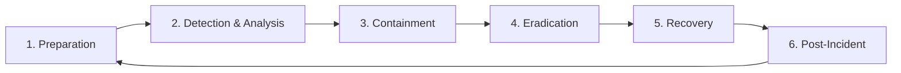

# Incident Response Plan

**Project**: Basic Calculator Web App  
**Version**: 1.0  
**Date**: 2025-11-07  
**Author**: Security Architect  
**Status**: Draft

---

## Executive Summary

This Incident Response Plan defines the procedures, roles, and responsibilities for responding to security incidents affecting the Basic Calculator Web App. The plan follows the NIST Incident Response lifecycle and ensures rapid detection, containment, and recovery from security events while maintaining compliance with GDPR breach notification requirements (72-hour notification window).

**Key Objectives:**

- **Rapid Response**: Detect and respond to incidents within 15 minutes
- **Minimize Impact**: Contain threats before data loss or service disruption
- **Compliance**: Meet GDPR 72-hour breach notification requirement
- **Continuous Improvement**: Learn from incidents to prevent recurrence
- **Transparency**: Communicate appropriately with users and stakeholders

---

## Table of Contents

1. [Incident Response Team](#1-incident-response-team)
2. [Incident Classification](#2-incident-classification)
3. [Incident Response Lifecycle](#3-incident-response-lifecycle)
4. [Detection and Analysis](#4-detection-and-analysis)
5. [Containment Strategies](#5-containment-strategies)
6. [Eradication and Recovery](#6-eradication-and-recovery)
7. [Post-Incident Activities](#7-post-incident-activities)
8. [Communication Plan](#8-communication-plan)
9. [Incident Response Playbooks](#9-incident-response-playbooks)
10. [Tools and Resources](#10-tools-and-resources)

---

## 1. Incident Response Team

### 1.1 Core Team Members

| Role | Responsibilities | Primary | Backup |
|------|------------------|---------|--------|
| **Incident Commander** | Overall coordination, decision making | CTO | Technical Lead |
| **Security Lead** | Security analysis, forensics | Security Architect | Senior Developer |
| **Technical Lead** | System recovery, code fixes | Technical Lead | Backend Lead |
| **Communications Lead** | Stakeholder communication, PR | CEO/COO | Product Manager |
| **Legal Advisor** | Compliance, regulatory notification | Legal Counsel | External Advisor |

### 1.2 Extended Team (as needed)

- **AWS Support** (Enterprise support contract)
- **Stripe Support** (payment-related incidents)
- **External Security Firm** (forensics, remediation)
- **PR Agency** (major breach, public response)

### 1.3 Contact Information

**Emergency Contact List:** (Store securely, not in public docs)

```
Incident Commander: [Name] - [Phone] - [Email]
Security Lead: [Name] - [Phone] - [Email]
Technical Lead: [Name] - [Phone] - [Email]
AWS Support: 1-800-AWS-SUPPORT
Stripe Support: support@stripe.com
External Security Firm: [Contact details]
```

### 1.4 Escalation Matrix

```
P0 (Critical) → Immediate page → Incident Commander + Security Lead + CTO
P1 (High) → Alert within 15 min → Incident Commander + Security Lead
P2 (Medium) → Alert within 1 hour → Security Lead + Technical Lead
P3 (Low) → Email notification → Security Lead
```

---

## 2. Incident Classification

### 2.1 Severity Levels

**P0 - Critical (< 15 minute response)**

- Active data breach (PII, payment data)
- Complete service outage
- Ransomware attack
- Database compromise
- Authentication system compromise

**P1 - High (< 1 hour response)**

- Suspected data breach (investigation needed)
- Partial service outage
- Successful exploitation of vulnerability
- Unauthorized access to system
- DDoS attack (service degraded)

**P2 - Medium (< 4 hour response)**

- Vulnerability discovered (not yet exploited)
- Failed intrusion attempt
- Malware detected (contained)
- Security misconfiguration discovered
- Unusual activity patterns

**P3 - Low (< 24 hour response)**

- Spam or phishing emails to users
- Minor security policy violation
- Outdated dependency with low-risk CVE
- Security awareness training needed

### 2.2 Incident Categories

**1. Data Breach** - Unauthorized access to user data  
**2. Service Disruption** - DDoS, system failure, sabotage  
**3. Account Compromise** - Stolen credentials, session hijacking  
**4. Malware/Ransomware** - Malicious code execution  
**5. Insider Threat** - Malicious or negligent employee action  
**6. Third-Party Compromise** - AWS, Stripe, or other vendor breach  
**7. Application Vulnerability** - Exploitable bug in code  
**8. Social Engineering** - Phishing, pretexting, baiting  

---

## 3. Incident Response Lifecycle

### 3.1 NIST Incident Response Phases



**Phase 1: Preparation** (Ongoing)

- Maintain incident response plan
- Train incident response team
- Deploy monitoring tools
- Establish communication channels

**Phase 2: Detection & Analysis** (Minutes)

- Monitor alerts from CloudWatch, Sentry, ZAP
- Analyze logs and forensic evidence
- Determine incident severity and scope
- Document initial findings

**Phase 3: Containment** (< 15 minutes for P0)

- Short-term containment (isolate affected systems)
- Preserve forensic evidence
- Implement temporary mitigations
- Prevent incident spread

**Phase 4: Eradication** (Hours to Days)

- Remove threat (patch, delete malware, revoke access)
- Identify root cause
- Strengthen defenses
- Verify threat eliminated

**Phase 5: Recovery** (Hours to Days)

- Restore systems from clean backups
- Verify system integrity
- Monitor for recurrence
- Return to normal operations

**Phase 6: Post-Incident Activities** (Within 1 week)

- Conduct post-incident review
- Document lessons learned
- Update incident response plan
- Implement preventive measures

---

## 4. Detection and Analysis

### 4.1 Detection Sources

**Automated Detection:**

| Source | Alert Type | Example |
|--------|-----------|---------|
| **CloudWatch Alarms** | Metric threshold | Failed logins > 50/5min |
| **AWS GuardDuty** | Threat detection | Suspicious API calls |
| **Sentry** | Application errors | Uncaught exceptions |
| **OWASP ZAP** | Vulnerability scan | XSS detected |
| **Snyk** | Dependency CVE | Critical npm vulnerability |
| **AWS WAF** | Attack patterns | SQL injection attempt |

**Manual Detection:**

- User reports (support tickets, emails)
- Security researcher disclosure
- Internal security audit findings
- News/social media (breach announcements)
- Third-party security notifications

### 4.2 Initial Assessment

**First 5 Minutes:**

1. ✅ **Verify Incident**: Is this a real security incident? (False positive check)
2. ✅ **Classify Severity**: P0, P1, P2, or P3?
3. ✅ **Notify Incident Commander**: Page or alert per escalation matrix
4. ✅ **Preserve Evidence**: Capture logs, screenshots, system state
5. ✅ **Document**: Start incident log (time, actions, findings)

**Incident Log Template:**

```
INCIDENT ID: INC-2025-001
Date/Time: 2025-11-07 14:35:00 UTC
Severity: P0
Category: Data Breach
Reporter: CloudWatch Alarm
Status: ACTIVE

Timeline:
[14:35] CloudWatch alarm: Unusual database query pattern
[14:37] Security Lead notified
[14:40] Database logs reviewed - SQL injection attempt detected
[14:42] Incident Commander paged
[14:45] Containment actions initiated...
```

### 4.3 Indicators of Compromise (IOCs)

**Authentication Anomalies:**

- Multiple failed login attempts from single IP
- Successful login from unusual location/device
- Login outside business hours (for admin accounts)
- Password reset requests without user action

**Application Anomalies:**

- Unusual API request patterns (frequency, endpoints)
- Requests with malicious payloads (XSS, SQL injection)
- Access to resources outside user's permissions
- Large data export requests

**Infrastructure Anomalies:**

- Unexpected AWS API calls (IAM changes, S3 access)
- Database queries with suspicious patterns
- Network traffic to unknown IP addresses
- CPU/memory spikes without justification

**Data Anomalies:**

- Unauthorized database modifications
- Missing or corrupted data
- Unusual data access patterns
- File integrity changes

---

## 5. Containment Strategies

### 5.1 Short-Term Containment (< 15 minutes)

**Goals:** Stop the bleeding, prevent spread, preserve evidence

**Actions by Incident Type:**

**Data Breach:**

```bash
# 1. Revoke compromised JWT tokens
aws dynamodb put-item \
  --table-name token-blacklist \
  --item '{"jti":{"S":"compromised_token_id"},"expiry":{"N":"1699999999"}}'

# 2. Disable compromised user accounts
prisma studio # or direct DB query
UPDATE users SET is_active = false WHERE id IN ('user_123', 'user_456');

# 3. Rotate JWT secret (force all users to re-authenticate)
aws secretsmanager update-secret \
  --secret-id jwt-secret \
  --secret-string "$(openssl rand -base64 32)"

# 4. Enable additional WAF rules
aws wafv2 update-web-acl # Block suspicious IP ranges
```

**DDoS Attack:**

```bash
# 1. Enable stricter rate limiting in API Gateway
aws apigateway update-stage \
  --rest-api-id abc123 \
  --stage-name prod \
  --patch-operations op=replace,path=/throttle/rateLimit,value=10

# 2. Add IP blocks to WAF
aws wafv2 update-ip-set # Block attacking IPs

# 3. Enable AWS Shield Advanced (if not already)
# Contact AWS support for immediate DDoS mitigation
```

**Account Compromise:**

```bash
# 1. Invalidate all user's refresh tokens
UPDATE users SET refresh_token_version = refresh_token_version + 1 
WHERE email = 'compromised@example.com';

# 2. Force password reset
UPDATE users SET password_reset_required = true, reset_token = '...' 
WHERE email = 'compromised@example.com';

# 3. Send security alert email to user
# (Automated via incident response script)
```

**Malware/Backdoor:**

```bash
# 1. Isolate infected Lambda function
aws lambda update-function-configuration \
  --function-name compromised-function \
  --environment '{"Variables":{"MAINTENANCE_MODE":"true"}}'

# 2. Remove malicious code
# Deploy previous known-good version
aws lambda update-function-code \
  --function-name compromised-function \
  --s3-bucket backups --s3-key lambda-v1.2.3.zip

# 3. Audit all recent deployments
# Review GitHub Actions logs for unauthorized pushes
```

### 5.2 Evidence Preservation

**Critical: Preserve evidence BEFORE making changes**

```bash
# 1. Capture database state
pg_dump -h db-endpoint -U admin calcapp > incident-db-backup-$(date +%s).sql

# 2. Export CloudWatch logs
aws logs create-export-task \
  --log-group-name /aws/lambda/api \
  --from $(date -d '2 hours ago' +%s)000 \
  --to $(date +%s)000 \
  --destination incident-logs-bucket

# 3. Snapshot RDS database (point-in-time recovery)
aws rds create-db-snapshot \
  --db-instance-identifier calcapp-prod \
  --db-snapshot-identifier incident-snapshot-$(date +%s)

# 4. Export Lambda function code
aws lambda get-function \
  --function-name api-auth \
  --query 'Code.Location' \
  --output text | xargs wget -O lambda-auth-incident.zip

# 5. Document all actions in incident log
```

### 5.3 Forensic Collection

**Data to Collect:**

- [ ] CloudWatch logs (API Gateway, Lambda, RDS)
- [ ] Database query logs (slow query log, audit log)
- [ ] AWS CloudTrail logs (API calls, IAM changes)
- [ ] Application logs (Sentry, custom logs)
- [ ] Network flow logs (VPC Flow Logs)
- [ ] WAF logs (attack patterns)
- [ ] User session data (JWT claims, cookies)
- [ ] Git commit history (code changes)
- [ ] CI/CD logs (GitHub Actions)

**Chain of Custody:**

```
Evidence ID: EVIDENCE-001
Item: Database backup (incident-db-backup-1699373760.sql)
Collected By: Security Lead
Date/Time: 2025-11-07 14:42:30 UTC
Hash (SHA-256): a1b2c3d4e5f6...
Storage Location: s3://incident-evidence/INC-2025-001/
Access Control: Incident response team only
```

---

## 6. Eradication and Recovery

### 6.1 Eradication Steps

**Goal:** Remove the threat completely

**1. Identify Root Cause**

- Code vulnerability? → Patch code
- Misconfiguration? → Fix configuration
- Compromised credentials? → Rotate all secrets
- Third-party issue? → Contact vendor, implement workaround

**2. Remove Threat**

```bash
# Example: Patch SQL injection vulnerability

# 1. Deploy hotfix (emergency deployment)
git checkout -b hotfix/sql-injection-fix
# Apply patch
git commit -m "SECURITY: Fix SQL injection in /v1/history endpoint"
git push origin hotfix/sql-injection-fix

# 2. Merge to main and deploy (skip normal approval for P0)
gh pr create --title "SECURITY HOTFIX: SQL injection" --emergency
gh pr merge --admin --delete-branch

# 3. Trigger production deployment
gh workflow run deploy-production.yml

# 4. Verify fix deployed
curl https://api.calcapp.com/v1/health
```

**3. Strengthen Defenses**

- Add WAF rules to block exploit attempts
- Implement additional input validation
- Enable stricter rate limiting
- Add security monitoring for similar patterns
- Update security documentation

**4. Verify Threat Eliminated**

- Run security scans (OWASP ZAP, Burp Suite)
- Review logs for continued attack attempts
- Monitor for behavioral indicators
- Conduct peer review of fixes

### 6.2 Recovery Process

**Goal:** Restore normal operations safely

**Phase 1: System Verification** (Before restoration)

- [ ] All malicious code removed
- [ ] Vulnerabilities patched
- [ ] Security controls strengthened
- [ ] Monitoring enhanced
- [ ] Forensic analysis complete (or in progress with systems secured)

**Phase 2: Restoration from Backups** (if needed)

```bash
# If database compromised, restore from clean backup

# 1. Identify last known-good backup (before compromise)
aws rds describe-db-snapshots \
  --db-instance-identifier calcapp-prod

# 2. Restore database to new instance
aws rds restore-db-instance-from-db-snapshot \
  --db-instance-identifier calcapp-prod-restored \
  --db-snapshot-identifier pre-incident-snapshot

# 3. Verify data integrity
# Run validation queries, check record counts

# 4. Switch application to restored database
# Update Lambda environment variables
aws lambda update-function-configuration \
  --function-name api-auth \
  --environment 'Variables={DB_HOST=calcapp-prod-restored.abc.rds.amazonaws.com}'

# 5. Monitor for issues
# Watch error logs, test critical functions
```

**Phase 3: Staged Rollout**

1. **Internal Testing** (15 minutes)
   - Test all critical functions (login, calculations, payments)
   - Verify security controls working
   - Check performance metrics

2. **Limited Rollout** (1 hour)
   - Enable for 1% of users (canary deployment)
   - Monitor error rates, performance
   - Watch for anomalies

3. **Full Rollout** (2-4 hours)
   - Gradually increase traffic (10% → 50% → 100%)
   - Continuous monitoring
   - Rollback plan ready

**Phase 4: Monitoring**

- **First 24 hours**: Continuous monitoring, on-call team
- **First week**: Daily security reviews, enhanced alerting
- **First month**: Weekly security checks, anomaly detection

---

## 7. Post-Incident Activities

### 7.1 Post-Incident Review (PIR)

**Schedule:** Within 1 week of incident resolution

**Attendees:**

- Incident response team
- Development team
- Management (CEO, CTO)
- External consultants (if involved)

**Agenda:**

1. **Incident Timeline** (What happened? When?)
2. **Root Cause Analysis** (Why did it happen?)
3. **Response Effectiveness** (What went well? What didn't?)
4. **Lessons Learned** (What should we do differently?)
5. **Action Items** (Preventive measures, process improvements)

**PIR Template:**

```markdown
# Post-Incident Review: INC-2025-001

**Incident**: SQL Injection Data Breach
**Date**: 2025-11-07
**Severity**: P0 (Critical)
**Duration**: 3 hours (detection to resolution)

## What Happened

[Detailed incident description]

## Timeline

| Time | Event | Action Taken |
|------|-------|--------------|
| 14:35 | CloudWatch alarm triggered | Security Lead notified |
| 14:40 | SQL injection confirmed | Incident Commander paged |
| ... | ... | ... |

## Root Cause

[Why the incident occurred - technical and process failures]

## What Went Well

- Rapid detection (5 minutes)
- Clear escalation process
- Effective communication
- Evidence preservation

## What Didn't Go Well

- Delayed containment (15 minutes to revoke tokens)
- Unclear ownership for AWS changes
- Incomplete forensic tooling

## Action Items

| Action | Owner | Due Date | Status |
|--------|-------|----------|--------|
| Implement input validation library | Tech Lead | 2025-11-14 | In Progress |
| Add SQL injection detection to WAF | Security | 2025-11-10 | Done |
| Update incident response runbook | Security | 2025-11-12 | Pending |
| Security training for developers | CTO | 2025-12-01 | Planned |

## Metrics

- Time to Detect: 5 minutes
- Time to Contain: 15 minutes
- Time to Eradicate: 2 hours
- Time to Recover: 45 minutes
- Users Affected: 237
- Data Exposed: Email addresses (no passwords or payment data)
- Cost: $15K (incident response, PR, notifications)
```

### 7.2 Regulatory Reporting

**GDPR Breach Notification** (if personal data affected)

**Timeline:** Within 72 hours of becoming aware

**Notification to Supervisory Authority:**

```
To: UK Information Commissioner's Office (ICO)
Subject: Personal Data Breach Notification - CalcApp Ltd

Dear ICO,

We are writing to report a personal data breach affecting CalcApp Ltd users.

1. DESCRIPTION OF BREACH
   - Nature: SQL injection attack leading to unauthorized database access
   - Date/Time: 2025-11-07, 14:30-17:30 UTC
   - Data Affected: 237 user email addresses (no passwords, payment data)

2. CONSEQUENCES
   - Low risk: Email addresses only, no sensitive data
   - Potential phishing risk for affected users

3. MEASURES TAKEN
   - SQL injection vulnerability patched (14:50)
   - Affected users notified (15:30)
   - Enhanced security monitoring implemented
   - Full security audit scheduled

4. CONTACT
   Name: [Data Protection Officer]
   Email: dpo@calcapp.com
   Phone: +44-xxx-xxx-xxxx

Regards,
CalcApp Ltd Data Protection Officer
```

**Notification to Affected Users:**

```
Subject: Important Security Notice - Action Required

Dear [User Name],

We are writing to inform you of a security incident that may have affected
your CalcApp account.

WHAT HAPPENED
On November 7, 2025, we detected and stopped a security breach that exposed
your email address to an unauthorized party. No passwords, payment details,
or calculation history were accessed.

WHAT WE'VE DONE
- Immediately patched the vulnerability (within 20 minutes)
- Enhanced our security monitoring
- Conducted a full security audit
- Reported the incident to the UK ICO (regulatory requirement)

WHAT YOU SHOULD DO
- Be alert for phishing emails (we will never ask for your password via email)
- Consider changing your password as a precaution
- Enable two-factor authentication when available (coming soon)
- Report suspicious emails to security@calcapp.com

We sincerely apologize for this incident and any concern it may cause.
Security is our top priority, and we are committed to protecting your data.

For questions, please contact: support@calcapp.com or +44-xxx-xxx-xxxx

Regards,
CalcApp Security Team
```

### 7.3 Documentation Updates

**Update Following Documents:**

- [ ] Incident Response Plan (this document)
- [ ] Security Architecture
- [ ] Security Runbook (add new playbook)
- [ ] Security Training Materials
- [ ] Monitoring Alert Thresholds
- [ ] WAF Rules
- [ ] Incident Response Team Contact List

---

## 8. Communication Plan

### 8.1 Internal Communication

**Incident Declared (P0/P1):**

- Slack: Post in #security-incidents channel
- Email: security-team@calcapp.com
- SMS: Page on-call team (PagerDuty)

**Regular Updates:**

- **P0**: Every 30 minutes
- **P1**: Every 1 hour
- **P2**: Every 4 hours

**Incident Resolved:**

- Post-mortem summary to #engineering
- All-hands update (for major incidents)

### 8.2 External Communication

**User Notification:** (When required)

- Criteria: Data breach, extended outage (>4 hours), security risk to users
- Method: Email, in-app banner, status page
- Timeline: As soon as facts are confirmed (within 4 hours for P0)

**Media/Press:** (For major incidents)

- Spokesperson: CEO or Communications Lead only
- Message: Prepared statement, reviewed by legal
- Channel: Press release, social media, blog post

**Regulatory Notification:**

- GDPR: Within 72 hours to ICO
- PCI DSS: Immediate notification to Stripe, card brands
- AWS: Report security incidents affecting AWS resources

### 8.3 Status Page

**Update:** <https://status.calcapp.com>

```markdown
# Incident Update - November 7, 2025

**Status**: Resolved
**Severity**: Critical
**Affected Services**: Web Application, API

## Timeline

**14:35 UTC** - We detected a security vulnerability and immediately began
investigation.

**14:50 UTC** - Vulnerability patched. Service remains available.

**15:30 UTC** - Affected users notified. Incident resolved.

**17:00 UTC** - Full security audit completed. No further issues found.

## Impact

A small number of users (237) had their email addresses exposed. No passwords,
payment details, or calculation history were accessed.

## Next Steps

We have implemented additional security measures and are conducting a full
security review. Affected users have been notified directly.

For questions: support@calcapp.com
```

---

## 9. Incident Response Playbooks

### 9.1 Playbook: Data Breach

**Scenario:** Unauthorized access to user data (emails, history, payment records)

**Immediate Actions (< 15 minutes):**

1. ✅ Confirm breach (verify unauthorized access in logs)
2. ✅ Identify scope (how many users? what data?)
3. ✅ Contain breach (revoke access, block IP, patch vulnerability)
4. ✅ Preserve evidence (database snapshot, log export)
5. ✅ Notify Incident Commander and Legal

**Investigation (< 1 hour):**

1. Review database audit logs
2. Identify attack vector (SQL injection? Stolen credentials?)
3. Determine data accessed (SELECT queries in logs)
4. Assess risk to users (PII? Payment data? Passwords?)

**Remediation (< 4 hours):**

1. Patch vulnerability
2. Rotate all credentials (JWT secrets, DB passwords, API keys)
3. Force password reset for affected users
4. Deploy enhanced monitoring

**Notification (< 72 hours for GDPR):**

1. Notify affected users (email)
2. Notify ICO (regulatory requirement)
3. Notify Stripe (if payment data affected)
4. Post status page update

### 9.2 Playbook: DDoS Attack

**Scenario:** High volume of traffic overwhelming service

**Immediate Actions (< 15 minutes):**

1. ✅ Confirm DDoS (vs legitimate traffic spike)
2. ✅ Enable AWS Shield Advanced (if not already)
3. ✅ Tighten rate limits (API Gateway throttling)
4. ✅ Block attacking IPs (WAF rules)
5. ✅ Scale infrastructure (increase Lambda concurrency, RDS capacity)

**Mitigation (< 1 hour):**

1. Analyze attack pattern (source IPs, request types, timing)
2. Create WAF rules to block attack signature
3. Enable geo-blocking if attack from specific region
4. Contact AWS Support for DDoS mitigation assistance
5. Monitor costs (unexpected AWS charges)

**Recovery:**

1. Gradually relax rate limits
2. Monitor for renewed attacks
3. Document attack pattern for future prevention

### 9.3 Playbook: Account Takeover

**Scenario:** User account accessed by unauthorized party

**Immediate Actions (< 15 minutes):**

1. ✅ Disable compromised account
2. ✅ Invalidate all user's sessions (increment refresh_token_version)
3. ✅ Review recent activity (API calls, data access, changes)
4. ✅ Notify user (email, SMS if available)
5. ✅ Determine attack method (credential stuffing? Phishing? Brute force?)

**Investigation:**

1. Check for similar compromises (same attack pattern on other accounts)
2. Review authentication logs (login attempts, IP addresses)
3. Assess damage (what did attacker access? modify? delete?)

**Remediation:**

1. Force password reset for user
2. Restore user data from backup (if modified)
3. Implement additional controls (brute force protection, suspicious login alerts)

### 9.4 Playbook: Malicious Code Deployment

**Scenario:** Backdoor or malicious code deployed to production

**Immediate Actions (< 15 minutes):**

1. ✅ Identify affected components (which Lambda? which version?)
2. ✅ Rollback to previous known-good version
3. ✅ Isolate affected systems (disable functions if needed)
4. ✅ Preserve evidence (download malicious code, logs)
5. ✅ Review recent deployments (GitHub Actions logs, git commits)

**Investigation:**

1. Determine how malicious code was deployed (compromised CI/CD? Insider?)
2. Analyze malicious code (what does it do?)
3. Check for data exfiltration (outbound network connections)

**Remediation:**

1. Rotate all deployment credentials (GitHub tokens, AWS keys)
2. Review and harden CI/CD pipeline
3. Code review all recent commits
4. Deploy clean version with enhanced security

### 9.5 Playbook: Third-Party Compromise

**Scenario:** AWS, Stripe, or other vendor reports security incident

**Immediate Actions (< 1 hour):**

1. ✅ Assess impact on our systems (which services use affected vendor?)
2. ✅ Review vendor's security advisory (what data? what actions needed?)
3. ✅ Rotate credentials (if vendor stores our secrets)
4. ✅ Notify users (if their data potentially affected)

**Mitigation:**

1. Follow vendor's remediation guidance
2. Implement additional controls (enhanced monitoring)
3. Evaluate vendor relationship (consider alternatives if severe)

---

## 10. Tools and Resources

### 10.1 Incident Response Tools

**Communication:**

- Slack: #security-incidents channel
- PagerDuty: On-call alerting
- Zoom: Incident war room (video bridge)
- Email: security-team@calcapp.com

**Forensics & Analysis:**

- AWS CloudWatch Insights: Log analysis
- AWS CloudTrail: API activity audit
- Prisma Studio: Database inspection
- Wireshark: Network packet capture (if needed)
- OWASP ZAP: Vulnerability verification

**Containment & Recovery:**

- AWS Console: Infrastructure changes
- GitHub: Code deployment (hotfixes)
- Terraform: Infrastructure as code updates
- Database backups: RDS snapshots, pg_dump

### 10.2 Contact List

**Internal:**

- Incident Response Team: (see section 1.1)
- Legal: legal@calcapp.com
- PR/Communications: pr@calcapp.com
- Customer Support: support@calcapp.com

**External:**

- AWS Support: 1-800-AWS-SUPPORT (Enterprise Support)
- Stripe Support: support@stripe.com
- Security Firm (Forensics): [External consultant]
- Legal Counsel: [External law firm]
- PR Agency: [External PR firm]

**Regulatory:**

- UK ICO (GDPR): <https://ico.org.uk/for-organisations/report-a-breach/>
- PCI SSC: <https://www.pcisecuritystandards.org/>

### 10.3 Documentation

**Incident Response Documents:**

- Incident Response Plan (this document)
- Security Architecture
- Security Runbook
- Security Testing Plan
- Disaster Recovery Plan
- Business Continuity Plan

**Templates:**

- Incident Log Template (see section 4.2)
- Post-Incident Review Template (see section 7.1)
- User Notification Email Template (see section 7.2)
- Press Release Template
- GDPR Breach Notification Template

---

## Summary

This Incident Response Plan provides a structured approach to handling security incidents:

1. **Prepared Team**: Clear roles, responsibilities, and contact information
2. **Rapid Response**: 15-minute response time for critical incidents
3. **Systematic Approach**: NIST lifecycle (Detect → Contain → Eradicate → Recover)
4. **Evidence Preservation**: Forensic collection for investigation and compliance
5. **Compliance**: GDPR 72-hour notification, regulatory reporting
6. **Continuous Improvement**: Post-incident reviews, lessons learned, plan updates

**Next Steps:**

1. Review and approve incident response plan
2. Train incident response team (tabletop exercises)
3. Test communication channels (Slack, PagerDuty)
4. Conduct incident response drill (simulated breach)
5. Review and update quarterly

---

**Document Approval:**

| Role | Name | Date | Signature |
|------|------|------|-----------|
| Security Architect | [TBD] | 2025-11-07 | [Pending] |
| CTO | [TBD] | [Pending] | [Pending] |
| Legal Counsel | [TBD] | [Pending] | [Pending] |
| CEO | [TBD] | [Pending] | [Pending] |

---

**Change Log:**

| Version | Date | Author | Changes |
|---------|------|--------|---------|
| 1.0 | 2025-11-07 | Security Architect | Initial draft |

---

**Review Schedule:**

- **Quarterly**: Review and update incident response plan
- **After Incident**: Update based on lessons learned
- **Annual**: Full incident response drill and plan revision
