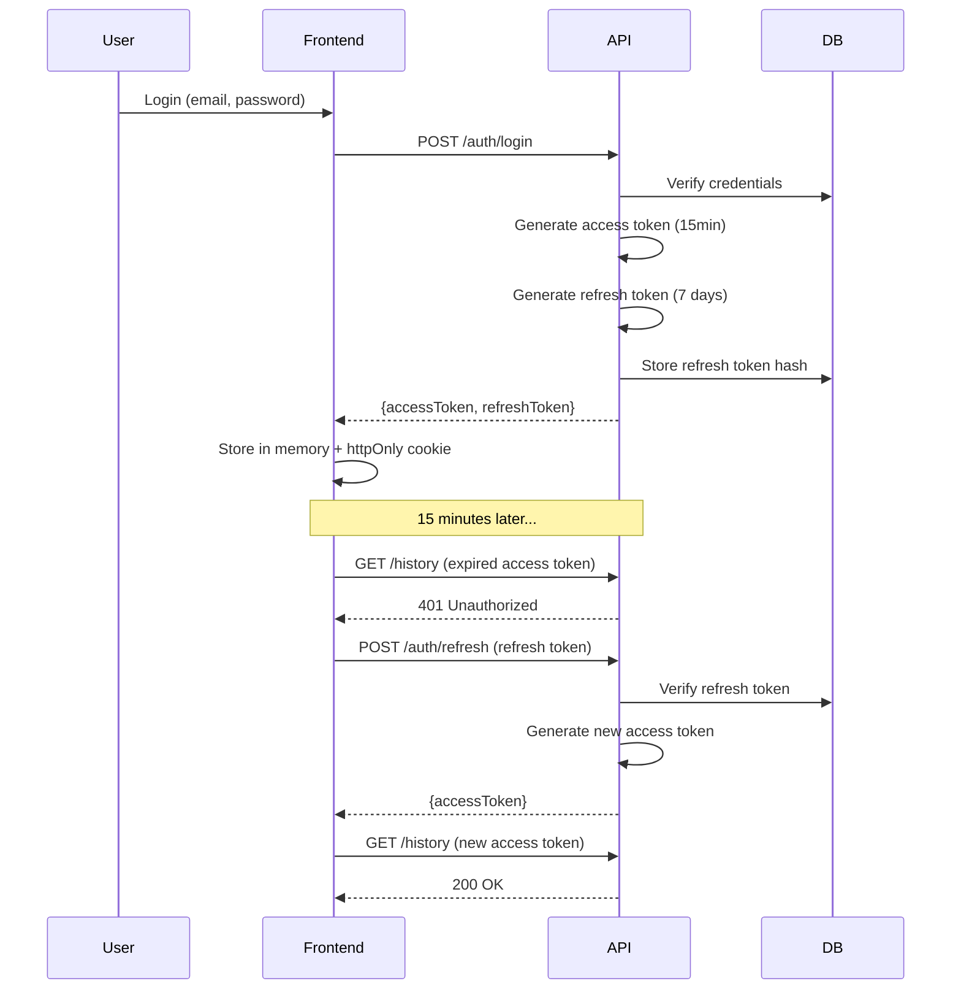
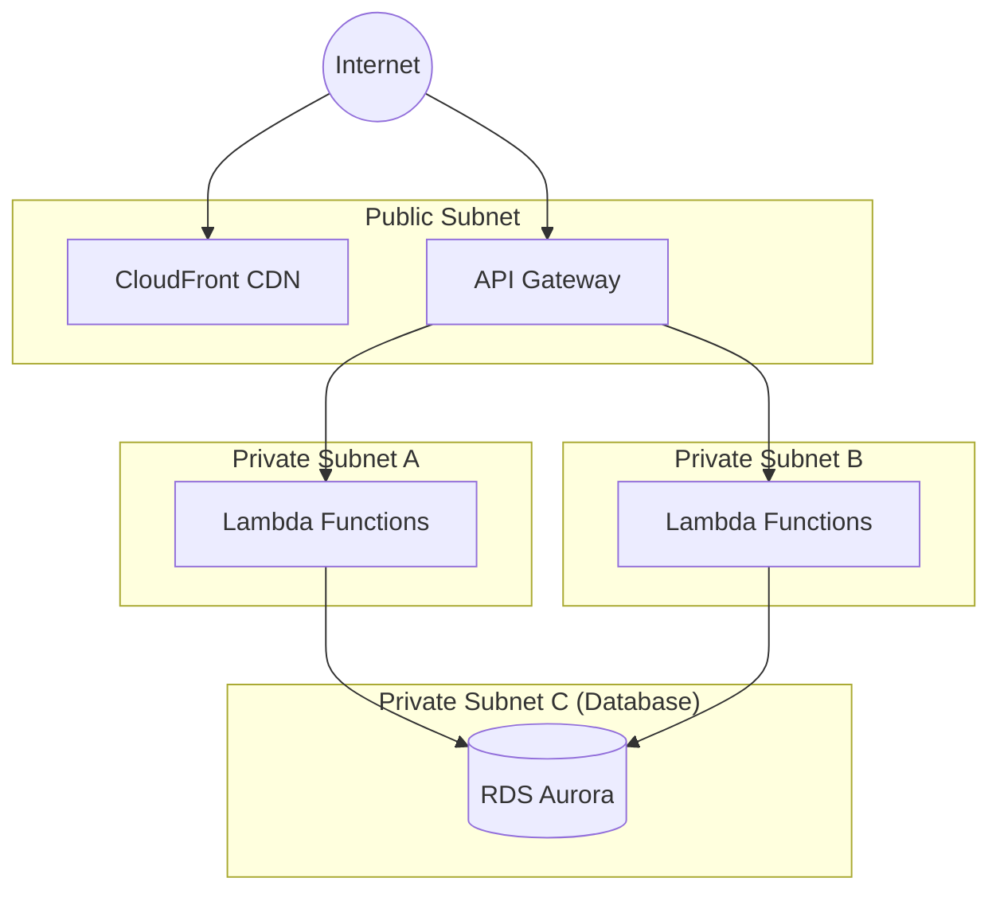

# Security Architecture

**Project**: Basic Calculator Web App  
**Version**: 1.0  
**Date**: 2025-11-07  
**Author**: Security Architect  
**Status**: Draft

---

## Executive Summary

This document defines comprehensive security controls and architecture for the Basic Calculator Web App. The security architecture follows a defense-in-depth approach with multiple layers of protection, implements OWASP Top 10 mitigations, and ensures GDPR compliance for user data protection.

**Security Objectives:**
- **Confidentiality**: Protect user credentials, payment data, and calculation history
- **Integrity**: Ensure data accuracy and prevent unauthorized modifications
- **Availability**: Maintain 99.9% uptime with DDoS protection
- **Compliance**: GDPR, PCI DSS Level 1 (via Stripe), OWASP ASVS Level 2

**Key Security Controls:**
- Multi-layer authentication (JWT with refresh tokens)
- End-to-end TLS 1.3 encryption
- Rate limiting and DDoS protection
- Input validation and output encoding
- Automated security scanning (SAST/DAST)
- Real-time threat monitoring and alerting
- Data encryption at rest and in transit
- Comprehensive audit logging

---

## Table of Contents

1. [Security Principles](#1-security-principles)
2. [Threat Model](#2-threat-model)
3. [Authentication & Authorization](#3-authentication--authorization)
4. [Data Protection](#4-data-protection)
5. [API Security](#5-api-security)
6. [Infrastructure Security](#6-infrastructure-security)
7. [Application Security](#7-application-security)
8. [Compliance](#8-compliance)
9. [Security Monitoring](#9-security-monitoring)
10. [Incident Response](#10-incident-response)
11. [Security Testing](#11-security-testing)
12. [Security Governance](#12-security-governance)

---

## 1. Security Principles

### 1.1 Core Security Principles

**Defense in Depth**
- Multiple layers of security controls
- No single point of failure
- Each layer mitigates different attack vectors

**Principle of Least Privilege**
- Users have minimum necessary permissions
- Service accounts have scoped IAM roles
- Database access restricted to application layer

**Fail Secure**
- Authentication failures deny access by default
- Errors don't leak sensitive information
- Timeouts invalidate sessions

**Zero Trust Architecture**
- Never trust, always verify
- Verify every request (JWT validation)
- Segment network access (VPC, security groups)

**Security by Design**
- Security built into development lifecycle
- Automated security testing in CI/CD
- Security reviews for all features

---

## 2. Threat Model

### 2.1 STRIDE Analysis

Comprehensive threat modeling using STRIDE methodology:

#### S - Spoofing Identity

**Threats:**
- Attacker impersonates legitimate user
- Stolen JWT tokens used for unauthorized access
- Session hijacking via XSS

**Mitigations:**
- Strong password requirements (8+ chars, complexity)
- JWT tokens with short expiry (15 minutes)
- Refresh tokens with rotation
- HttpOnly cookies prevent XSS token theft
- Secure flag on cookies (HTTPS only)
- SameSite=Strict cookies prevent CSRF

#### T - Tampering with Data

**Threats:**
- Modify calculation history
- Alter subscription status
- Inject malicious JavaScript

**Mitigations:**
- Input validation (Zod schemas)
- Output encoding (prevent XSS)
- SQL injection prevention (Prisma ORM)
- Database foreign key constraints
- Audit logs for all modifications
- Content Security Policy (CSP) headers

#### R - Repudiation

**Threats:**
- User denies performing subscription action
- Dispute over payment charges
- Unauthorized account access claims

**Mitigations:**
- Comprehensive audit logging (all API calls)
- Immutable logs stored in CloudWatch
- Payment records with Stripe IDs
- Email confirmations for critical actions
- IP address and user agent logging
- Timestamp all database records

#### I - Information Disclosure

**Threats:**
- Expose user emails or payment data
- Leak JWT secret keys
- Verbose error messages reveal system internals

**Mitigations:**
- Encrypt sensitive data at rest (AES-256)
- TLS 1.3 for data in transit
- Generic error messages to users
- Secrets stored in AWS Secrets Manager
- No PII in logs or error messages
- Database column-level encryption for emails

#### D - Denial of Service

**Threats:**
- API flooding
- Database connection exhaustion
- Expensive calculation requests
- Resource exhaustion attacks

**Mitigations:**
- Rate limiting (100 req/min per user, 10K global)
- API Gateway throttling
- Connection pooling (RDS Proxy, max 100 connections)
- CloudFront DDoS protection (AWS Shield)
- Lambda concurrency limits (1000 max)
- Request size limits (10KB max body)
- Query timeout (5 seconds max)

#### E - Elevation of Privilege

**Threats:**
- Free user accesses premium features
- User modifies other users' data
- SQL injection to gain admin access

**Mitigations:**
- JWT claims for subscription tier
- Database row-level security (user_id checks)
- Prisma ORM prevents SQL injection
- Least privilege IAM roles for Lambda
- No admin accounts (use AWS IAM for infrastructure)
- Input validation prevents privilege escalation

### 2.2 Attack Surface Analysis

**External Attack Surface:**

| Component | Exposure | Risk Level | Mitigations |
|-----------|----------|------------|-------------|
| Static website (CloudFront) | Public | Low | Read-only, CDN cached, HTTPS only |
| API Gateway | Public | **High** | Rate limiting, WAF, JWT auth |
| Database (RDS) | Private (VPC) | Medium | No public IP, IAM auth, encrypted |
| Lambda functions | Private (VPC) | Low | No direct access, API Gateway only |
| Stripe webhooks | Public (signed) | Medium | Signature verification, HTTPS |

**Internal Attack Surface:**

- Lambda to RDS connections (TLS, IAM auth)
- Inter-service communication (VPC endpoints)
- AWS console access (MFA required)
- CI/CD pipeline (GitHub Actions OIDC)

### 2.3 Risk Assessment

**Critical Risks:**

1. **JWT Secret Compromise** (Likelihood: Low, Impact: Critical)
   - **Impact**: Attacker can forge authentication tokens
   - **Mitigation**: Store in AWS Secrets Manager, rotate quarterly, use strong random key (256-bit)

2. **SQL Injection** (Likelihood: Low, Impact: High)
   - **Impact**: Database breach, data exfiltration
   - **Mitigation**: Prisma ORM (parameterized queries), input validation, least privilege DB user

3. **Payment Fraud** (Likelihood: Medium, Impact: High)
   - **Impact**: Financial loss, chargebacks
   - **Mitigation**: Stripe Radar (fraud detection), email confirmation, webhook signature verification

4. **DDoS Attack** (Likelihood: Medium, Impact: Medium)
   - **Impact**: Service unavailability, increased costs
   - **Mitigation**: CloudFront DDoS protection, rate limiting, auto-scaling, alerting

5. **XSS Attack** (Likelihood: Medium, Impact: Medium)
   - **Impact**: Session hijacking, data theft
   - **Mitigation**: Content Security Policy, output encoding, HttpOnly cookies

---

## 3. Authentication & Authorization

### 3.1 Authentication Architecture

**Multi-Token Strategy: Access Token + Refresh Token**



**Token Strategy Details:**

| Token Type | Expiry | Storage | Purpose |
|------------|--------|---------|---------|
| Access Token | 15 minutes | Memory (JavaScript variable) | API authentication |
| Refresh Token | 7 days | HttpOnly cookie (SameSite=Strict) | Token renewal |

**Why Two Tokens?**
- **Security**: Short-lived access tokens limit window of compromise
- **Usability**: Long-lived refresh tokens avoid frequent re-authentication
- **XSS Protection**: HttpOnly cookies can't be accessed by JavaScript
- **CSRF Protection**: SameSite=Strict prevents cross-site requests

### 3.2 Password Security

**Password Requirements:**
- Minimum 8 characters
- At least 1 uppercase letter
- At least 1 lowercase letter
- At least 1 number
- At least 1 special character (optional but encouraged)
- Maximum 128 characters (prevent DoS)
- No common passwords (check against Have I Been Pwned API)

**Password Storage:**
- **Algorithm**: bcrypt (cost factor 12)
- **Why bcrypt**: Adaptive hashing, resistant to rainbow tables and brute force
- **Cost Factor 12**: ~300ms per hash (balance between security and UX)
- **No password hints**: Force password reset instead

**Password Reset Flow:**
1. User requests reset (email address)
2. Generate secure random token (32 bytes)
3. Store token hash in database with 1-hour expiry
4. Send reset link via email (token in URL)
5. User clicks link, sets new password
6. Invalidate reset token and all refresh tokens (force re-login)

### 3.3 JWT Token Structure

**Access Token Claims:**

```json
{
  "sub": "user_123456",
  "email": "alice@example.com",
  "tier": "premium",
  "iat": 1699372800,
  "exp": 1699373700,
  "iss": "calcapp-api",
  "aud": "calcapp-web"
}
```

**Refresh Token Claims:**

```json
{
  "sub": "user_123456",
  "type": "refresh",
  "jti": "refresh_abc123",
  "iat": 1699372800,
  "exp": 1699977600,
  "iss": "calcapp-api"
}
```

**JWT Security:**
- **Algorithm**: HS256 (HMAC-SHA256)
- **Secret Key**: 256-bit random key stored in AWS Secrets Manager
- **Key Rotation**: Quarterly (accept both old and new keys for 24 hours)
- **Validation**: Signature, expiry, issuer, audience
- **Revocation**: Refresh token blacklist in database (jti claim)

### 3.4 Session Management

**Session Security:**
- No server-side sessions (stateless JWT)
- Logout invalidates refresh token (adds jti to blacklist)
- "Log out all devices" invalidates all user's refresh tokens
- Concurrent sessions allowed (same user, multiple devices)
- Session timeout: 15 minutes (access token expiry)
- Absolute timeout: 7 days (refresh token expiry)

**Session Revocation Triggers:**
- User logs out
- Password change
- Account deletion
- Suspicious activity detected
- User requests "log out all devices"

---

## 4. Data Protection

### 4.1 Data Classification

**Data Sensitivity Levels:**

| Level | Data Types | Protection |
|-------|-----------|------------|
| **Critical** | Passwords, payment tokens | Hashed (bcrypt), never stored plaintext |
| **High** | Email addresses, user IDs | Encrypted at rest, TLS in transit |
| **Medium** | Calculation history, display names | TLS in transit, audit logging |
| **Low** | Public app content, static assets | CDN caching, HTTPS |

### 4.2 Encryption Strategy

**Data in Transit:**
- **TLS 1.3** for all connections (API, database, external services)
- **HTTPS only** (HSTS header with 1-year max-age)
- **Certificate**: AWS Certificate Manager (ACM) with auto-renewal
- **Cipher suites**: Modern, secure ciphers only (no TLS 1.0/1.1)

**Data at Rest:**
- **Database**: AWS RDS encryption (AES-256) with KMS
- **Backups**: Encrypted snapshots (same KMS key)
- **S3 static assets**: Not encrypted (public read-only content)
- **CloudWatch logs**: Encrypted with CloudWatch KMS key

**Application-Level Encryption:**
- **Passwords**: bcrypt (cost 12) - one-way hash
- **Email addresses**: Consider column-level encryption if required by compliance
- **Calculation history**: No encryption (not PII, user consent for storage)

### 4.3 Data Retention & Deletion

**Retention Policies:**

| Data Type | Retention Period | Deletion Method |
|-----------|------------------|-----------------|
| User accounts | Indefinite (until user deletes) | Soft delete (30 days), then hard delete |
| Calculation history | Indefinite (premium value) | Cascades with user deletion |
| Audit logs | 1 year (compliance) | Archived to S3 Glacier, deleted after 7 years |
| Payment records | 7 years (tax compliance) | Anonymized (remove PII, keep transaction IDs) |
| Refresh tokens | 7 days (expiry) | Auto-deleted on expiry |

**GDPR Compliance:**

**Right to Access:**
- `/api/v1/data-export` endpoint returns all user data as JSON
- Includes: profile, subscription, calculation history, payment records
- Delivered as downloadable JSON file

**Right to Deletion (Right to be Forgotten):**
1. User requests deletion via UI
2. Soft delete (set `deleted_at` timestamp)
3. Disable login and API access immediately
4. 30-day grace period (allow account recovery)
5. Hard delete after 30 days:
   - Delete user record
   - Cascade delete calculation history
   - Anonymize payment records (keep for compliance)
   - Revoke all refresh tokens
6. Email confirmation of deletion

**Right to Rectification:**
- Users can update email and display name
- Audit log records all changes

**Right to Data Portability:**
- Export data in machine-readable JSON format
- Standardized schema for interoperability

### 4.4 Data Minimization

**Only Collect What's Needed:**
- Email address (authentication, communication)
- Password hash (authentication)
- Display name (optional, UI personalization)
- Calculation history (premium feature value)
- Subscription status (access control)
- Payment records (compliance, tax reporting)

**NOT Collected:**
- Physical address (not needed)
- Phone number (not needed)
- Birth date (not needed)
- Gender, race, or other demographics (not needed)
- IP addresses (logged for 7 days, then deleted)

---

## 5. API Security

### 5.1 Input Validation

**Validation Strategy:**
- **Server-side validation** (never trust client)
- **Zod schemas** for runtime type checking
- **Whitelist approach** (allow known-good inputs)
- **Reject unknown fields** (prevent parameter pollution)

**Validation Rules:**

**Email Validation:**
```typescript
const emailSchema = z.string()
  .email('Invalid email format')
  .max(254, 'Email too long')
  .transform(email => email.toLowerCase().trim());
```

**Password Validation:**
```typescript
const passwordSchema = z.string()
  .min(8, 'Password must be at least 8 characters')
  .max(128, 'Password too long')
  .regex(/[A-Z]/, 'Must contain uppercase letter')
  .regex(/[a-z]/, 'Must contain lowercase letter')
  .regex(/[0-9]/, 'Must contain number');
```

**Calculation Expression Validation:**
```typescript
const calculationSchema = z.string()
  .max(1000, 'Expression too long')
  .regex(/^[0-9+\-*/.() ]+$/, 'Invalid characters in expression');
```

**Anti-Injection Measures:**
- Prisma ORM (parameterized queries, no raw SQL)
- Sanitize user inputs (strip HTML tags)
- No `eval()` or `Function()` constructors
- Whitelist allowed characters for calculator expressions

### 5.2 Rate Limiting

**Multi-Layer Rate Limiting:**

| Layer | Limit | Window | Scope | Action |
|-------|-------|--------|-------|--------|
| **Per User** | 100 requests | 1 minute | By JWT sub claim | 429 Too Many Requests |
| **Per IP** | 1000 requests | 1 minute | By source IP | 429 + temporary block |
| **Global** | 10,000 requests | 1 minute | All traffic | 503 Service Unavailable |
| **Login Attempts** | 5 failed logins | 15 minutes | By email | Account lockout (30 min) |
| **Registration** | 3 registrations | 1 hour | By IP | Prevent bot signups |

**Rate Limit Headers:**
```http
X-RateLimit-Limit: 100
X-RateLimit-Remaining: 87
X-RateLimit-Reset: 1699373760
Retry-After: 45
```

**Implementation:**
- API Gateway throttling (AWS managed)
- Redis cache for per-user counters (alternative: DynamoDB)
- Exponential backoff for repeated violations

### 5.3 CORS Configuration

**Allowed Origins:**
- Production: `https://calcapp.com`
- Staging: `https://staging.calcapp.com`
- Development: `http://localhost:5173`

**CORS Headers:**
```http
Access-Control-Allow-Origin: https://calcapp.com
Access-Control-Allow-Methods: GET, POST, PUT, DELETE, OPTIONS
Access-Control-Allow-Headers: Content-Type, Authorization
Access-Control-Allow-Credentials: true
Access-Control-Max-Age: 86400
```

**Preflight Handling:**
- OPTIONS requests return 204 No Content
- Cache preflight for 24 hours

### 5.4 API Security Headers

**Security Headers:**

```http
# Prevent XSS attacks
Content-Security-Policy: default-src 'self'; script-src 'self'; style-src 'self' 'unsafe-inline'; img-src 'self' data: https:; connect-src 'self' https://api.stripe.com

# Prevent clickjacking
X-Frame-Options: DENY
Frame-Ancestors: 'none'

# Prevent MIME sniffing
X-Content-Type-Options: nosniff

# Force HTTPS
Strict-Transport-Security: max-age=31536000; includeSubDomains; preload

# Referrer policy
Referrer-Policy: strict-origin-when-cross-origin

# Permissions policy
Permissions-Policy: geolocation=(), microphone=(), camera=()
```

**Why These Headers?**
- **CSP**: Prevents XSS by restricting script sources
- **X-Frame-Options**: Prevents clickjacking attacks
- **X-Content-Type-Options**: Prevents MIME confusion attacks
- **HSTS**: Forces HTTPS for all connections
- **Referrer-Policy**: Limits referrer information leakage
- **Permissions-Policy**: Restricts browser APIs

### 5.5 Error Handling

**Error Response Format:**

```json
{
  "error": {
    "code": "AUTH_INVALID_CREDENTIALS",
    "message": "Invalid email or password",
    "statusCode": 401,
    "timestamp": "2025-11-07T12:34:56Z",
    "requestId": "req_abc123"
  }
}
```

**Security Considerations:**
- **Generic error messages** (don't reveal system internals)
- **No stack traces** in production
- **Log detailed errors** server-side only
- **Consistent error format** (avoid timing attacks)
- **Rate limit error responses** (prevent enumeration)

**Example Secure Error Messages:**
- ❌ "User alice@example.com not found" → ✅ "Invalid email or password"
- ❌ "Password incorrect" → ✅ "Invalid email or password"
- ❌ "Database connection failed" → ✅ "Internal server error"
- ❌ "JWT signature invalid" → ✅ "Unauthorized"

---

## 6. Infrastructure Security

### 6.1 Network Security

**VPC Architecture:**



**Security Groups:**

**Lambda Security Group:**
- Inbound: None (no direct access)
- Outbound: HTTPS (443) to RDS, Stripe, Secrets Manager

**RDS Security Group:**
- Inbound: PostgreSQL (5432) from Lambda security group only
- Outbound: None

**Network ACLs:**
- Deny all by default
- Allow HTTPS (443) inbound/outbound
- Allow PostgreSQL (5432) within VPC only

### 6.2 IAM Security

**Principle of Least Privilege:**

**Lambda Execution Role:**
```json
{
  "Version": "2012-10-17",
  "Statement": [
    {
      "Effect": "Allow",
      "Action": [
        "logs:CreateLogGroup",
        "logs:CreateLogStream",
        "logs:PutLogEvents"
      ],
      "Resource": "arn:aws:logs:*:*:*"
    },
    {
      "Effect": "Allow",
      "Action": [
        "ec2:CreateNetworkInterface",
        "ec2:DescribeNetworkInterfaces",
        "ec2:DeleteNetworkInterface"
      ],
      "Resource": "*"
    },
    {
      "Effect": "Allow",
      "Action": [
        "secretsmanager:GetSecretValue"
      ],
      "Resource": "arn:aws:secretsmanager:*:*:secret:calcapp/*"
    },
    {
      "Effect": "Allow",
      "Action": [
        "rds:DescribeDBInstances"
      ],
      "Resource": "*"
    }
  ]
}
```

**RDS IAM Authentication:**
- Lambda uses IAM authentication to RDS (no passwords)
- Generate short-lived authentication tokens
- Rotate credentials automatically

**Secrets Management:**
- AWS Secrets Manager for sensitive credentials
- Automatic rotation for database passwords
- KMS encryption for secrets at rest

### 6.3 DDoS Protection

**AWS Shield Standard** (included free):
- Layer 3/4 DDoS protection
- SYN/UDP flood protection
- Reflection attack mitigation

**CloudFront DDoS Protection:**
- Global edge network absorbs traffic
- Geographic restrictions (if needed)
- Origin protection (API Gateway hidden behind CloudFront)

**Application-Level Protection:**
- Rate limiting (API Gateway)
- Request size limits (10KB max body)
- Query complexity limits (prevent expensive operations)

---

## 7. Application Security

### 7.1 Frontend Security

**Content Security Policy:**

```http
Content-Security-Policy: 
  default-src 'self';
  script-src 'self';
  style-src 'self' 'unsafe-inline';
  img-src 'self' data: https:;
  font-src 'self';
  connect-src 'self' https://api.calcapp.com https://api.stripe.com;
  frame-src https://js.stripe.com;
  frame-ancestors 'none';
  base-uri 'self';
  form-action 'self';
```

**XSS Prevention:**
- No `innerHTML` (use `textContent` instead)
- Sanitize user inputs before display
- CSP prevents inline scripts
- HttpOnly cookies prevent token theft

**CSRF Prevention:**
- SameSite=Strict cookies
- No state-changing GET requests
- Verify JWT for all mutations

**Dependency Security:**
- Regular `npm audit` in CI/CD
- Dependabot automatic PR for vulnerabilities
- Review all third-party packages before adding
- Pin exact versions (no `^` or `~`)

### 7.2 Backend Security

**SQL Injection Prevention:**
- Prisma ORM (parameterized queries)
- No raw SQL queries
- Input validation with Zod

**Command Injection Prevention:**
- No `child_process.exec()` or `eval()`
- Whitelist allowed operations
- Validate all inputs

**Path Traversal Prevention:**
- No file system access (serverless)
- Validate file paths if needed
- Restrict to specific directories

**Dependency Security:**
- Lock file committed (package-lock.json)
- Regular security audits
- Minimal dependencies (reduce attack surface)

---

## 8. Compliance

### 8.1 GDPR Compliance

**Data Controller**: CalcApp Ltd.  
**Data Processor**: AWS (sub-processor)

**GDPR Requirements:**

✅ **Lawful Basis**: Consent (user registration) + Legitimate Interest (fraud prevention)  
✅ **Transparency**: Privacy policy, clear data usage  
✅ **Right to Access**: Data export API  
✅ **Right to Rectification**: Update profile API  
✅ **Right to Erasure**: Account deletion with 30-day grace period  
✅ **Right to Portability**: JSON export format  
✅ **Data Minimization**: Only collect necessary data  
✅ **Storage Limitation**: Retention policies documented  
✅ **Security**: Encryption, access controls, audit logs  
✅ **Breach Notification**: Incident response plan (notify within 72 hours)

**Data Processing Agreement (DPA):**
- AWS GDPR-compliant (standard DPA)
- Stripe GDPR-compliant (PCI DSS Level 1)
- All data stored in EU region (eu-west-1 London) for EU users

### 8.2 PCI DSS Compliance

**Approach**: Use Stripe (PCI DSS Level 1 certified)

**Our Responsibilities:**
- Never store credit card numbers
- Never log payment details
- Use Stripe.js (tokenization)
- Verify webhook signatures
- Maintain TLS 1.2+ for all payment API calls

**Stripe Handles:**
- Card data storage (tokenized)
- PCI DSS compliance certification
- Fraud detection (Stripe Radar)
- 3D Secure authentication

**SAQ A-EP Compliance** (self-assessment for e-commerce):
- ✅ Use approved payment processor (Stripe)
- ✅ No card data stored on our servers
- ✅ HTTPS for all payment pages
- ✅ Regular security testing

### 8.3 Accessibility & Security

**WCAG 2.1 AA Security Considerations:**
- Authentication mechanism accessible to screen readers
- Error messages clearly announced
- Password fields properly labeled
- 2-factor authentication (future) must be accessible
- Session timeout warnings announced

---

## 9. Security Monitoring

### 9.1 Logging Strategy

**What to Log:**

| Event | Log Level | Retention | PII |
|-------|-----------|-----------|-----|
| Successful login | INFO | 90 days | Email (hashed) |
| Failed login | WARN | 90 days | Email (hashed), IP |
| API requests | INFO | 30 days | User ID, endpoint |
| API errors | ERROR | 1 year | User ID, error code |
| Database queries | DEBUG (dev only) | N/A | No |
| Payment events | INFO | 7 years | User ID, Stripe ID |
| Security events | WARN | 1 year | All available context |

**Sensitive Data Handling:**
- **Never log**: Passwords, tokens, credit cards, full emails
- **Hash before logging**: Email addresses (SHA-256)
- **Redact**: Partial credit card numbers (last 4 digits only)
- **Encrypt**: Logs containing PII

**Log Structure (JSON):**

```json
{
  "timestamp": "2025-11-07T12:34:56.789Z",
  "level": "WARN",
  "event": "auth.login.failed",
  "userId": null,
  "email_hash": "5d41402abc4b2a76b9719d911017c592",
  "ip": "192.0.2.1",
  "userAgent": "Mozilla/5.0...",
  "reason": "invalid_password",
  "requestId": "req_abc123"
}
```

### 9.2 Security Monitoring

**CloudWatch Alarms:**

1. **High Failed Login Rate**
   - Metric: Failed logins > 50 in 5 minutes
   - Action: SNS alert to security team
   - Indicates: Brute force attack

2. **Unusual API Traffic**
   - Metric: API requests > 20,000/minute
   - Action: Increase rate limits, alert team
   - Indicates: Potential DDoS

3. **Database Connection Errors**
   - Metric: Connection failures > 10 in 1 minute
   - Action: Page on-call engineer
   - Indicates: Database issue or attack

4. **High 4xx Error Rate**
   - Metric: 4xx responses > 25% of traffic
   - Action: Alert security team
   - Indicates: Scanning or probing

5. **Lambda Errors**
   - Metric: Uncaught exceptions > 5 in 5 minutes
   - Action: Alert engineering team
   - Indicates: Application bug or exploit attempt

**Real-Time Threat Detection:**

**AWS WAF Rules:**
- SQL injection patterns
- XSS patterns
- Known bad IP addresses (threat intelligence feeds)
- Geographic restrictions (if needed)

**CloudTrail Monitoring:**
- IAM policy changes
- S3 bucket policy changes
- Security group modifications
- Unauthorized AWS API calls

### 9.3 Third-Party Monitoring

**Sentry** (application monitoring):
- Real-time error tracking
- Release tracking
- Performance monitoring
- Breadcrumb trails for debugging

**Datadog/New Relic** (optional):
- APM (Application Performance Monitoring)
- Infrastructure monitoring
- Security analytics

---

## 10. Incident Response

### 10.1 Incident Response Plan

**Preparation → Detection → Containment → Eradication → Recovery → Lessons Learned**

**Phase 1: Preparation**
- Incident response team identified
- Runbooks for common scenarios
- Contact list (on-call rotation)
- Backup and restore procedures tested

**Phase 2: Detection**
- CloudWatch alarms trigger
- User reports suspicious activity
- Security scanning tools flag vulnerabilities
- Third-party security researchers report issues

**Phase 3: Containment**

**Immediate Actions (< 15 minutes):**
1. Isolate affected systems (revoke compromised tokens)
2. Block malicious IP addresses (WAF rules)
3. Disable compromised user accounts
4. Capture forensic evidence (logs, database state)

**Short-term Actions (< 1 hour):**
1. Assess scope of breach
2. Notify stakeholders (internal first)
3. Implement temporary mitigations
4. Preserve evidence for analysis

**Phase 4: Eradication**
1. Identify root cause
2. Patch vulnerabilities
3. Remove malware/backdoors
4. Rotate all credentials
5. Update security rules

**Phase 5: Recovery**
1. Restore from clean backups (if needed)
2. Monitor for recurrence
3. Gradually restore service
4. Verify integrity

**Phase 6: Lessons Learned**
1. Post-incident review (within 1 week)
2. Document findings
3. Update runbooks
4. Implement preventive measures
5. Train team on lessons learned

### 10.2 Incident Classification

| Severity | Definition | Response Time | Example |
|----------|-----------|---------------|---------|
| **P0 - Critical** | Data breach, service down | < 15 min | Database compromised |
| **P1 - High** | Vulnerability exploited | < 1 hour | XSS attack detected |
| **P2 - Medium** | Potential vulnerability | < 4 hours | npm package CVE |
| **P3 - Low** | Minor security issue | < 24 hours | Outdated TLS cipher |

### 10.3 Breach Notification

**GDPR Requirements: Notify within 72 hours**

**Notification Process:**
1. Assess if breach affects personal data
2. Determine number of affected users
3. Document breach details (what, when, how)
4. Notify supervisory authority (Data Protection Authority)
5. Notify affected users if high risk
6. Publish transparency report (if appropriate)

**Email Template (User Notification):**

```
Subject: Important Security Notice

Dear [User],

We are writing to inform you of a security incident that may have affected
your CalcApp account.

What happened: [Brief description]
What data was affected: [Specific data types]
What we're doing: [Mitigation steps]
What you should do: [Action items for users]

We take security seriously and apologize for any concern this may cause.
For questions, contact security@calcapp.com.

CalcApp Security Team
```

---

## 11. Security Testing

### 11.1 Security Testing Strategy

**Security Testing Layers:**

| Test Type | Frequency | Tool | Scope |
|-----------|-----------|------|-------|
| **SAST** (Static) | Every commit | ESLint security rules, Semgrep | Source code analysis |
| **DAST** (Dynamic) | Daily (staging) | OWASP ZAP | Running application |
| **Dependency Scan** | Every commit | npm audit, Snyk | Third-party packages |
| **Container Scan** | N/A (serverless) | N/A | N/A |
| **Penetration Test** | Quarterly | External firm | Full system |
| **Bug Bounty** | Continuous (future) | HackerOne/Bugcrowd | All vulnerabilities |

### 11.2 SAST (Static Analysis)

**Tools:**
- **ESLint** with security plugins:
  - `eslint-plugin-security`
  - `eslint-plugin-no-secrets`
- **Semgrep** (custom rules)
- **TypeScript strict mode** (type safety)

**Checks:**
- Detect hardcoded secrets
- Unsafe regex patterns (ReDoS)
- SQL injection patterns
- XSS vulnerabilities
- Insecure randomness
- Weak crypto algorithms

**CI/CD Integration:**
```yaml
# GitHub Actions
- name: Security Lint
  run: npm run lint:security
  
- name: Semgrep Scan
  run: semgrep --config=auto
```

### 11.3 DAST (Dynamic Analysis)

**OWASP ZAP (Zed Attack Proxy):**

**Automated Scanning:**
1. Spider application (discover endpoints)
2. Active scan (inject payloads)
3. Generate report
4. Fail build if high/critical vulnerabilities

**Weekly Full Scan (Staging):**
```bash
zap-cli quick-scan --self-contained \
  --spider -r https://staging.calcapp.com
```

**OWASP Top 10 Coverage:**
- ✅ A01:2021 - Broken Access Control
- ✅ A02:2021 - Cryptographic Failures
- ✅ A03:2021 - Injection
- ✅ A04:2021 - Insecure Design
- ✅ A05:2021 - Security Misconfiguration
- ✅ A06:2021 - Vulnerable and Outdated Components
- ✅ A07:2021 - Identification and Authentication Failures
- ✅ A08:2021 - Software and Data Integrity Failures
- ✅ A09:2021 - Security Logging and Monitoring Failures
- ✅ A10:2021 - Server-Side Request Forgery (SSRF)

### 11.4 Penetration Testing

**Quarterly External Penetration Test:**

**Scope:**
- Web application (frontend + API)
- Authentication mechanisms
- Payment flow
- Infrastructure (limited, AWS handles most)

**Methodology:**
- OWASP Testing Guide
- OWASP ASVS Level 2
- PTES (Penetration Testing Execution Standard)

**Deliverables:**
- Executive summary
- Vulnerability report (severity, CVSS scores)
- Proof of concept exploits
- Remediation recommendations
- Retest after fixes applied

**Penetration Testing Vendors:**
- OffSec (Offensive Security)
- Cobalt.io
- Synack
- HackerOne (managed bug bounty)

### 11.5 Dependency Security

**npm audit:**
```bash
npm audit --audit-level=moderate
```

**Automated Dependency Updates:**
- **Dependabot** (GitHub): Auto-create PRs for vulnerabilities
- **Renovate**: Auto-update dependencies
- **Snyk**: Real-time vulnerability alerts

**Dependency Review:**
- Review all new dependencies before adding
- Check package popularity and maintenance
- Review package permissions
- Audit package code for suspicious behavior

---

## 12. Security Governance

### 12.1 Security Policies

**Access Control Policy:**
- MFA required for AWS console access
- Password rotation every 90 days
- Immediate revocation on employee departure
- Least privilege access (role-based)

**Secure Development Policy:**
- Security training for all developers
- Peer review for all code changes
- Security review for new features
- Dependency updates within 7 days of CVE

**Data Handling Policy:**
- No production data in development/staging
- Encrypted backups required
- Secure deletion of old backups
- No personal laptops access production

**Third-Party Security:**
- Security questionnaire for all vendors
- Annual vendor security review
- Data processing agreements (GDPR)
- Vendor breach notification clause

### 12.2 Security Training

**Developer Security Training:**
- OWASP Top 10 awareness
- Secure coding practices
- Security testing methodologies
- Incident response procedures

**Training Schedule:**
- Onboarding: Security 101 (2 hours)
- Quarterly: Security lunch & learn (1 hour)
- Annual: Formal security training (4 hours)
- Ad-hoc: Security advisories (as needed)

### 12.3 Security Roadmap

**Phase 1: MVP (Current)**
- ✅ JWT authentication
- ✅ HTTPS/TLS 1.3
- ✅ Input validation
- ✅ Rate limiting
- ✅ Basic logging

**Phase 2: Post-Launch (Q1 2026)**
- Implement security headers (CSP, HSTS)
- Set up SAST/DAST in CI/CD
- First external penetration test
- Implement refresh token rotation
- Enhanced audit logging

**Phase 3: Scale (Q2 2026)**
- 2-factor authentication (TOTP)
- Advanced rate limiting (per-endpoint)
- Real-time security monitoring (Datadog)
- Bug bounty program
- SOC 2 Type I audit

**Phase 4: Enterprise (Q3 2026)**
- SSO/SAML integration
- Advanced fraud detection
- Anomaly detection (ML-based)
- SOC 2 Type II certification
- ISO 27001 certification

---

## Summary

This security architecture provides comprehensive protection for the Basic Calculator Web App through:

1. **Defense in Depth**: Multiple layers of security controls
2. **Proactive Security**: Threat modeling, security testing, monitoring
3. **Compliance**: GDPR, PCI DSS (via Stripe), OWASP ASVS Level 2
4. **Incident Response**: Documented procedures, 72-hour breach notification
5. **Continuous Improvement**: Security roadmap, regular testing, training

**Next Steps:**
- Implement security controls during development
- Set up security monitoring and alerting
- Conduct first penetration test before production launch
- Establish security governance processes

---

**Document Approval:**

| Role | Name | Date | Signature |
|------|------|------|-----------|
| Security Architect | [TBD] | 2025-11-07 | [Pending] |
| System Architect | [TBD] | [Pending] | [Pending] |
| Technical Lead | [TBD] | [Pending] | [Pending] |
| Project Manager | [TBD] | [Pending] | [Pending] |

---

**Change Log:**

| Version | Date | Author | Changes |
|---------|------|--------|---------|
| 1.0 | 2025-11-07 | Security Architect | Initial draft |
