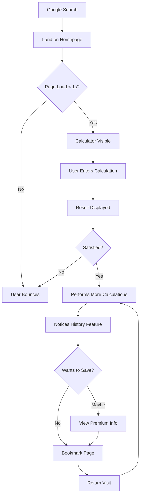
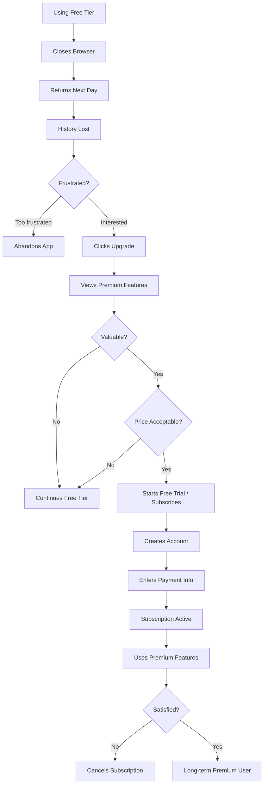
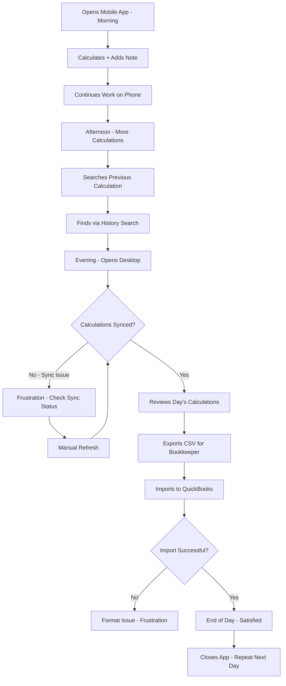
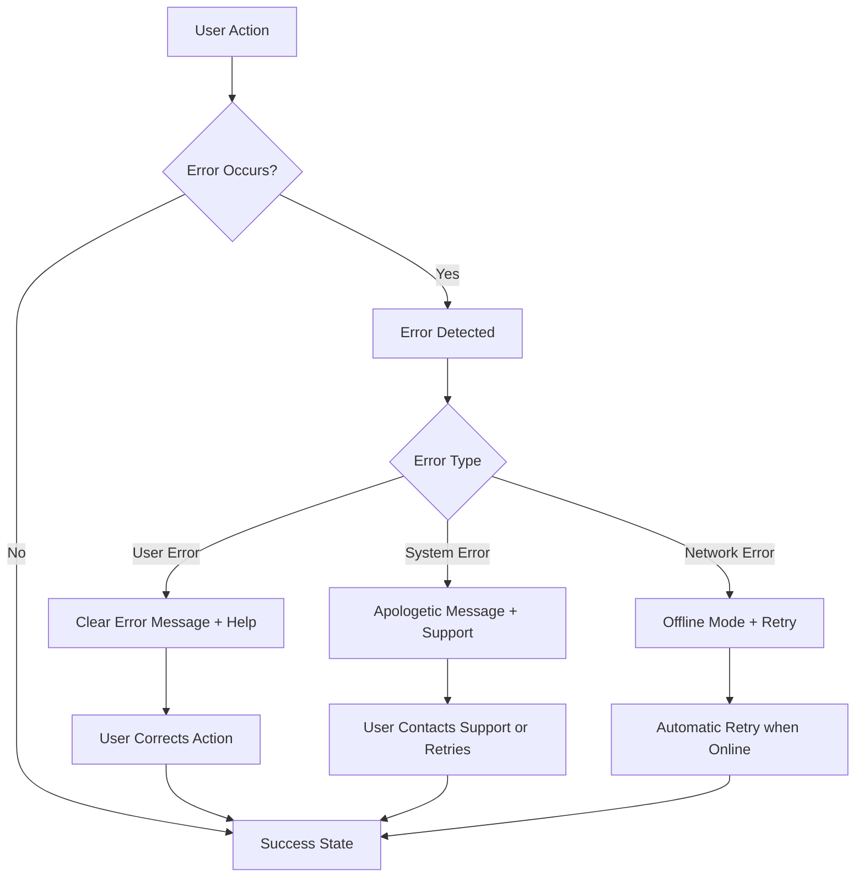

# User Journey Maps: Basic Calculator Web App

**Date Created**: 2025-11-07  
**Role**: UX/UI Designer (Alex Chen)  
**Status**: Initial Draft  
**Version**: 1.0

---

## Overview

This document maps the key user journeys for the Basic Calculator Web App, capturing user actions, touchpoints, emotions, and opportunities for improvement at each stage. These journeys are based on the primary personas and user stories.

---

## Journey 1: First-Time User Onboarding (Free Tier)

**Persona**: Jamie Thompson (College Student)  
**Goal**: Start using the calculator immediately without friction  
**Entry Point**: Google search "free online calculator" → lands on homepage  
**Success Criteria**: Performs first calculation within 10 seconds

### Journey Stages

#### Stage 1: Discovery & Arrival

**Actions**:
- User searches for "free online calculator" or similar
- Clicks search result link
- Page loads and presents calculator interface

**Touchpoints**:
- Search engine results page (SERP)
- Landing page / Homepage
- Calculator interface

**User Thoughts**:
- "I need to calculate something quickly"
- "Is this page loading fast enough?"
- "Does this look trustworthy?"

**Emotions**: 😐 Neutral, slightly impatient

**Pain Points**:
- Slow page load would cause bounce
- Ads or popups would be frustrating
- Complex interface would be confusing

**Opportunities**:
- ✅ Lightning-fast load (< 1 second)
- ✅ Clean, immediate interface (no splash screen)
- ✅ Clear value proposition visible (e.g., "No Ads • Privacy-Focused")
- ✅ Calculator ready to use (no login required)

**Metrics**:
- Time to interactive: < 1 second
- Bounce rate: < 20%

---

#### Stage 2: First Interaction

**Actions**:
- User clicks calculator button or types on keyboard
- Enters a simple calculation (e.g., "5 + 3")
- Presses equals or Enter

**Touchpoints**:
- Calculator button grid
- Display screen
- Keyboard input (if used)

**User Thoughts**:
- "Let me try a quick calculation to see if this works"
- "Can I use my keyboard or just click?"
- "Is this accurate?"

**Emotions**: 🙂 Curious, testing

**Pain Points**:
- Unresponsive buttons (lag)
- Unexpected behavior
- Unclear button labels

**Opportunities**:
- ✅ Instant button feedback (visual + haptic on mobile)
- ✅ Support both mouse and keyboard input
- ✅ Display calculation as user types (e.g., "5 + 3 =")
- ✅ Clear, large result display
- ✅ Smooth animations (not distracting)

**Metrics**:
- Time to first calculation: < 10 seconds
- Calculation accuracy: 100%

---

#### Stage 3: Exploration

**Actions**:
- User performs several calculations
- Tests different operations (÷, ×, −, +)
- Notices calculation history appearing
- May test decimal numbers

**Touchpoints**:
- Calculator buttons (all operations)
- Display screen
- Calculation history panel

**User Thoughts**:
- "Okay, this works well"
- "Oh, it keeps a history—that's useful"
- "Can I clear this if I need to?"
- "Does it do decimals?"

**Emotions**: 🙂 Satisfied, engaged

**Pain Points**:
- History might feel cluttered
- Not obvious how to clear display
- Unclear limits (how many decimals?)

**Opportunities**:
- ✅ Auto-scroll history (most recent at top)
- ✅ Clear button easily accessible (C, AC, or Clear)
- ✅ Visual limit indicators (if any)
- ✅ Keyboard shortcuts shown on hover (tooltip)
- ✅ Session history persists during tab refresh

**Metrics**:
- Calculations per session: 3+ (engaged user)
- Return rate: > 40% within 7 days

---

#### Stage 4: Retention Decision

**Actions**:
- User bookmarks the page OR
- User adds to browser home screen (PWA) OR
- User simply remembers the URL
- User may dismiss "upgrade to premium" message (if shown)

**Touchpoints**:
- Browser bookmark/favorites
- PWA install prompt (optional)
- Premium upgrade banner (subtle)

**User Thoughts**:
- "This is way better than other calculators I've tried"
- "I'll bookmark this for next time"
- "Do I need premium? Not yet, but maybe later"

**Emotions**: 😊 Happy, satisfied

**Pain Points**:
- Aggressive upgrade prompts would be annoying
- Unclear premium value proposition
- Fear of losing free tier

**Opportunities**:
- ✅ Subtle premium messaging ("Unlock cloud history with Premium")
- ✅ PWA install prompt (optional, not pushy)
- ✅ Reminder that free tier always available
- ✅ Social proof (e.g., "Join 10,000+ users")

**Metrics**:
- Bookmark rate: > 15%
- PWA install rate: > 5%
- Premium modal view rate: 20-30%

---

### Journey Flow Diagram

---

### Overall Journey Insights

**Peak Moments**:
- First result displays correctly (trust established)
- Discovery of history feature (unexpected value)
- Fast, responsive interactions (delightful)

**Pain Points**:
- Slow load time = instant bounce
- Complex interface = confusion
- Intrusive ads/popups = distrust

**Opportunities**:
- Progressive Web App (offline access)
- Keyboard shortcuts (power users)
- Dark mode (accessibility + preference)
- Share calculation link (social proof)

---

## Journey 2: Free → Premium Upgrade (Sarah Martinez)

**Persona**: Sarah Martinez (Privacy-Conscious Professional)  
**Goal**: Upgrade to premium to access persistent history and export features  
**Entry Point**: Using free tier, encounters limitation (session history lost)  
**Success Criteria**: Successfully subscribes and understands premium value

### Journey Stages

#### Stage 1: Limitation Discovery

**Actions**:
- User closes browser tab
- Returns the next day
- Realizes calculation history is gone

**Touchpoints**:
- Calculator interface
- Empty history panel
- "Upgrade to Premium" message

**User Thoughts**:
- "Wait, where did my calculations go?"
- "I needed to reference yesterday's numbers"
- "This is frustrating—I should have noted them down"

**Emotions**: 😟 Frustrated, disappointed

**Pain Points**:
- Lost data = friction
- Unclear that history is session-only
- No warning before data loss

**Opportunities**:
- ✅ Clear indication "History is session-only (Free)" in UI
- ✅ Warning before closing tab: "History will be lost"
- ✅ "Upgrade to keep history forever" message
- ✅ Show example of premium history (demo)

**Metrics**:
- Users encountering limitation: ~40%
- Upgrade modal view rate: 60% of those users

---

#### Stage 2: Value Assessment

**Actions**:
- Clicks "Learn More" or "Upgrade" button
- Reads premium features list
- Compares pricing options (monthly vs. annual)
- Evaluates value proposition

**Touchpoints**:
- Premium pricing page
- Feature comparison table (Free vs. Premium)
- Testimonials / social proof

**User Thoughts**:
- "Is $4.99/month worth it for me?"
- "What else do I get besides history?"
- "Can I trust this service with my payment info?"
- "Is there a money-back guarantee?"

**Emotions**: 🤔 Contemplative, cautious

**Pain Points**:
- Unclear value proposition
- Trust concerns (payment security)
- Price sensitivity
- Fear of subscription fatigue

**Opportunities**:
- ✅ Clear feature breakdown (Free vs. Premium table)
- ✅ Highlight privacy commitment ("We never sell your data")
- ✅ Payment security badges (Stripe, SSL, GDPR compliant)
- ✅ 7-day free trial OR 30-day money-back guarantee
- ✅ Annual discount (e.g., save 20%)
- ✅ Show ROI: "Save 2 hours/month = $X in your time"

**Metrics**:
- Pricing page bounce rate: < 40%
- Free trial start rate: 25% of viewers
- Direct purchase rate: 10% of viewers

---

#### Stage 3: Purchase Decision

**Actions**:
- Clicks "Start Free Trial" or "Subscribe Now"
- Enters email address
- Creates password (or social login)
- Enters payment information (Stripe form)
- Reviews subscription details
- Confirms purchase

**Touchpoints**:
- Account creation form
- Payment form (Stripe Checkout)
- Confirmation page

**User Thoughts**:
- "Okay, let me try this for a month"
- "The payment form looks secure"
- "Will I be charged immediately?"
- "Can I cancel anytime?"

**Emotions**: 😊 Optimistic, slightly nervous

**Pain Points**:
- Long signup form (friction)
- Payment form errors
- Unclear billing terms
- Hidden cancellation policy

**Opportunities**:
- ✅ Social login option (Google, Apple) for quick signup
- ✅ Clear billing transparency ("First 7 days free, then $4.99/month")
- ✅ "Cancel anytime" message visible
- ✅ Stripe Checkout (trusted, familiar)
- ✅ Email confirmation immediately
- ✅ Success page with next steps

**Metrics**:
- Signup completion rate: > 70%
- Payment error rate: < 5%
- Immediate cancellation rate: < 2%

---

#### Stage 4: Premium Experience

**Actions**:
- Returns to calculator (now logged in)
- Performs calculations
- Sees "History saved to cloud" indicator
- Tests history persistence (closes browser, returns)
- Explores export feature (CSV download)
- Adds notes to calculations

**Touchpoints**:
- Calculator interface (premium version)
- Cloud sync indicator
- Export button
- Calculation notes field

**User Thoughts**:
- "Great, my history is now synced"
- "Let me test this—close browser and reopen"
- "Perfect, my calculations are still here"
- "The export feature will be useful for taxes"

**Emotions**: 😊 Satisfied, validated

**Pain Points**:
- Sync lag or failure
- Export format not useful
- Premium features unclear

**Opportunities**:
- ✅ Visual sync indicator ("Last synced: 2 seconds ago")
- ✅ Sync conflict resolution (if any)
- ✅ Export formats: CSV, PDF, JSON
- ✅ Premium badge/icon (subtle status indicator)
- ✅ Feature discovery tips ("Did you know you can add notes?")

**Metrics**:
- Feature usage rate (export, notes): > 60%
- Retention after 30 days: > 80%
- Churn rate: < 5% monthly

---

### Journey Flow Diagram

---

### Overall Journey Insights

**Peak Moments**:
- Free trial starts (commitment without risk)
- First successful sync (history preserved)
- Export calculation history (concrete value)

**Pain Points**:
- Data loss without warning (free tier limitation)
- Price objections ($4.99/month competitive but not free)
- Payment security concerns

**Opportunities**:
- Transparent data retention policy
- 7-day free trial removes risk
- Clear, truthful value communication
- Testimonials from privacy advocates
- Annual plan discount (20% off = $47.88/year)

---

## Journey 3: Daily Premium User Workflow (Marcus Williams)

**Persona**: Marcus Williams (Small Business Owner)  
**Goal**: Use calculator throughout workday across phone and desktop  
**Entry Point**: Opens calculator on phone (morning), then desktop (evening)  
**Success Criteria**: Seamlessly accesses calculations across devices

### Journey Stages

#### Stage 1: Morning (Mobile Use)

**Actions**:
- Opens calculator app on phone (PWA or web)
- Calculates coffee inventory cost
- Adds note: "Coffee beans - Nov 7"
- Continues working on shop floor

**Touchpoints**:
- Mobile browser or PWA
- Calculator interface (mobile view)
- Notes field

**User Thoughts**:
- "Let me calculate today's coffee order"
- "I'll add a note so I remember this later"
- "Phone calculator is easy to use on the floor"

**Emotions**: 🙂 Efficient, focused

**Pain Points**:
- Small buttons (hard to tap)
- Bright screen (glare in shop)
- Accidentally tapping wrong button

**Opportunities**:
- ✅ Large touch targets (44x44px minimum)
- ✅ Dark mode option (reduce glare)
- ✅ Haptic feedback on button press
- ✅ Undo/redo feature (fix mistakes quickly)

---

#### Stage 2: Afternoon (Mobile Use Continued)

**Actions**:
- Calculates tip split for barista team
- Adds note: "Tip split - 3 baristas"
- Takes quick photo of calculation (optional future feature)
- Checks previous day's margin calculation

**Touchpoints**:
- Calculator
- Calculation history (scrollable list)
- Search/filter (if needed)

**User Thoughts**:
- "What was yesterday's profit margin?"
- "Let me scroll through history to find it"
- "Ah, here it is—35%"

**Emotions**: 🙂 Satisfied, efficient

**Pain Points**:
- History is long, hard to scroll
- Can't find specific calculation quickly
- Mobile screen is small for reading history

**Opportunities**:
- ✅ Search history by note keywords
- ✅ Filter by date (today, yesterday, this week)
- ✅ Pin important calculations to top
- ✅ Swipe gestures (swipe left to delete, right to pin)

---

#### Stage 3: Evening (Desktop Use)

**Actions**:
- Opens calculator on desktop computer
- Logged in automatically (session persists)
- Sees all day's calculations synced
- Reviews calculations for bookkeeping
- Exports history as CSV for QuickBooks import
- Adds a few more calculations for tomorrow

**Touchpoints**:
- Desktop browser
- Calculator interface (desktop view)
- Export button
- Downloaded CSV file

**User Thoughts**:
- "Great, all my calculations from today are here"
- "Let me export this month's calculations for my bookkeeper"
- "Desktop is easier for end-of-day admin work"

**Emotions**: 😊 Satisfied, organized

**Pain Points**:
- Export format not compatible with QuickBooks
- Sync lag (calculations not showing up)
- Desktop UI feels too sparse (too much whitespace)

**Opportunities**:
- ✅ Export format options (CSV, Excel, PDF, QuickBooks format)
- ✅ Real-time sync indicator ("Syncing..." / "Synced")
- ✅ Desktop UI optimized (use horizontal space better)
- ✅ Keyboard shortcuts for power users
- ✅ Batch operations (select multiple, delete, export)

---

### Journey Flow Diagram

---

### Overall Journey Insights

**Peak Moments**:
- Seamless cross-device sync (mobile → desktop)
- Finding past calculation quickly via search
- Successful export and import to QuickBooks

**Pain Points**:
- Sync lag or failure (causes distrust)
- Export format incompatibility (lost time)
- Mobile UI challenges (small buttons, glare)

**Opportunities**:
- Offline mode with sync when online (PWA)
- Template calculations ("Tip Split Calculator")
- Integration with accounting software
- Desktop widget or browser extension (quick access)
- Voice input ("Calculate 45 times 12")

---

## Journey 4: Error Recovery (All Users)

**Scenario**: User makes an error or encounters unexpected behavior  
**Goal**: Understand what went wrong and correct it  
**Entry Point**: Various error states  
**Success Criteria**: User successfully recovers and continues using the app

### Common Error Scenarios

#### Scenario A: Division by Zero

**Actions**:
- User enters "10 ÷ 0"
- Presses equals

**Expected Behavior**:
- Error message: "Cannot divide by zero"
- Display clears or shows previous state
- Calculator remains functional

**Emotions**: 😐 Neutral (expected error)

**Opportunities**:
- ✅ Clear, friendly error message
- ✅ Educational tooltip ("Why can't I divide by zero?")
- ✅ Easy recovery (press C or start new calculation)

---

#### Scenario B: Payment Failure

**Actions**:
- User attempts to subscribe
- Payment card is declined

**Expected Behavior**:
- Clear error message: "Payment declined. Please check your card details."
- Option to try different card
- Support contact visible

**Emotions**: 😟 Frustrated, embarrassed

**Opportunities**:
- ✅ Specific error message (expired card, insufficient funds, etc.)
- ✅ Alternate payment methods (PayPal, Google Pay)
- ✅ Support chat available
- ✅ Save progress (don't make user re-enter account info)

---

#### Scenario C: Sync Failure

**Actions**:
- User performs calculations
- Sync fails (no internet, server error)
- User closes app

**Expected Behavior**:
- Calculations saved locally (offline-first)
- Sync resumes when connection restored
- Warning: "Offline - will sync when connected"

**Emotions**: 😟 Concerned (data loss fear)

**Opportunities**:
- ✅ Offline-first architecture (local storage + sync)
- ✅ Clear sync status indicator
- ✅ Conflict resolution (if calculations made on multiple devices)
- ✅ Manual sync button

---

### Error Recovery Flow Diagram

---

## Journey Summary & Design Priorities

### Journey Metrics Dashboard

| Journey | Entry Point | Success Rate Target | Avg. Time | Key Metric |
|---------|-------------|---------------------|-----------|------------|
| First-Time User | Search → Landing | 80%+ complete first calc | < 10 sec | Time to first calculation |
| Free → Premium | Limitation discovery | 15%+ conversion | 2-3 min | Free trial start rate |
| Daily Premium User | Daily usage | 95%+ sync success | Varies | Cross-device sync reliability |
| Error Recovery | Error state | 90%+ successful recovery | < 30 sec | Error resolution rate |

### Universal Design Principles (From Journeys)

1. **Speed**: < 1 second load, instant interactions
2. **Clarity**: Clear feedback, obvious next actions
3. **Trust**: Privacy messaging, security indicators
4. **Flexibility**: Keyboard + touch, mobile + desktop
5. **Forgiveness**: Easy undo, clear error messages
6. **Delight**: Smooth animations, thoughtful micro-interactions

### Top 10 Opportunities (Prioritized)

1. **Lightning-fast load time** (< 1 second) — critical for first impression
2. **Clear free vs. premium boundaries** — transparent limitations
3. **Seamless cross-device sync** — premium core value
4. **Offline-first architecture** — reliability and trust
5. **Large touch targets** (mobile) — accessibility and usability
6. **Keyboard shortcuts** (desktop) — power user efficiency
7. **Search and filter history** — find calculations quickly
8. **Export format flexibility** — CSV, PDF, QuickBooks-compatible
9. **7-day free trial** — remove barrier to premium conversion
10. **Dark mode** — user preference and accessibility

---

**Document Status**: Ready for Wireframe Design  
**Last Updated**: 2025-11-07  
**Next Review**: 2025-12-07
