# ConceptShipAI Roles and Artifacts

This document provides a comprehensive overview of all roles in the ConceptShipAI framework, organized by Team Topologies patterns.

---

## Role 0: Customer

### Description
The person or organization initiating the project. Provides the initial project vision, requirements, and constraints that fuel the entire workflow.

### Consumes
- Their own vision, business needs, and domain knowledge

### Produces
- `docs/input/project-brief.md` - Comprehensive project brief with requirements, constraints, and success criteria

**See**: [Full Customer Role Details](./roles/00-customer.md)

---

## Role 1: Business Analyst

### Description
Analyzes the project brief to extract and formalize business requirements, stakeholder needs, and success criteria.

### Consumes
- `docs/input/project-brief.md` - Initial project description and requirements

### Produces
- `docs/requirements/business-requirements.md` - Detailed business requirements
- `docs/requirements/stakeholder-analysis.md` - Stakeholder identification and needs
- `docs/requirements/success-criteria.md` - Measurable success criteria and KPIs
- `docs/requirements/constraints.md` - Business, technical, and regulatory constraints

---

## Role 2: Requirements Engineer

### Description
Transforms business requirements into detailed functional and non-functional requirements with clear acceptance criteria.

### Consumes
- `docs/requirements/business-requirements.md`
- `docs/requirements/stakeholder-analysis.md`
- `docs/requirements/success-criteria.md`
- `docs/requirements/constraints.md`

### Produces
- `docs/requirements/functional-requirements.md` - Detailed functional requirements with IDs
- `docs/requirements/non-functional-requirements.md` - Performance, security, usability requirements
- `docs/requirements/user-stories.md` - User stories with acceptance criteria
- `docs/requirements/requirements-traceability-matrix.md` - Links between business and functional requirements

---

## Role 3: System Architect

### Description
Designs the overall system architecture, technology stack, and integration patterns based on requirements.

### Consumes
- `docs/requirements/functional-requirements.md`
- `docs/requirements/non-functional-requirements.md`
- `docs/requirements/constraints.md`

### Produces
- `docs/architecture/system-architecture.md` - High-level system design and components
- `docs/architecture/technology-stack.md` - Chosen technologies and justifications
- `docs/architecture/data-architecture.md` - Database schema and data flow
- `docs/architecture/integration-architecture.md` - APIs, services, and integration patterns
- `docs/architecture/deployment-architecture.md` - Infrastructure and deployment strategy

---

## Role 4: Security Architect

### Description
Identifies security requirements, threats, and implements security controls throughout the architecture.

### Consumes
- `docs/requirements/non-functional-requirements.md`
- `docs/architecture/system-architecture.md`
- `docs/architecture/data-architecture.md`
- `docs/architecture/integration-architecture.md`

### Produces
- `docs/architecture/security-architecture.md` - Security controls and patterns
- `docs/architecture/threat-model.md` - Identified threats and mitigations
- `docs/architecture/authentication-authorization.md` - Auth strategy and implementation
- `docs/architecture/data-protection.md` - Encryption, privacy, and compliance measures

---

## Role 5: UX/UI Designer

### Description
Creates user experience flows, interface designs, and interaction patterns based on user stories and requirements.

### Consumes
- `docs/requirements/user-stories.md`
- `docs/requirements/stakeholder-analysis.md`
- `docs/architecture/system-architecture.md`

### Produces
- `docs/design/user-personas.md` - Detailed user personas
- `docs/design/user-journey-maps.md` - User flows and journey maps
- `docs/design/wireframes.md` - Interface wireframes (ASCII/Mermaid diagrams)
- `docs/design/ui-specifications.md` - Detailed UI component specifications
- `docs/design/design-system.md` - Colors, typography, components guidelines

---

## Role 6: Database Designer

### Description
Creates detailed database schema, optimizes data models, and defines data management strategies.

### Consumes
- `docs/architecture/data-architecture.md`
- `docs/requirements/functional-requirements.md`
- `docs/architecture/security-architecture.md`

### Produces
- `docs/design/database-schema.md` - Detailed database schema with DDL
- `docs/design/data-models.md` - Entity relationship diagrams (Mermaid)
- `docs/design/data-migration-strategy.md` - Data migration and seeding plans
- `docs/design/database-optimization.md` - Indexing, partitioning, query optimization

---

## Role 7: API Designer

### Description
Designs REST/GraphQL APIs, defines endpoints, request/response formats, and API contracts.

### Consumes
- `docs/architecture/integration-architecture.md`
- `docs/requirements/functional-requirements.md`
- `docs/architecture/security-architecture.md`

### Produces
- `docs/design/api-specification.md` - Complete API documentation (OpenAPI/Swagger style)
- `docs/design/api-endpoints.md` - Detailed endpoint specifications
- `docs/design/data-contracts.md` - Request/response schemas
- `docs/design/api-error-handling.md` - Error codes and handling strategies

---

## Role 8: DevOps Engineer

### Description
Plans CI/CD pipelines, infrastructure as code, monitoring, and deployment strategies.

### Consumes
- `docs/architecture/deployment-architecture.md`
- `docs/architecture/technology-stack.md`
- `docs/requirements/non-functional-requirements.md`

### Produces
- `docs/planning/cicd-pipeline.md` - CI/CD pipeline design
- `docs/planning/infrastructure-as-code.md` - IaC specifications (Terraform/CloudFormation style)
- `docs/planning/monitoring-strategy.md` - Logging, monitoring, and alerting
- `docs/planning/deployment-strategy.md` - Blue-green, canary, rollback procedures

---

## Role 9: Test Architect

### Description
Designs comprehensive testing strategy including unit, integration, E2E, and performance tests.

### Consumes
- `docs/requirements/functional-requirements.md`
- `docs/requirements/user-stories.md`
- `docs/architecture/system-architecture.md`

### Produces
- `docs/planning/test-strategy.md` - Overall testing approach
- `docs/planning/test-plan.md` - Detailed test plan with test cases
- `docs/planning/test-scenarios.md` - Test scenarios mapped to requirements
- `docs/planning/performance-test-plan.md` - Load and performance testing strategy

---

## Role 10: Technical Lead

### Description
Creates implementation roadmap, breaks down work into tasks, estimates effort, and provides technical guidance.

### Consumes
- All previous artifacts from docs/requirements, docs/architecture, docs/design, and docs/planning

### Produces
- `docs/implementation/implementation-roadmap.md` - Phased implementation plan
- `docs/implementation/task-breakdown.md` - Detailed tasks with dependencies
- `docs/implementation/coding-standards.md` - Code style, patterns, best practices
- `docs/implementation/development-setup.md` - Local environment setup guide
- `docs/implementation/technical-decisions.md` - ADRs (Architecture Decision Records)

---

## Role 11: Documentation Writer

### Description
Creates comprehensive technical documentation, user guides, and API documentation.

### Consumes
- All artifacts from previous roles
- `docs/design/api-specification.md`
- `docs/implementation/development-setup.md`

### Produces
- `docs/implementation/readme.md` - Project README
- `docs/implementation/user-guide.md` - End-user documentation
- `docs/implementation/developer-guide.md` - Developer onboarding and contribution guide
- `docs/implementation/api-documentation.md` - Complete API reference
- `docs/implementation/deployment-guide.md` - Deployment instructions

---

## Role 12: Project Manager

### Description
Reviews all artifacts, creates final project execution plan, identifies risks, and provides go/no-go assessment.

### Consumes
- All artifacts from all previous roles

### Produces
- `docs/planning/project-plan.md` - Comprehensive project execution plan
- `docs/planning/risk-register.md` - Identified risks and mitigation strategies
- `docs/planning/resource-plan.md` - Required resources and skills
- `docs/planning/project-timeline.md` - Milestones and deliverables timeline
- `docs/planning/readiness-assessment.md` - Go/no-go decision and readiness checklist

---

## Workflow Sequence

```mermaid
graph TD
    A[Role 0: Customer] --> A1[Project Brief]
    A1 --> B[Role 1: Business Analyst]
    B --> C[Role 2: Requirements Engineer]
    C --> D[Role 3: System Architect]
    D --> E[Role 4: Security Architect]
    D --> F[Role 5: UX/UI Designer]
    D --> G[Role 6: Database Designer]
    D --> H[Role 7: API Designer]
    D --> I[Role 8: DevOps Engineer]
    C --> J[Role 9: Test Architect]
    E --> K[Role 10: Technical Lead]
    F --> K
    G --> K
    H --> K
    I --> K
    J --> K
    K --> L[Role 11: Documentation Writer]
    L --> M[Role 12: Project Manager]
    M --> N[Ready for Development! 🚀]
```

## Notes

- **Customer First**: The workflow begins with the Customer (Role 0) providing a comprehensive project brief
- **Sequential Execution**: Roles 1-12 must be executed in order, though some roles (5-9) can be parallelized
- **Artifact Completeness**: Each artifact must be complete and reviewed before proceeding
- **Traceability**: All artifacts maintain clear references to consumed artifacts
- **Versioning**: Each artifact should include creation date and version number
- **Iterative**: If gaps are found in later roles, earlier roles may need to be revisited

---

**Total Roles**: 13 (0-12)  
**Total Artifacts**: 50+  
**Estimated Process Time**: Varies by project complexity

**Customer Role**: The starting point - see [Role 00: Customer](./roles/00-customer.md) for detailed guidance on creating an effective project brief.
