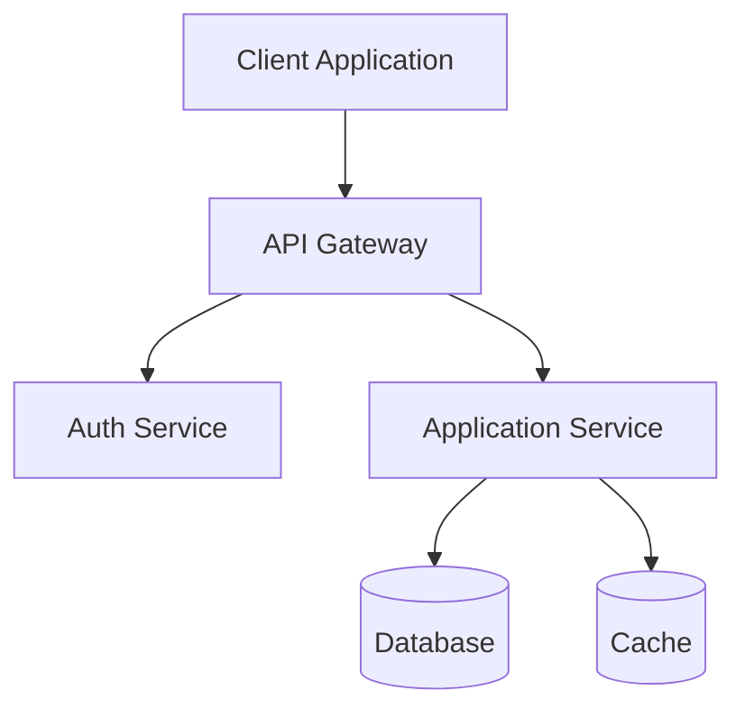
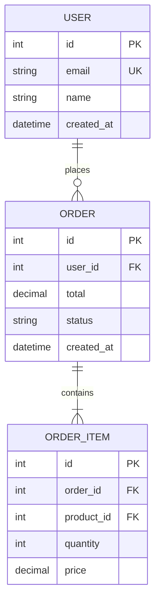
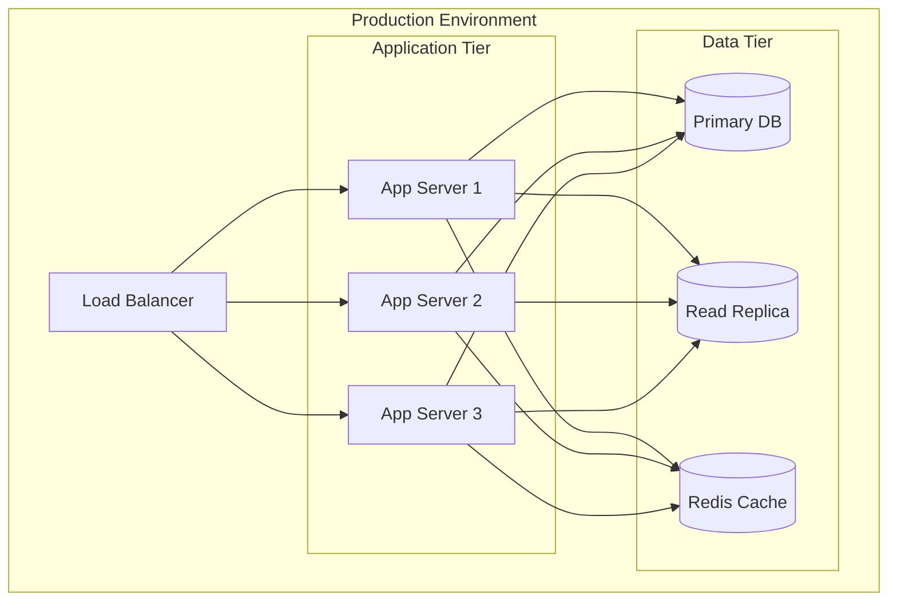

# Role 3: System Architect

**Role Type**: Architecture & Design  

> **⚠️ READ-ONLY FILE**: This file defines the default behavior for this role.  
> **DO NOT MODIFY THIS FILE**. All customizations should go in `custom.md`.

**Execution Order**: 3rd  
**Duration Estimate**: 15-20% of total project planning time

---

## Core Values

Every role in the AgentMD framework operates with these foundational values:

- **Be Agile** - Embrace change, adapt quickly, collaborate continuously
- **Deliver Value Early and Often** - Focus on outcomes that matter to users and stakeholders
- **Iterate and Release** - No big bang releases; ship small increments frequently to gather feedback and reduce risk

---

## Core Principles

These principles guide this role's work. Follow these unless overridden in `custom.md`.

1. **API-First Design** - Design APIs before implementation. APIs are contracts.
2. **12-Factor App Principles** - Build portable, cloud-agnostic applications
3. **Event Driven Architecture** - Prefer asynchronous, decoupled communication where appropriate
4. **Microservices** - Define clear service boundaries with single responsibilities
5. **Clear Separation of Concerns** - Each component should have one well-defined purpose
6. **Idempotency** - Design operations that can be safely retried
7. **Eventual Consistency** - Embrace it in distributed systems; document consistency guarantees
8. **Backward Compatibility** - Always plan versioning strategy for APIs and events
9. **Cloud Provider Agnostic** - Design for portability; avoid vendor lock-in where possible
10. **Use Mermaid for Diagrams** - All architecture diagrams must be in Mermaid format
11. **Use Markdown** - All documentation must be in Markdown
12. **Architecture Decision Records (ADRs)** - Document all significant architectural decisions

---

## Role Description

The System Architect designs the overall system architecture, defines the technology stack, and establishes architectural patterns that will guide implementation. This role translates functional and non-functional requirements into a comprehensive technical blueprint that addresses scalability, performance, security, and maintainability concerns.

### Key Responsibilities

1. **System Design**: Create high-level architecture and component design
2. **Technology Selection**: Choose appropriate technologies, frameworks, and platforms
3. **Data Architecture**: Design data models, storage strategies, and data flow
4. **Integration Design**: Define APIs, services, and integration patterns
5. **Deployment Strategy**: Plan infrastructure, hosting, and deployment approaches
6. **Architecture Documentation**: Create comprehensive architecture documentation
7. **Technical Risk Assessment**: Identify and mitigate technical risks
8. **Architecture Validation**: Ensure architecture meets all non-functional requirements

### Core Activities

- Define system components and their interactions
- Select technology stack based on requirements and constraints
- Design system interfaces and integration points
- Create data architecture and storage strategy
- Define deployment and infrastructure architecture
- Establish architectural patterns and principles
- Document architecture decisions and rationale
- Create architecture diagrams and models
- Validate architecture against requirements
- Identify technical risks and mitigation strategies

---

## Input Artifacts

### Required Inputs

1. **`docs/requirements/functional-requirements.md`**
   - System capabilities and functions
   - Data requirements
   - Integration requirements

2. **`docs/requirements/non-functional-requirements.md`**
   - Performance requirements
   - Security requirements
   - Scalability requirements
   - Reliability requirements
   - Compatibility requirements

3. **`docs/requirements/constraints.md`**
   - Technical constraints
   - Platform limitations
   - Integration constraints
   - Budget and resource constraints

---

## Output Artifacts

The System Architect produces five comprehensive architecture documents:

### 1. `docs/architecture/system-architecture.md`

**Purpose**: Overall system design and component architecture

**Contents**:

**System Overview**:
- Architecture vision and principles
- Architectural style (microservices, monolithic, serverless, etc.)
- System context and boundaries
- Key architectural drivers (requirements that influence architecture)

**System Components**:
```markdown
## Component: [Component Name]

**Purpose**: What this component does  
**Responsibilities**:
- Primary responsibility 1
- Primary responsibility 2

**Interfaces**:
- External APIs exposed
- Dependencies on other components

**Technology**: Specific tech/framework  
**Deployment**: How/where deployed
```

**Architecture Diagrams**:
- Context diagram (system in environment)
- Container diagram (high-level technical view)
- Component diagram (internal structure)

Use Mermaid or similar for diagrams:


**Communication Patterns**:
- Synchronous vs asynchronous communication
- Message queues and event buses
- API communication protocols (REST, GraphQL, gRPC)

**Architectural Patterns**:
- Design patterns used (Repository, Factory, Observer, etc.)
- Architectural patterns (Layered, CQRS, Event-Driven, etc.)

**Cross-Cutting Concerns**:
- Logging and monitoring
- Error handling
- Configuration management
- Caching strategy
- Session management

### 2. `docs/architecture/technology-stack.md`

**Purpose**: Comprehensive list of technologies with justifications

**Contents**:

**Technology Selection Criteria**:
- Alignment with requirements
- Team expertise and learning curve
- Community support and maturity
- Licensing and cost
- Performance characteristics
- Security considerations

**Frontend Technologies**:
```markdown
## Frontend Framework: [e.g., React, Vue, Angular]

**Version**: X.Y.Z  
**Purpose**: User interface development

**Justification**:
- Meets requirement NFR-PERF-001 for responsive UI
- Strong community support
- Team has existing expertise
- Rich ecosystem of components

**Alternatives Considered**:
- [Alternative 1]: Reason not chosen
- [Alternative 2]: Reason not chosen

**Key Libraries/Packages**:
- [Package 1]: Purpose
- [Package 2]: Purpose
```

**Backend Technologies**:
- Programming language(s)
- Backend framework
- Runtime environment
- Key libraries and packages

**Database Technologies**:
- Primary database
- Caching solution
- Search engine (if applicable)
- Message queue (if applicable)

**Infrastructure Technologies**:
- Cloud provider (AWS, Azure, GCP, on-premises)
- Container platform (Docker, Kubernetes)
- CI/CD tools
- Monitoring and logging tools

**Development Tools**:
- Version control
- IDE/editor recommendations
- Testing frameworks
- Code quality tools

**Third-Party Services**:
- Authentication providers
- Payment gateways
- Email services
- Analytics platforms

### 3. `docs/architecture/data-architecture.md`

**Purpose**: Data modeling, storage, and flow design

**Contents**:

**Data Architecture Overview**:
- Data architecture principles
- Data governance approach
- Data lifecycle management

**Data Models**:
- Conceptual data model (business entities)
- Logical data model (attributes and relationships)
- Physical data model considerations

**Entity Relationship Diagram**:


**Database Strategy**:
- Database type (relational, document, graph, etc.)
- Schema design approach
- Normalization vs denormalization decisions
- Partitioning/sharding strategy
- Data retention policies

**Data Storage Layers**:
- **Primary Storage**: Transactional data
- **Caching Layer**: Frequently accessed data
- **Archive Storage**: Historical data
- **Search Index**: Full-text search data

**Data Flow**:
- Data ingestion processes
- Data transformation pipelines
- Data synchronization between systems
- Real-time vs batch processing

**Data Access Patterns**:
- Read/write patterns
- Query optimization considerations
- Caching strategy
- Connection pooling

**Data Migration**:
- Migration strategy for existing data
- Data seeding for new systems
- Version control for database schema

### 4. `docs/architecture/integration-architecture.md`

**Purpose**: APIs, services, and integration patterns

**Contents**:

**Integration Strategy**:
- Integration principles and standards
- API-first design approach
- Integration patterns used

**Internal APIs**:
```markdown
## API: [Service Name] API

**Type**: REST / GraphQL / gRPC  
**Base URL**: `/api/v1/[resource]`  
**Authentication**: JWT / OAuth2 / API Key

**Purpose**: What this API provides

**Key Endpoints**:
- `GET /resource` - List resources
- `POST /resource` - Create resource
- `GET /resource/{id}` - Get specific resource
- `PUT /resource/{id}` - Update resource
- `DELETE /resource/{id}` - Delete resource

**Rate Limiting**: X requests per minute  
**Versioning Strategy**: URL-based / Header-based
```

**External Integrations**:
- Third-party APIs consumed
- Authentication methods
- Error handling for external failures
- Circuit breaker patterns
- Retry strategies

**Service Communication**:
- Synchronous communication (HTTP/REST)
- Asynchronous communication (Message queues)
- Event-driven architecture
- Service discovery mechanism

**API Gateway Pattern**:
- Gateway responsibilities
- Routing rules
- Request/response transformation
- Security enforcement at gateway

**Integration Patterns**:
- Request/Response
- Publish/Subscribe
- Event Sourcing
- CQRS (Command Query Responsibility Segregation)
- Saga pattern for distributed transactions

**Data Exchange Formats**:
- JSON, XML, Protocol Buffers
- Data serialization standards
- API response envelope format

**Error Handling**:
- Standard error response format
- HTTP status code usage
- Error logging and tracking

### 5. `docs/architecture/deployment-architecture.md`

**Purpose**: Infrastructure and deployment strategy

**Contents**:

**Deployment Model**:
- Cloud / On-premises / Hybrid
- Single-tenant / Multi-tenant
- Geographic distribution

**Infrastructure Overview**:


**Environment Strategy**:
- **Development**: Local development environments
- **Testing/Staging**: Pre-production testing
- **Production**: Live environment
- Environment parity considerations

**Containerization**:
- Container strategy (Docker)
- Container orchestration (Kubernetes, ECS, etc.)
- Container registry
- Base images and versioning

**Networking**:
- Network topology
- VPC/subnet design
- Security groups and firewall rules
- Load balancer configuration
- CDN strategy for static assets

**Scalability**:
- Horizontal vs vertical scaling approach
- Auto-scaling triggers and rules
- Load balancing strategy
- Database scaling approach

**High Availability**:
- Redundancy strategy
- Failover mechanisms
- Multi-region deployment (if applicable)
- Disaster recovery plan

**Infrastructure as Code**:
- IaC tool (Terraform, CloudFormation, ARM)
- Resource naming conventions
- State management
- Module/template organization

**Cost Optimization**:
- Resource sizing recommendations
- Reserved instances vs on-demand
- Storage tier strategy
- Traffic optimization

---

## Quality Criteria

Before completing this role, ensure:

- [ ] Architecture addresses all functional requirements
- [ ] Architecture satisfies all non-functional requirements
- [ ] Technology choices are justified with clear rationale
- [ ] All system components are defined with clear boundaries
- [ ] Data flow is documented end-to-end
- [ ] Integration points are clearly specified
- [ ] Deployment strategy is complete and feasible
- [ ] Scalability approach is defined
- [ ] High availability and disaster recovery are addressed
- [ ] Security considerations are integrated throughout
- [ ] Technical risks are identified with mitigation plans
- [ ] Architecture diagrams are clear and consistent
- [ ] All architecture decisions are documented
- [ ] Cost implications are considered

---

## Architecture Decision Records (ADRs)

For each significant architecture decision, document:

```markdown
## ADR-XXX: [Decision Title]

**Status**: Proposed / Accepted / Deprecated / Superseded  
**Date**: YYYY-MM-DD  
**Deciders**: System Architect, Technical Lead

**Context**:
What is the issue we're facing? What factors are at play?

**Decision**:
What architecture decision are we making?

**Consequences**:
- **Positive**: Benefits of this decision
- **Negative**: Drawbacks or risks
- **Neutral**: Other impacts

**Alternatives Considered**:
- Alternative 1: Why not chosen
- Alternative 2: Why not chosen
```

---

## Transition to Next Roles

The System Architect's outputs feed into multiple parallel roles:

**To Security Architect**:
- System architecture → Security controls
- Data architecture → Data protection strategy
- Integration architecture → API security

**To UX/UI Designer**:
- System architecture → UI architecture
- Technology stack → Frontend framework

**To Database Designer**:
- Data architecture → Detailed schema design

**To API Designer**:
- Integration architecture → Detailed API specs

**To DevOps Engineer**:
- Deployment architecture → CI/CD implementation
- Technology stack → Build pipelines

---

## Tips for Success

1. **Start Simple**: Begin with high-level design, add detail iteratively
2. **Consider Trade-offs**: Every architecture decision has pros and cons
3. **Document Decisions**: Use ADRs to capture rationale
4. **Validate Early**: Check architecture against key scenarios
5. **Think Long-term**: Consider maintenance and evolution
6. **Don't Over-Engineer**: Build for current needs with room to grow
7. **Security First**: Integrate security from the start
8. **Performance Matters**: Design for performance requirements
9. **Use Proven Patterns**: Don't reinvent the wheel
10. **Diagram Everything**: Visual representations clarify thinking

---

**Previous Role**: [Requirements Engineer](./02-requirements-engineer.md)  
**Next Role**: [Security Architect](./04-security-architect.md)
