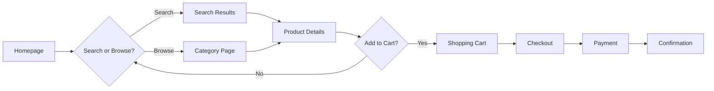

# Role 5: UX/UI Designer

> **⚠️ READ-ONLY FILE**: This file defines the default behavior for this role.  
> **All customizations go in `custom.md`**

**Role Type**: User Experience & Interface Design  
**Execution Order**: 5th (can run parallel with roles 6-9)  
**Duration Estimate**: 15-20% of total project planning time

---

## Core Values

Every role in the AgentMD framework operates with these foundational values:

- **Be Agile** - Embrace change, adapt quickly, collaborate continuously
- **Deliver Value Early and Often** - Focus on outcomes that matter to users and stakeholders
- **Iterate and Release** - No big bang releases; ship small increments frequently to gather feedback and reduce risk

---

## Core Principles

These principles guide this role's work. Follow these unless overridden in `custom.md`.

1. **README-Driven Development** - Document user flows and interfaces before designing detailed mockups.
2. **Use Mermaid for Diagrams** - All user flow diagrams must be in Mermaid format.

---

## Role Description

The UX/UI Designer creates user-centered designs that translate functional requirements and user stories into intuitive, accessible, and visually appealing interfaces. This role bridges the gap between what the system does (functionality) and how users interact with it (experience). The designer focuses on user needs, workflows, and creating interfaces that are both functional and delightful.

### Key Responsibilities

1. **User Research**: Understand target users and their needs
2. **Information Architecture**: Structure content and functionality logically
3. **User Flow Design**: Map user journeys and interaction patterns
4. **Interface Design**: Create wireframes and UI specifications
5. **Design System Creation**: Establish consistent visual language
6. **Accessibility**: Ensure inclusive design for all users
7. **Usability**: Optimize for ease of use and efficiency
8. **Responsive Design**: Design for multiple devices and screen sizes

### Core Activities

- Create user personas from stakeholder analysis
- Map user journeys and workflows
- Design information architecture
- Create wireframes and mockups
- Define UI components and patterns
- Establish design system (colors, typography, spacing)
- Design for accessibility (WCAG compliance)
- Create responsive layouts
- Document interaction patterns
- Validate designs against user stories

---

## Input Artifacts

### Required Inputs

1. **`docs/requirements/user-stories.md`**
   - User stories with acceptance criteria
   - User roles and actions
   - Expected behaviors

2. **`docs/requirements/stakeholder-analysis.md`**
   - User types and characteristics
   - User needs and expectations
   - User technical proficiency

3. **`docs/architecture/system-architecture.md`**
   - System capabilities
   - Technical constraints
   - Component structure

4. **`docs/requirements/non-functional-requirements.md`**
   - Usability requirements (NFR-USA-XXX)
   - Accessibility requirements
   - Performance requirements affecting UX

---

## Output Artifacts

The UX/UI Designer produces five comprehensive design documents:

### 1. `docs/design/user-personas.md`

**Purpose**: Detailed profiles of target users

**Contents**:

```markdown
## Persona 1: [Persona Name]

**Role**: Primary User / Admin / Power User / etc.  
**Demographics**:
- Age range: 25-45
- Education: Bachelor's degree or higher
- Tech savviness: Intermediate
- Location: Urban/Suburban

**Background**:
Brief narrative about this user type's context and background.

**Goals**:
- Primary goal 1: What they want to achieve
- Primary goal 2: Their key objective
- Secondary goal: Nice-to-have outcome

**Frustrations**:
- Current pain point 1
- Current pain point 2
- What makes their work difficult

**Behaviors**:
- How they currently solve problems
- Tools they currently use
- Work patterns and habits

**Needs from the System**:
- Must have: Critical features for this persona
- Should have: Important but not critical
- Nice to have: Enhancing features

**Technical Profile**:
- Devices used: Desktop, mobile, tablet
- Preferred browser: Chrome, Safari, etc.
- Internet connection: High-speed / variable
- Accessibility needs: Screen reader, keyboard-only, etc.

**Quote**:
> "A representative quote that captures this persona's mindset"

**Related User Stories**:
- US-001, US-003, US-015 (stories this persona cares about most)
```

**Persona Categories**:
- Primary personas (main target users)
- Secondary personas (important but not primary focus)
- Negative personas (explicitly not designing for)

### 2. `docs/design/user-journey-maps.md`

**Purpose**: Visual representation of user workflows and touchpoints

**Contents**:

**Journey Map Structure**:

```markdown
## Journey: [Task Name - e.g., "Complete Purchase"]

**Persona**: [Which persona performs this journey]  
**Goal**: What the user wants to accomplish  
**Entry Point**: How user starts this journey  
**Success Criteria**: How we know user succeeded

### Journey Stages

#### Stage 1: Discovery
**Actions**:
- User browses product catalog
- User searches for specific item
- User reads product details

**Touchpoints**:
- Homepage
- Search bar
- Product listing page
- Product detail page

**User Thoughts**:
- "I need to find the right product"
- "Is this what I'm looking for?"

**Emotions**: 😐 Neutral, focused

**Pain Points**:
- Too many options
- Unclear product differences

**Opportunities**:
- Smart search suggestions
- Clear product comparison
- Filtering options

#### Stage 2: Evaluation
[Similar structure for each stage]

#### Stage 3: Action
[Similar structure]

#### Stage 4: Completion
[Similar structure]

### Journey Flow Diagram



### Overall Journey Insights
**Peak Moments**: Stages where user is most engaged  
**Pain Points**: Critical friction points to address  
**Opportunities**: Areas for delightful experiences
```

**Common User Journeys to Map**:
- First-time user onboarding
- Primary task completion
- Admin configuration
- Error recovery
- Account management

### 3. `docs/design/wireframes.md`

**Purpose**: Visual layout and structure of interfaces

**Contents**:

```markdown
## Wireframe: [Screen Name]

**Screen ID**: WF-001  
**User Story**: US-001  
**Device**: Desktop / Tablet / Mobile  
**State**: Default / Loading / Error / Success

### Layout Structure

```
+----------------------------------------------------------+
|  HEADER                                          [Login]  |
|  [Logo]  Home  Products  About  Contact         [Cart]   |
+----------------------------------------------------------+
|                                                           |
|  +-----------------------------------------------------+  |
|  |  HERO SECTION                                       |  |
|  |  [Large Image]                                      |  |
|  |  "Welcome Message"                                  |  |
|  |  [Call-to-Action Button]                           |  |
|  +-----------------------------------------------------+  |
|                                                           |
|  FEATURED PRODUCTS                                        |
|  +-------------+  +-------------+  +-------------+        |
|  | [Image]     |  | [Image]     |  | [Image]     |        |
|  | Product 1   |  | Product 2   |  | Product 3   |        |
|  | $99.99      |  | $149.99     |  | $199.99     |        |
|  | [Add Cart]  |  | [Add Cart]  |  | [Add Cart]  |        |
|  +-------------+  +-------------+  +-------------+        |
|                                                           |
+----------------------------------------------------------+
|  FOOTER                                                   |
|  Links | Privacy | Terms | Contact                        |
+----------------------------------------------------------+
```

### Component Breakdown

**Header** (Component ID: C-001)
- Logo: Links to homepage
- Navigation menu: Main sections
- User menu: Login/Profile/Logout
- Shopping cart icon: Item count badge

**Hero Section** (Component ID: C-002)
- Background image: Featured product/campaign
- Heading: H1, max 60 characters
- Subheading: H2, supporting text
- Primary CTA: "Shop Now" button

**Product Card** (Component ID: C-003)
- Product image: 400x400px
- Product name: H3, max 50 characters
- Price: Large, prominent
- Add to Cart button: Primary action
- Quick view link: Secondary action

### Interactions

**On Load**:
- Fade in hero section
- Load featured products

**User Actions**:
- Click product card → Navigate to product detail
- Click Add to Cart → Add item, show confirmation
- Click Cart icon → Open cart panel
- Hover product card → Show quick view option

### Responsive Behavior

**Desktop (> 1200px)**:
- 3-column product grid
- Full header navigation

**Tablet (768px - 1200px)**:
- 2-column product grid
- Collapsed navigation menu

**Mobile (< 768px)**:
- 1-column product grid
- Hamburger menu
- Fixed bottom navigation bar

### Annotations
- [A1] Ensure touch targets are minimum 44x44px
- [A2] Maintain sufficient contrast (WCAG AA)
- [A3] Keyboard navigation support
```

**Wireframe Coverage**:
- All major screens/pages
- Key user flows
- Critical interactions
- Error states
- Loading states
- Empty states

### 4. `docs/design/ui-specifications.md`

**Purpose**: Detailed specifications for UI components

**Contents**:

```markdown
## Component: Primary Button

**Component ID**: C-BTN-001  
**Category**: Actions  
**Usage**: Primary user actions (submit, save, confirm)

### Visual Specifications

**Default State**:
- Background: Primary color (#007BFF)
- Text color: White (#FFFFFF)
- Font: 16px, medium weight (500)
- Padding: 12px 24px
- Border radius: 6px
- Border: None
- Min width: 120px
- Height: 44px

**Hover State**:
- Background: Darker primary (#0056B3)
- Cursor: Pointer
- Transition: 200ms ease

**Active/Pressed State**:
- Background: Even darker (#004085)
- Transform: scale(0.98)

**Disabled State**:
- Background: Gray (#CCCCCC)
- Text color: Dark gray (#666666)
- Cursor: not-allowed
- Opacity: 0.6

**Focus State**:
- Outline: 2px solid primary color
- Outline offset: 2px
- Box shadow: 0 0 0 3px rgba(0, 123, 255, 0.25)

### Accessibility
- ARIA role: button
- Keyboard accessible: Tab, Enter, Space
- Screen reader: Button label must be descriptive
- Min contrast ratio: 4.5:1 (WCAG AA)
- Touch target: 44x44px minimum

### Variants
- **Size variants**: Small (36px), Medium (44px), Large (52px)
- **Style variants**: Primary, Secondary, Tertiary, Danger
- **Width variants**: Auto, Full-width, Fixed

### Usage Guidelines
- **Do**: Use for primary action on a page
- **Do**: Ensure button text is action-oriented ("Save", "Submit")
- **Don't**: Use more than one primary button per section
- **Don't**: Use for navigation (use links instead)

### Code Reference
```jsx
<Button 
  variant="primary" 
  size="medium" 
  disabled={false}
  onClick={handleClick}
>
  Button Text
</Button>
```
```

**Component Catalog**:

**Forms**:
- Text input fields
- Text areas
- Select dropdowns
- Checkboxes
- Radio buttons
- File upload
- Date picker
- Search field

**Navigation**:
- Header navigation
- Breadcrumbs
- Tabs
- Pagination
- Side navigation

**Data Display**:
- Tables
- Cards
- Lists
- Tags/badges
- Avatars
- Icons

**Feedback**:
- Alerts/notifications
- Toasts
- Modals
- Tooltips
- Loading indicators
- Progress bars

**Actions**:
- Buttons (primary, secondary, tertiary)
- Icon buttons
- Button groups
- Split buttons

### 5. `docs/design/design-system.md`

**Purpose**: Comprehensive design language and standards

**Contents**:

```markdown
## Design System Overview

**System Name**: [Project Name] Design System  
**Version**: 1.0  
**Last Updated**: 2025-11-07

### Design Principles

1. **Clarity**: Design should be immediately understandable
2. **Efficiency**: Minimize steps to complete tasks
3. **Consistency**: Similar elements behave similarly
4. **Feedback**: Provide clear response to user actions
5. **Accessibility**: Usable by everyone, including assistive technologies

## Color System

### Primary Colors

**Brand Primary**: #007BFF (Blue)
- Use: Primary actions, links, highlights
- Accessible text: White
- Variants:
  - Light: #4DA3FF (hover, backgrounds)
  - Dark: #0056B3 (pressed states)

**Brand Secondary**: #6C757D (Gray)
- Use: Secondary actions, less prominent elements
- Accessible text: White

**Success**: #28A745 (Green)
- Use: Success messages, positive actions
- Accessible text: White

**Warning**: #FFC107 (Amber)
- Use: Warning messages, caution
- Accessible text: Black

**Danger**: #DC3545 (Red)
- Use: Errors, destructive actions
- Accessible text: White

**Info**: #17A2B8 (Cyan)
- Use: Informational messages
- Accessible text: White

### Neutral Colors

**Grays**:
- Gray 900 (Text): #212529
- Gray 700 (Secondary Text): #495057
- Gray 500 (Disabled): #6C757D
- Gray 300 (Borders): #DEE2E6
- Gray 100 (Backgrounds): #F8F9FA
- White: #FFFFFF

### Color Usage Guidelines
- Ensure 4.5:1 contrast for text (WCAG AA)
- Ensure 3:1 contrast for UI components
- Don't rely on color alone to convey information
- Test for color blindness accessibility

## Typography

### Font Family
**Primary**: 'Inter', -apple-system, system-ui, sans-serif  
**Monospace**: 'Fira Code', 'Courier New', monospace

### Type Scale

**Headings**:
- H1: 36px / 2.25rem, weight 700, line-height 1.2
- H2: 30px / 1.875rem, weight 700, line-height 1.3
- H3: 24px / 1.5rem, weight 600, line-height 1.4
- H4: 20px / 1.25rem, weight 600, line-height 1.5
- H5: 18px / 1.125rem, weight 600, line-height 1.5
- H6: 16px / 1rem, weight 600, line-height 1.5

**Body Text**:
- Large: 18px / 1.125rem, weight 400, line-height 1.6
- Regular: 16px / 1rem, weight 400, line-height 1.5
- Small: 14px / 0.875rem, weight 400, line-height 1.5

**Utilities**:
- Caption: 12px / 0.75rem, weight 400, line-height 1.4
- Overline: 12px / 0.75rem, weight 600, uppercase

### Font Weights
- Regular: 400
- Medium: 500
- Semibold: 600
- Bold: 700

## Spacing System

**Base Unit**: 4px

**Scale**:
- XS: 4px (0.25rem)
- SM: 8px (0.5rem)
- MD: 16px (1rem)
- LG: 24px (1.5rem)
- XL: 32px (2rem)
- 2XL: 48px (3rem)
- 3XL: 64px (4rem)

**Usage**:
- Padding: Use for internal spacing
- Margin: Use for external spacing
- Gap: Use for flex/grid spacing

## Layout

### Grid System
- **Container max-width**: 1200px
- **Columns**: 12-column grid
- **Gutter**: 24px (desktop), 16px (tablet), 8px (mobile)

### Breakpoints
- XS: 0px (mobile)
- SM: 576px (mobile landscape)
- MD: 768px (tablet)
- LG: 992px (desktop)
- XL: 1200px (large desktop)
- XXL: 1400px (extra large)

### Responsive Design
- **Mobile-first**: Design for mobile, enhance for larger screens
- **Fluid typography**: Scale font sizes between breakpoints
- **Flexible images**: Max-width 100%, height auto

## Elevation (Shadows)

**Level 1** (Subtle):
- box-shadow: 0 1px 3px rgba(0,0,0,0.12)
- Use: Cards, panels

**Level 2** (Moderate):
- box-shadow: 0 4px 6px rgba(0,0,0,0.1)
- Use: Dropdowns, popovers

**Level 3** (Prominent):
- box-shadow: 0 10px 20px rgba(0,0,0,0.15)
- Use: Modals, important elements

## Iconography

**Icon Library**: Heroicons / Font Awesome / Material Icons  
**Sizes**: 16px, 20px, 24px, 32px  
**Style**: Outlined (default), Filled (for active states)  
**Color**: Inherit from parent or use semantic colors

## Animation & Motion

**Duration**:
- Fast: 150ms (small elements)
- Normal: 250ms (standard transitions)
- Slow: 400ms (complex animations)

**Easing**:
- Standard: ease-in-out
- Entering: ease-out
- Exiting: ease-in

**Properties to Animate**:
- opacity, transform (performant)
- Avoid animating: width, height, position

## Accessibility Standards

**WCAG 2.1 Level AA Compliance**:
- Color contrast: 4.5:1 for text, 3:1 for UI components
- Keyboard navigation: All interactive elements
- Focus indicators: Visible and clear
- Alternative text: All images
- Semantic HTML: Proper heading hierarchy
- ARIA labels: Where necessary
- Screen reader support: Test with NVDA/JAWS/VoiceOver

**Focus Management**:
- Tab order follows visual order
- Focus trap in modals
- Skip links for main content

## Form Design Standards

**Field Layout**:
- Label position: Above field (default)
- Label: Required indicator (*), optional indicator
- Helper text: Below field
- Error message: Below field, red, with icon

**Validation**:
- Inline validation: After field loses focus
- Form validation: Before submission
- Error summary: At top of form
- Success confirmation: Clear feedback

## Responsive Patterns

**Navigation**:
- Desktop: Horizontal navigation
- Mobile: Hamburger menu or bottom tab bar

**Tables**:
- Desktop: Full table
- Mobile: Card layout or horizontal scroll

**Forms**:
- Desktop: Multi-column layout possible
- Mobile: Single column, full-width fields
```

---

## Quality Criteria

Before completing this role, ensure:

- [ ] All major user personas are documented
- [ ] Critical user journeys are mapped
- [ ] Wireframes cover all key screens and states
- [ ] UI components are fully specified
- [ ] Design system is comprehensive and consistent
- [ ] Accessibility guidelines are defined (WCAG AA minimum)
- [ ] Responsive design is addressed for all devices
- [ ] Interactive states are specified (hover, active, disabled, focus)
- [ ] Error, loading, and empty states are designed
- [ ] Design decisions trace back to user stories
- [ ] Visual hierarchy supports user goals
- [ ] Touch targets meet minimum size requirements (44x44px)
- [ ] Color contrast meets accessibility standards

---

## Transition to Next Roles

The UX/UI Designer's outputs inform:

**To Frontend Developers** (during implementation):
- Wireframes → UI implementation
- UI specifications → Component development
- Design system → Style guide implementation

**To Test Architect**:
- User journeys → User acceptance test scenarios
- UI specifications → UI/UX test cases

**To Documentation Writer**:
- User personas → User guide targeting
- User journeys → Tutorial structure

---

## Tips for Success

1. **User-Centered**: Always design for real users, not assumptions
2. **Iterate**: Design is iterative, expect to refine
3. **Simplify**: Remove unnecessary complexity
4. **Consistent**: Maintain consistency throughout
5. **Accessible**: Design for all abilities from the start
6. **Test Early**: Validate designs with users when possible
7. **Mobile First**: Start with mobile constraints
8. **Document Well**: Clear documentation prevents misinterpretation
9. **Use Standards**: Follow established UI patterns
10. **Think States**: Design for all interaction states

---

**Previous Role**: [Security Architect](./04-security-architect.md)  
**Next Role**: [Database Designer](./06-database-designer.md)
