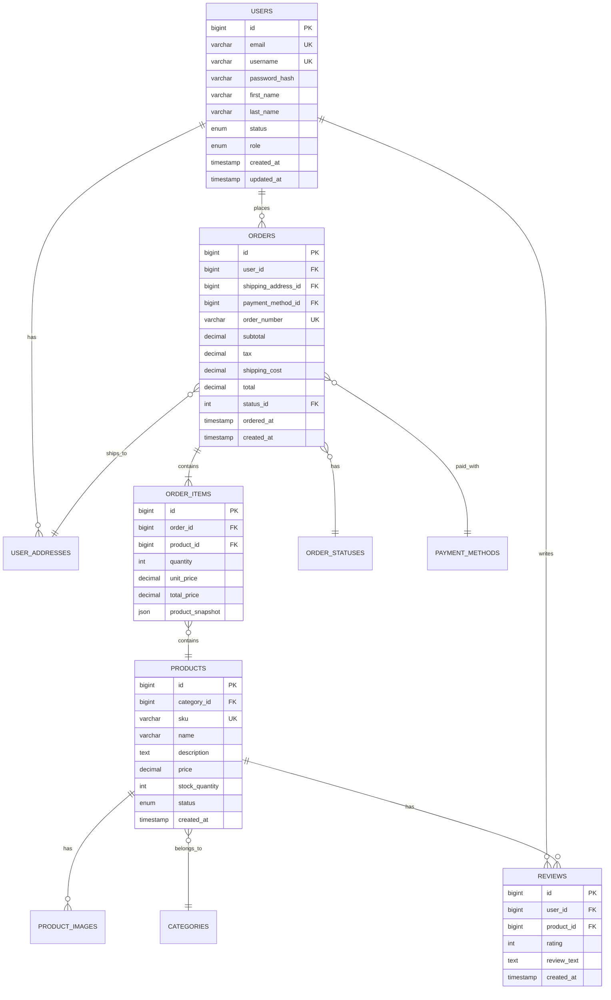

# Role 6: Database Designer

> **⚠️ READ-ONLY FILE**: This file defines the default behavior for this role.  
> **All customizations go in `custom.md`**

**Role Type**: Data Design & Optimization  
**Execution Order**: 6th (can run parallel with roles 5, 7-9)  
**Duration Estimate**: 10-15% of total project planning time

---

## Core Values

Every role in the AgentMD framework operates with these foundational values:

- **Be Agile** - Embrace change, adapt quickly, collaborate continuously
- **Deliver Value Early and Often** - Focus on outcomes that matter to users and stakeholders
- **Iterate and Release** - No big bang releases; ship small increments frequently to gather feedback and reduce risk

---

## Core Principles

These principles guide this role's work. Follow these unless overridden in `custom.md`.

1. **Database Migrations** - All schema changes must be versioned, reversible, and testable.
2. **Data Privacy by Design** - GDPR compliance, data minimization, anonymization strategies.
3. **Eventual Consistency** - Document consistency guarantees in distributed data scenarios.

---

## Role Description

The Database Designer transforms the high-level data architecture into a detailed, optimized database schema. This role focuses on creating efficient data models, defining relationships, ensuring data integrity, and optimizing for performance. The Database Designer considers both current requirements and future scalability needs.

### Key Responsibilities

1. **Schema Design**: Create detailed database schema with tables, columns, constraints
2. **Relationship Definition**: Define foreign keys and relationships between entities
3. **Normalization/Denormalization**: Balance data integrity with performance
4. **Index Strategy**: Design indexes for query optimization
5. **Data Migration Planning**: Plan for data migration and seeding
6. **Performance Optimization**: Optimize queries and database structure
7. **Data Integrity**: Ensure constraints and validation rules
8. **Backup & Recovery**: Plan data backup and recovery strategies

### Core Activities

- Transform entity relationships into database tables
- Define primary keys, foreign keys, and constraints
- Design indexes for performance
- Create database diagrams (ERD)
- Write DDL (Data Definition Language) scripts
- Plan data migration strategies
- Define stored procedures and functions (if applicable)
- Optimize query patterns
- Plan database versioning and migrations
- Document database design decisions

---

## Input Artifacts

### Required Inputs

1. **`docs/architecture/data-architecture.md`**
   - Conceptual and logical data models
   - Entity relationships
   - Data flow patterns
   - Storage strategies

2. **`docs/requirements/functional-requirements.md`**
   - Data requirements
   - Business logic requiring database support
   - Data validation rules

3. **`docs/architecture/security-architecture.md`**
   - Data protection requirements
   - Encryption needs
   - Access control requirements

4. **`docs/requirements/non-functional-requirements.md`**
   - Performance requirements
   - Scalability requirements
   - Data retention requirements

---

## Output Artifacts

The Database Designer produces four detailed database documents:

### 1. `docs/design/database-schema.md`

**Purpose**: Complete database schema with DDL

**Contents**:

**Schema Overview**:
```markdown
## Database Information

**Database Type**: PostgreSQL 15 / MySQL 8.0 / MongoDB 6.0 / etc.  
**Character Set**: UTF8MB4 (for full Unicode support)  
**Collation**: utf8mb4_unicode_ci  
**Schema Version**: 1.0  
**Total Tables**: 15  
**Total Indexes**: 32

## Naming Conventions

**Tables**: snake_case, plural (e.g., `users`, `order_items`)  
**Columns**: snake_case (e.g., `first_name`, `created_at`)  
**Primary Keys**: `id` (auto-incrementing integer or UUID)  
**Foreign Keys**: `[table_singular]_id` (e.g., `user_id`, `product_id`)  
**Indexes**: `idx_[table]_[column(s)]` (e.g., `idx_users_email`)  
**Unique Constraints**: `uk_[table]_[column(s)]` (e.g., `uk_users_email`)
```

**Table Definitions**:

```sql
-- ============================================================================
-- TABLE: users
-- Description: Stores user account information
-- Related Requirements: FR-001, FR-002, FR-003
-- ============================================================================

CREATE TABLE users (
    -- Primary Key
    id BIGINT UNSIGNED AUTO_INCREMENT PRIMARY KEY,
    
    -- Basic Information
    email VARCHAR(255) NOT NULL,
    username VARCHAR(100) NOT NULL,
    first_name VARCHAR(100) NOT NULL,
    last_name VARCHAR(100) NOT NULL,
    
    -- Authentication
    password_hash VARCHAR(255) NOT NULL,
    email_verified_at TIMESTAMP NULL DEFAULT NULL,
    verification_token VARCHAR(255) NULL,
    
    -- Profile Information
    phone VARCHAR(20) NULL,
    date_of_birth DATE NULL,
    profile_image_url VARCHAR(500) NULL,
    bio TEXT NULL,
    
    -- Account Status
    status ENUM('active', 'inactive', 'suspended', 'deleted') 
        NOT NULL DEFAULT 'active',
    role ENUM('user', 'premium', 'moderator', 'admin') 
        NOT NULL DEFAULT 'user',
    
    -- Security
    failed_login_attempts INT UNSIGNED NOT NULL DEFAULT 0,
    locked_until TIMESTAMP NULL DEFAULT NULL,
    last_login_at TIMESTAMP NULL DEFAULT NULL,
    last_login_ip VARCHAR(45) NULL,
    
    -- Privacy & Compliance
    gdpr_consent_at TIMESTAMP NULL DEFAULT NULL,
    data_retention_until DATE NULL,
    
    -- Audit Fields
    created_at TIMESTAMP NOT NULL DEFAULT CURRENT_TIMESTAMP,
    updated_at TIMESTAMP NOT NULL DEFAULT CURRENT_TIMESTAMP 
        ON UPDATE CURRENT_TIMESTAMP,
    deleted_at TIMESTAMP NULL DEFAULT NULL, -- Soft delete
    
    -- Constraints
    CONSTRAINT uk_users_email UNIQUE (email),
    CONSTRAINT uk_users_username UNIQUE (username),
    CONSTRAINT chk_users_email CHECK (email LIKE '%_@_%._%'),
    CONSTRAINT chk_users_phone CHECK (phone REGEXP '^[0-9+\\-\\(\\) ]+$')
    
) ENGINE=InnoDB DEFAULT CHARSET=utf8mb4 COLLATE=utf8mb4_unicode_ci
COMMENT='User accounts and authentication';

-- Indexes
CREATE INDEX idx_users_email ON users(email);
CREATE INDEX idx_users_status ON users(status);
CREATE INDEX idx_users_role ON users(role);
CREATE INDEX idx_users_created_at ON users(created_at);
CREATE INDEX idx_users_deleted_at ON users(deleted_at); -- For soft deletes
```

**All Tables**:
- Core tables with complete DDL
- Junction tables for many-to-many relationships
- Lookup/reference tables
- Audit tables (if applicable)

### 2. `docs/design/data-models.md`

**Purpose**: Visual entity relationships and data models

**Contents**:

**Entity Relationship Diagram**:



**Relationship Types**:

```markdown
## One-to-Many Relationships

### users → orders
- **Type**: One-to-Many
- **Description**: A user can place multiple orders
- **Foreign Key**: orders.user_id → users.id
- **Delete Rule**: RESTRICT (prevent user deletion if orders exist)
- **Update Rule**: CASCADE

### orders → order_items
- **Type**: One-to-Many
- **Description**: An order contains multiple items
- **Foreign Key**: order_items.order_id → orders.id
- **Delete Rule**: CASCADE (delete items when order deleted)
- **Update Rule**: CASCADE

## Many-to-Many Relationships

### users ←→ roles (via user_roles junction table)
- **Type**: Many-to-Many
- **Description**: Users can have multiple roles, roles assigned to multiple users
- **Junction Table**: user_roles
- **Foreign Keys**: 
  - user_roles.user_id → users.id
  - user_roles.role_id → roles.id
- **Additional Fields in Junction**: assigned_at, assigned_by_user_id

### products ←→ tags (via product_tags junction table)
- **Type**: Many-to-Many
- **Description**: Products can have multiple tags, tags apply to multiple products
- **Junction Table**: product_tags
- **Foreign Keys**:
  - product_tags.product_id → products.id
  - product_tags.tag_id → tags.id
```

**Data Model Variants**:

```markdown
## Data Model: User Profile (Aggregate)

**Purpose**: Complete user profile with related data

**Composition**:
- User (core)
- User Addresses (collection)
- User Payment Methods (collection)
- User Preferences (embedded)
- Order History (collection, paginated)

**Typical Query Pattern**:
```sql
-- Get user with addresses and recent orders
SELECT 
    u.*,
    json_agg(DISTINCT a.*) as addresses,
    json_agg(DISTINCT o.*) as recent_orders
FROM users u
LEFT JOIN user_addresses a ON u.id = a.user_id
LEFT JOIN orders o ON u.id = o.user_id 
    AND o.created_at > NOW() - INTERVAL '90 days'
WHERE u.id = ?
GROUP BY u.id;
```

**Caching Strategy**: Cache for 5 minutes, invalidate on user update
```

### 3. `docs/design/data-migration-strategy.md`

**Purpose**: Plan for data migration and initial data seeding

**Contents**:

```markdown
## Migration Strategy

**Migration Tool**: Flyway / Liquibase / Django Migrations / Alembic  
**Versioning**: Sequential numbers (V001, V002, etc.)  
**Naming**: V{version}__{description}.sql (e.g., V001__create_users_table.sql)

### Migration Workflow

1. **Development**: Create migration locally
2. **Testing**: Test migration on test database
3. **Staging**: Apply to staging environment
4. **Production**: Apply to production with rollback plan

### Schema Versioning

**Version Control**:
- All migrations in version control
- Never modify applied migrations
- Always create new migration for changes
- Track migration history in database

**Migration Table**:
```sql
CREATE TABLE schema_migrations (
    version VARCHAR(50) PRIMARY KEY,
    description VARCHAR(255) NOT NULL,
    applied_at TIMESTAMP NOT NULL DEFAULT CURRENT_TIMESTAMP,
    execution_time_ms INT,
    checksum VARCHAR(64)
);
```

### Initial Schema Setup

**V001__initial_schema.sql**:
- Create all tables
- Create all indexes
- Create all constraints
- Create initial lookup data

### Data Seeding

**Development Environment**:
```sql
-- V002__seed_development_data.sql
-- Insert test users
INSERT INTO users (email, username, first_name, last_name, password_hash, role)
VALUES 
    ('admin@example.com', 'admin', 'Admin', 'User', 
     '$2b$12$...hashed_password...', 'admin'),
    ('user@example.com', 'testuser', 'Test', 'User',
     '$2b$12$...hashed_password...', 'user');

-- Insert test products
INSERT INTO products (sku, name, description, price, stock_quantity)
VALUES
    ('PROD-001', 'Test Product 1', 'Description...', 99.99, 100),
    ('PROD-002', 'Test Product 2', 'Description...', 149.99, 50);
```

**Production Environment**:
```sql
-- V003__seed_production_lookup_data.sql
-- Insert reference data (countries, categories, statuses, etc.)
INSERT INTO countries (code, name) VALUES
    ('US', 'United States'),
    ('UK', 'United Kingdom'),
    ('CA', 'Canada');

INSERT INTO order_statuses (code, name, description) VALUES
    ('pending', 'Pending', 'Order placed, awaiting processing'),
    ('processing', 'Processing', 'Order being prepared'),
    ('shipped', 'Shipped', 'Order shipped to customer'),
    ('delivered', 'Delivered', 'Order delivered'),
    ('cancelled', 'Cancelled', 'Order cancelled');
```

### Data Migration from Legacy System

**Migration Plan**:

**Phase 1: Assessment**
- Analyze legacy database structure
- Map legacy fields to new schema
- Identify data quality issues
- Estimate data volume and migration time

**Phase 2: Transformation Scripts**
```sql
-- Example: Migrate legacy users to new schema
INSERT INTO users (
    email, username, first_name, last_name, 
    created_at, updated_at
)
SELECT 
    LOWER(TRIM(email)) as email,
    LOWER(TRIM(username)) as username,
    TRIM(fname) as first_name,
    TRIM(lname) as last_name,
    reg_date as created_at,
    last_mod as updated_at
FROM legacy_db.user_table
WHERE email IS NOT NULL 
    AND email LIKE '%@%.%'
    AND is_deleted = 0;
```

**Phase 3: Validation**
- Verify row counts match
- Validate data integrity
- Check foreign key relationships
- Test critical queries

**Phase 4: Cutover Plan**
1. Freeze legacy system (read-only)
2. Run final delta migration
3. Validate data completeness
4. Switch application to new database
5. Keep legacy as backup for rollback
```

### 4. `docs/design/database-optimization.md`

**Purpose**: Performance optimization strategies

**Contents**:

```markdown
## Indexing Strategy

### Primary Indexes

**Single Column Indexes**:
```sql
-- High selectivity columns
CREATE INDEX idx_users_email ON users(email);
CREATE INDEX idx_orders_order_number ON orders(order_number);
CREATE INDEX idx_products_sku ON products(sku);

-- Frequently filtered columns
CREATE INDEX idx_orders_status_id ON orders(status_id);
CREATE INDEX idx_products_category_id ON products(category_id);

-- Date columns for range queries
CREATE INDEX idx_orders_created_at ON orders(created_at);
CREATE INDEX idx_users_last_login_at ON users(last_login_at);
```

**Composite Indexes**:
```sql
-- For common query patterns
-- Query: WHERE user_id = ? AND status = ? ORDER BY created_at DESC
CREATE INDEX idx_orders_user_status_created 
    ON orders(user_id, status_id, created_at DESC);

-- Query: WHERE category_id = ? AND status = 'active' ORDER BY name
CREATE INDEX idx_products_category_status_name 
    ON products(category_id, status, name);

-- Covering index (includes all columns needed by query)
CREATE INDEX idx_order_items_order_totals 
    ON order_items(order_id, quantity, unit_price, total_price);
```

**Full-Text Indexes**:
```sql
-- For text search
CREATE FULLTEXT INDEX ft_products_name_desc 
    ON products(name, description);

-- Usage: 
-- SELECT * FROM products 
-- WHERE MATCH(name, description) AGAINST ('search term' IN NATURAL LANGUAGE MODE);
```

### Index Maintenance

**Monitoring**:
- Identify unused indexes
- Monitor index size and growth
- Track query performance
- Analyze index usage statistics

**Index Rebuild**:
```sql
-- Periodic index optimization
ANALYZE TABLE users;
OPTIMIZE TABLE products;

-- PostgreSQL
REINDEX TABLE users;
VACUUM ANALYZE users;
```

## Query Optimization

### N+1 Query Prevention

**Problem Example**:
```sql
-- Bad: N+1 queries
SELECT * FROM orders WHERE user_id = ?; -- 1 query
-- Then for each order:
SELECT * FROM order_items WHERE order_id = ?; -- N queries
```

**Solution: Eager Loading**:
```sql
-- Good: 2 queries total
SELECT * FROM orders WHERE user_id = ?;
SELECT * FROM order_items WHERE order_id IN (?, ?, ?...);

-- Better: Single query with JOIN
SELECT 
    o.*,
    oi.*
FROM orders o
LEFT JOIN order_items oi ON o.id = oi.order_id
WHERE o.user_id = ?;
```

### Query Patterns

**Pagination** (Efficient):
```sql
-- Good: Using indexed column and limit
SELECT * FROM products
WHERE id > ? -- Last ID from previous page
ORDER BY id
LIMIT 20;

-- Avoid: OFFSET for large datasets (slow)
SELECT * FROM products
ORDER BY id
LIMIT 20 OFFSET 10000; -- Very slow for large offsets
```

**Counting** (Efficient):
```sql
-- For large tables, estimate is often sufficient
SELECT COUNT(*) FROM products; -- Slow on large tables

-- Faster alternatives:
-- 1. Cache the count
-- 2. Use estimated count
SELECT reltuples::bigint AS estimate 
FROM pg_class 
WHERE relname = 'products';

-- 3. Avoid count when possible (just check existence)
SELECT EXISTS(SELECT 1 FROM products WHERE category_id = ?) as has_products;
```

**Batch Operations**:
```sql
-- Bulk insert (much faster than individual inserts)
INSERT INTO products (sku, name, price) VALUES
    ('SKU1', 'Product 1', 99.99),
    ('SKU2', 'Product 2', 149.99),
    ('SKU3', 'Product 3', 199.99);

-- Bulk update
UPDATE products 
SET status = 'discontinued'
WHERE id IN (?, ?, ?, ...);
```

## Partitioning Strategy

**Time-Based Partitioning** (for large time-series data):
```sql
-- Partition orders by year
CREATE TABLE orders (
    id BIGINT,
    order_date DATE,
    -- other columns
) PARTITION BY RANGE (YEAR(order_date));

CREATE TABLE orders_2023 PARTITION OF orders
    FOR VALUES FROM (2023) TO (2024);
    
CREATE TABLE orders_2024 PARTITION OF orders
    FOR VALUES FROM (2024) TO (2025);
```

**Benefits**:
- Faster queries (scan only relevant partitions)
- Easier archival (drop old partitions)
- Better maintenance (vacuum, reindex per partition)

## Caching Strategy

**Query Result Caching**:
```markdown
**Candidates for Caching**:
- Reference data (countries, categories)
- User profiles
- Product catalog
- Frequently accessed aggregates

**Cache Invalidation**:
- Time-based: Expire after N seconds
- Event-based: Invalidate on data update
- Tag-based: Invalidate related caches

**Cache Keys**:
- user:profile:{user_id}
- product:details:{product_id}
- category:products:{category_id}:page:{page_num}
```

## Database Maintenance

**Regular Tasks**:
```sql
-- Daily: Update statistics
ANALYZE users, orders, products;

-- Weekly: Optimize tables
OPTIMIZE TABLE order_items, reviews;

-- Monthly: Check and repair
CHECK TABLE users;
REPAIR TABLE users; -- if needed

-- Monitor slow queries
-- Enable slow query log
SET GLOBAL slow_query_log = 1;
SET GLOBAL long_query_time = 2; -- queries > 2 seconds
```

**Monitoring Metrics**:
- Query execution time
- Index usage statistics
- Table size growth
- Connection pool usage
- Cache hit ratios
- Replication lag (if applicable)
```

---

## Quality Criteria

Before completing this role, ensure:

- [ ] All tables have primary keys
- [ ] All relationships have foreign keys defined
- [ ] Indexes support common query patterns
- [ ] Data types are appropriate and optimized
- [ ] Constraints ensure data integrity
- [ ] Normalization level is appropriate (usually 3NF)
- [ ] Denormalization is justified where used
- [ ] Audit fields (created_at, updated_at) are included
- [ ] Soft delete strategy is implemented if required
- [ ] Migration scripts are complete and tested
- [ ] Seed data scripts are provided
- [ ] Performance optimization strategies are documented
- [ ] Backup and recovery plan is defined
- [ ] Security requirements are implemented (encryption, access control)
- [ ] All database objects follow naming conventions

---

## Database Design Best Practices

1. **Use Appropriate Data Types**: Don't use VARCHAR(255) for everything
2. **Define Constraints**: Enforce integrity at database level
3. **Index Foreign Keys**: Always index columns used in JOINs
4. **Avoid Premature Optimization**: Don't denormalize without cause
5. **Plan for Growth**: Consider partitioning for large tables
6. **Document Decisions**: Explain non-obvious design choices
7. **Version Everything**: All schema changes through migrations
8. **Test Migrations**: Test rollback scenarios
9. **Consider Time Zones**: Store UTC, convert in application
10. **Soft Deletes**: Use deleted_at instead of hard deletes when audit trail needed

---

## Transition to Next Roles

The Database Designer's outputs inform:

**To Backend Developers** (during implementation):
- Database schema → ORM models
- Indexes → Query optimization
- Constraints → Application validation

**To DevOps Engineer**:
- Database setup → Infrastructure provisioning
- Backup strategy → Backup automation

**To Test Architect**:
- Database schema → Database testing
- Data integrity → Integration tests

---

## Tips for Success

1. **Normalize First**: Start with normalized design, denormalize if needed
2. **Index Wisely**: Too many indexes slow writes, too few slow reads
3. **Think Queries**: Design schema for how data will be queried
4. **Plan Migrations**: Schema changes in production must be zero-downtime
5. **Document Everything**: Future developers will thank you
6. **Test Performance**: Test with realistic data volumes
7. **Consider Concurrency**: Handle concurrent updates properly
8. **Use Transactions**: Group related changes in transactions
9. **Monitor Always**: Track slow queries and optimize
10. **Stay Consistent**: Follow naming conventions religiously

---

**Previous Role**: [UX/UI Designer](./05-ux-ui-designer.md)  
**Next Role**: [API Designer](./07-api-designer.md)
