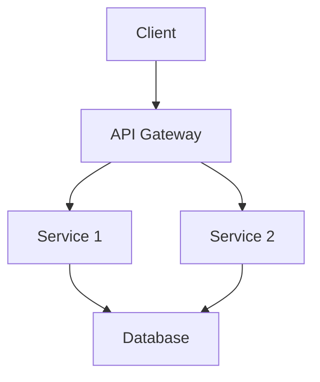
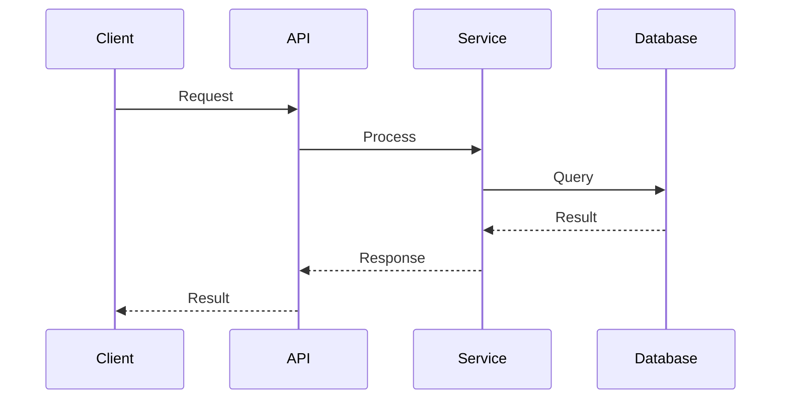

# Architecture

## System Overview

[High-level description]

## Architecture Diagram

## Components

### [Component Name]

**Purpose**: [What it does]

**Responsibilities**:
- [Responsibility 1]
- [Responsibility 2]

**Technology**: [Tech stack]

**Dependencies**:
- [Dependency 1]
- [Dependency 2]

## Data Flow

## Security

[Security considerations and implementations]

## Scalability

[How the system scales]

## Observability

[Logging, metrics, tracing strategy]
